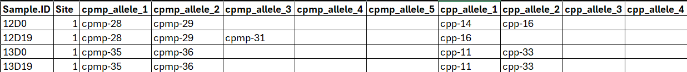

# MalReBay

## 1. Introduction

The **World Health Organization (WHO)** recommends **Therapeutic
Efficacy Studies (TES)**to monitor antimalarial drug effectiveness. In
TES, patients with uncomplicated malaria are treated and followed for
several weeks to assess whether the infection clears and remains
suppressed. A key challenge during follow-up is distinguishing between
two causes of recurrent parasitaemia:

- **recrudescence:** the reappearance of parasites from the original
  infection after partial clearance. + **reinfection:** a new infection
  from a separate mosquito bite.

This distinction, known as **molecular correction**, relies on comparing
parasite genotypes from the initial infection and any subsequent
recurrence.

`MalReBay` is an R package that implements a **Bayesian framework** for
molecular correction. Rather than making a deterministic call, it uses
genotyping data from a patient’s initial infection (day 0) and
recurrence samples to estimate the probability that a recurrence is due
to **recrudescence** versus **reinfection**. Compared to rule-based
methods, `MalReBay` explicitly accounts for genotyping uncertainty,
within-host diversity, and local allele frequency information, providing
a principled and robust classification.

This tutorial provides a step-by-step guide to the main analysis
workflow, from loading your data to interpreting the final results.
Starting with the conceptual framework.

## 2. Bayesian framework for molecular correction

For each patient $`i`$, a binary variable $`R_i`$ indicates the
recurrence cause: $`R_i = 1`$ for recrudescence and $`R_i = 0`$ for
reinfection.Bayesian inference updates prior beliefs about $`R_i`$ using
the observed genotyping data $`D_i`$, producing the posterior
probability $`P(R_i=1|D_i,\theta)`$.


Overview of the Bayesian inference framework workflow.

The three components of the model are:

- Prior $`P(R_i)`$ is the baseline belief about recrudescence before
  seeing the data.

- Likelihood $`P(D_i|R_i)`$ is the probability of the observed allele
  patterns given each hypothesis, accounting for allele frequencies,
  within-host diversity, and genotyping errors.

- Posterior $`P(R_i|D_i)`$ is the updated probability that a recurrence
  is a recrudescence after combining priors and data.

Recurrences events are classified as recrudescence when $`P(R_i|D_i)`$
exceeds a threshold (e.g., 0.5). These probabilities cannot be solved
analytically because the posterior distribution has no closed form;
therefore, MalReBay uses Markov chain Monte Carlo (MCMC) sampling to
approximate them.

## 3. The MalReBay workflow

The main
[`MalReBay()`](https://swisstph.github.io/MalReBay/reference/MalReBay.md)
function automates the full pipeline: it takes paired genotyping data
from `day 0` and `day of recurrence`, combines them with model
parameters (genotyping error rates, within-host diversity, allele
frequencies), runs MCMC sampling, and returns posterior estimates and
recurrence classifications summarised at both the patient and study
level. The following sections describe the required input formats and
how to prepare your data.

## 4. Input Data

`MalReBay` accepts two types of genotyping data:

- Length-polymorphic markers (e.g., microsatellites, MSP, GLURP).

- Amplicon sequencing data (haplotype).

The primary input is an Excel file containing genotyping data. The input
structure is similar for both types, with one key difference:
length-polymorphic columns store fragment lengths in base pairs, while
amplicon sequencing columns store haplotype labels.

### 4.1 Length-polymorphic markers

The Excel file should contain:

- A `Sample.ID` column that uniquely identifies each sample and includes
  “Day 0” or “Day of recurrence”.

- The day of sampling (0 for baseline, X for recurrence). Note sometimes
  this is included in the Sample.ID column (e.g., `BD21-002D0` and
  `BD21-002D42`).

- A `Site` column indicating the geographical origin of the sample.

- Marker columns named like `LocusName_AlleleNumber` (e.g., `313_1`,
  `313_2`, `313_3`, etc.), where each cell represents the parasite
  clones fragment length observed in base pairs.

Here is an example of the expected input format for length-polymorphic
data: 

### 4.2 Amplicon sequencing data

The input data has a similar structure to length-polymorphic data, the
marker columns store haplotype labels 90 instead of allele lengths.

Here is an example of the expected input format for amplicon sequencing
data: 

## 5. Descriptive analysis

Before running the classification analysis, exploring your genotyping
data is strongly recommended. `MalReBay` provides visualizations
tailored to each data type that can help you:

- Identify the most informative or frequent markers in the population
- Assess data quality and completeness
- Evaluate overall marker polymorphism and richness

Both data types share two core visualisation types, the MOI violin plots
and diversity charts.

- **MOI Violin Plots:** Show the distribution of the number of distinct
  parasite clones per infection, providing insight into infection
  complexity across samples.

- **Allele Diversity Pie Charts:** Display the relative frequencies of
  different alleles within each marker, highlighting dominant alleles
  and overall marker polymorphism.

## 6. Example of classification: length-polymorphic markers

In this section, we provide a step-by-step example of using the
`MalReBay` package to classify recurrent malaria infections with
length-polymorphic genotyping data.

We will use an example dataset included with the package, containing
data from a Therapeutic Efficacy Study (TES) conducted in Angola in
2021. The dataset includes 7 microsatellite markers; `313`, `383`,
`TA1`, `POLYA`, `PFPK2`, `2490`, `TA109`, genotyped from 70 patients
from three study sites: Benguela, Lunda Sul and Zaire.

We will focus on a single site: Benguela.

``` r
# Load required libraries
library(MalReBay)
library(dplyr)
library(ggplot2)
library(purrr)
library(tidyr)
library(here)
library(kableExtra)
```

#### Step 1: Load data

We import the example dataset using `MalReBay:::import_data()`. The
dataset includes both late failure samples and any additional samples.

``` r
input_file_lp <- system.file("extdata", "Angola_2021_TES_7NMS.xlsx", package = "MalReBay")
marker_file   <- system.file("extdata", "makers_details.xlsx", package = "MalReBay")

# Import and validate data
imported_data <- MalReBay::import_data(
  filepath = input_file_lp, 
  marker_filepath = marker_file
)
#> INFO: Detected 'length_polymorphic' data format.
#> Warning in MalReBay::import_data(filepath = input_file_lp, marker_filepath =
#> marker_file): NAs introduced by coercion
#> Warning in FUN(X[[i]], ...): NAs introduced by coercion
#> Warning in FUN(X[[i]], ...): NAs introduced by coercion
#> Warning in FUN(X[[i]], ...): NAs introduced by coercion
#> Warning in FUN(X[[i]], ...): NAs introduced by coercion
#> Warning in FUN(X[[i]], ...): NAs introduced by coercion
#> Warning in FUN(X[[i]], ...): NAs introduced by coercion
#> INFO: Using 7 markers: 313, 383, TA1, POLYA, PFPK2, 2490, TA109
```

#### Step 2: Define an Output Folder

An output folder is defined to store results generated by the analysis.
If the folder does not already exist, it will be created automatically.

``` r
# Use a temporary directory 
output_dir_lp <- file.path(tempdir(), "malrebay_results")

if (!dir.exists(output_dir_lp)) { 
  dir.create(output_dir_lp, recursive = TRUE)
}

# Prepare data for descriptive plots
genotypedata_lp <- dplyr::bind_rows(imported_data$late_failures, imported_data$additional)
```

#### Step 3: Descriptive statistics

In this step, we generate summary statistics to explore the genetic
characteristics of the data before running the Bayesian model. Two key
measures are considered:

- Multiplicity of Infection (MOI): estimates the number of distinct
  parasite clones per marker in each sample, providing insight into
  within-host diversity.

- Marker diversity: visualizes the distribution of allele sizes for each
  marker, helping to assess the level of genetic variability in the
  study population.

These descriptive outputs give context for interpreting molecular
correction results and can highlight potential sources of genotyping
uncertainty.

##### Multiplicity of Infection (MOI)

``` r
if (nrow(genotypedata_lp) > 0) {
  first_site      <- unique(genotypedata_lp$Site)[1]
  genotypedata_s1 <- dplyr::filter(genotypedata_lp, Site == first_site)

  moi_plots <- MalReBay::plot_moi(
    genotypedata  = genotypedata_s1,
    output_folder = output_dir_lp
  )
  print(moi_plots[[first_site]])
}
```


##### Marker diversity

``` r
if (nrow(genotypedata_lp) > 0) {
  MalReBay::plot_markers_diversity(
    genotypedata    = genotypedata_lp,
    data_type       = "length_polymorphic",
    marker_info     = imported_data$marker_info,
    output_folder   = output_dir_lp
  )
}
```

#### Step 4: MCMC Configuration

The MCMC sampler has several parameters that control its runtime and
convergence criteria. For this quick tutorial, we will use a relaxed
configuration. For a real analysis, you should use more iterations
(e.g., `max_iterations` should be 10000 or more) and stricter thresholds
to ensure robust convergence.

##### Parameter Definitions

- **iter:** The total number of iterations per chain (including warmup).

- **burn_in_frac:** The fraction of iterations used for warmup
  (typically 0.5).

- **chains:** The number of independent Markov chains to run..

- **adapt_delta:** (Stan-specific) Controls the step size during
  sampling. Increasing this (e.g., to 0.95) helps with “divergent
  transitions.”

#### Step 5: Execute the Main Function

Now we can run the analysis.
[`MalReBay()`](https://swisstph.github.io/MalReBay/reference/MalReBay.md)
will print progress messages to the console, informing you about the
data type it detected, the sites it is analyzing, and the status of the
MCMC convergence. The ‘future’ package is used in the background for
parallel processing, so you can expect the analysis to run faster on
multi-core machines.

``` r
# Define a config list
quick_config <- list(
  n_chains     = 2,
  iter         = 1000,   # Increased from 300 to ensure Stan finishes
  burn_in_frac = 0.5,
  random_seed  = 42
)

# Run the full pipeline
results <- MalReBay::MalReBay(
  filepath        = input_file_lp,
  marker_filepath = marker_file,
  mcmc_config     = quick_config,
  output_folder   = output_dir_lp,
  verbose         = FALSE
)
#> Warning in import_data(filepath = filepath, marker_filepath = marker_filepath,
#> : NAs introduced by coercion
#> Warning in FUN(X[[i]], ...): NAs introduced by coercion
#> Warning in FUN(X[[i]], ...): NAs introduced by coercion
#> Warning in FUN(X[[i]], ...): NAs introduced by coercion
#> Warning in FUN(X[[i]], ...): NAs introduced by coercion
#> Warning in FUN(X[[i]], ...): NAs introduced by coercion
#> Warning in FUN(X[[i]], ...): NAs introduced by coercion
#> === validate_stan_data ===
#>   [PASS] N >= 1
#>   [PASS] J >= 1
#>   [PASS] max_K >= 1
#>   [PASS] length(K) == J
#>   [PASS] dim(recoded0) == [N, J*maxMOI]
#>   [PASS] additional_counts exists
#>   [PASS] additional_counts has data
#> === ALL CHECKS PASSED ===
#> Warning: There were 154 divergent transitions after warmup. See
#> https://mc-stan.org/misc/warnings.html#divergent-transitions-after-warmup
#> to find out why this is a problem and how to eliminate them.
#> Warning: Examine the pairs() plot to diagnose sampling problems
#> Warning: Tail Effective Samples Size (ESS) is too low, indicating posterior variances and tail quantiles may be unreliable.
#> Running the chains for more iterations may help. See
#> https://mc-stan.org/misc/warnings.html#tail-ess
#> === validate_stan_data ===
#>   [PASS] N >= 1
#>   [PASS] J >= 1
#>   [PASS] max_K >= 1
#>   [PASS] length(K) == J
#>   [PASS] dim(recoded0) == [N, J*maxMOI]
#>   [PASS] additional_counts exists
#>   [PASS] additional_counts has data
#> === ALL CHECKS PASSED ===
#> Warning: There were 169 divergent transitions after warmup. See
#> https://mc-stan.org/misc/warnings.html#divergent-transitions-after-warmup
#> to find out why this is a problem and how to eliminate them.
#> Warning: Examine the pairs() plot to diagnose sampling problems
#> Warning: Bulk Effective Samples Size (ESS) is too low, indicating posterior means and medians may be unreliable.
#> Running the chains for more iterations may help. See
#> https://mc-stan.org/misc/warnings.html#bulk-ess
#> Warning: Tail Effective Samples Size (ESS) is too low, indicating posterior variances and tail quantiles may be unreliable.
#> Running the chains for more iterations may help. See
#> https://mc-stan.org/misc/warnings.html#tail-ess
#> === validate_stan_data ===
#>   [PASS] N >= 1
#>   [PASS] J >= 1
#>   [PASS] max_K >= 1
#>   [PASS] length(K) == J
#>   [PASS] dim(recoded0) == [N, J*maxMOI]
#>   [PASS] additional_counts exists
#>   [PASS] additional_counts has data
#> === ALL CHECKS PASSED ===
#> Warning: There were 193 divergent transitions after warmup. See
#> https://mc-stan.org/misc/warnings.html#divergent-transitions-after-warmup
#> to find out why this is a problem and how to eliminate them.
#> Warning: Examine the pairs() plot to diagnose sampling problems
#> Warning: Tail Effective Samples Size (ESS) is too low, indicating posterior variances and tail quantiles may be unreliable.
#> Running the chains for more iterations may help. See
#> https://mc-stan.org/misc/warnings.html#tail-ess

if (is.null(results)) {
  knitr::knit_exit("MCMC failed to produce results; skipping remaining chunks.")
}
```

The
[`MalReBay()`](https://swisstph.github.io/MalReBay/reference/MalReBay.md)
function returns a list containing two key data frames:

- `summary`: Main results for each patient, including the posterior
  probability of recrudescence and the number of comparable loci.

- `marker_details`: Detailed information on each marker for each
  patient.

``` r
# Access the main results table
summary_df <- results$posterior_probabilities

knitr::kable(head(summary_df), caption = "Classification results showing posterior probabilities.")
```

| Site | Sample.ID | Probability | N_Available_D0 | N_Available_DF | N_Comparable_Loci |
|:---|:---|---:|---:|---:|---:|
| Benguela | BD21-002 | 0.0000000 | 7 | 7 | 7 |
| Benguela | BD21-040 | 0.0001151 | 7 | 7 | 7 |
| Benguela | BD21-041 | 0.9927172 | 7 | 7 | 7 |
| Benguela | BD21-053 | 0.4605430 | 7 | 5 | 5 |
| Benguela | BD21-075 | 0.0000001 | 7 | 7 | 7 |
| Benguela | BD21-099 | 0.0001545 | 7 | 7 | 7 |

Classification results showing posterior probabilities.

Key columns in the summary include:

- **Site**: The geographical site of the sample.

- **Sample.ID**: The unique patient identifier.

- **Probability**: The posterior probability that the infection is a
  **recrudescence**. A value near 1.0 suggests recrudescence, while a
  value near 0.0 suggests reinfection.

- **N_Available_D0 / N_Available_DF**: The number of loci with genetic
  data at Day 0 and Day of Failure, respectively.

- **N_Comparable_Loci**: The number of loci with data at *both* time
  points, which is the amount of data used for the classification.

#### Step 6: Visualizing the Results

A histogram of the posterior probabilities provides a clear overview of
the classification results. If the histogram shows a clear separation
into two groups (one near 0 and one near 1), this indicates high
confidence in distinguishing recrudescence from reinfection.

The histogram allows you to visually assess the certainty of the
classifications and to identify any ambiguous cases for further
investigation.

``` r
# Generate the histogram (this is also saved in Step 4 automatically)
MalReBay::plot_probability_histogram(results)
```


In this example run, we see a clear group of patients with low
probability (likely reinfections) and another group with high
probability (likely recrudescences).

#### Step 7: Convergence diagnosis

Convergence is monitored automatically during sampling using both the
log-likelihood and standard diagnostics. By default, the algorithm will
stop once the following criteria are met:

- **R-hat (Gelman–Rubin diagnostic):** All monitored parameters must
  have $`\hat{R} < 1.1`$ and the Gelman–Rubin plot should stabilize near
  1.0 and remain below the 1.1 threshold.

- **Effective Sample Size (ESS):** The number of effectively independent
  samples must exceed the user-defined threshold (the value defined in
  parameter `ess_threshold`)

- **Maximum iterations:** If convergence has not been reached, sampling
  stops once the iteration cap (the value defined in parameter
  `max_iterations`).

##### How to Generate Plots Interactively

The
[`MalReBay()`](https://swisstph.github.io/MalReBay/reference/MalReBay.md)
function saves the MCMC log-likelihood data for each site within its
results object. You can use the exported `plot_likelihood_diagnostics`
function to view the plots for any site interactively in your R session.

The key plots for diagnostics are:

- **Trace plot:** Chains should look like “fuzzy caterpillars” with no
  trends.

- **Gelman-Rubin plot:** The shrink factor should approach 1.

- **Histogram:** Shows the posterior distribution of the log-likelihood.

- **Autocorrelation (ACF) plot:** Correlation should drop to zero
  quickly.

##### Example: Diagnostics for a Single Site

Below is an example using the site `Benguela`, demonstrating how to
generate and visualize the convergence diagnostics:

``` r
# Select the first site for diagnostic plotting
site_to_plot <- names(results$mcmc_loglikelihoods)[1]
loglik_data  <- results$mcmc_loglikelihoods[[site_to_plot]]

if (!is.null(loglik_data)) {
  MalReBay::plot_likelihood_diagnostics(
    all_chains_loglikelihood = loglik_data,
    site_name                = site_to_plot,
    stan_fit                 = results$stan_fits[[site_to_plot]],
    save_plot                = FALSE,
    output_folder            = NULL,
    verbose                  = FALSE
  )
}
```


These trace, Gelman–Rubin, histogram, and ACF plots collectively provide
visual assurance that the MCMC chains have mixed well and stabilized.

#### Step 8: Comparison with other methods

To evaluate the performance of the Bayesian classification in MalReBay,
we compare its results against a simpler **match-counting algorithm**.
This algorithm counts allele matches between Day 0 and recurrence
samples to provide a baseline for comparison.

For length-polymorphic markers, we combine the outputs of `MalReBay` and
the `match-counting` algorithm into a single table. This allows us to
examine, for each patient:

- The number of loci compared and the number of matches between samples.
- The per-locus results from match-counting (`R` for match, `NI` for
  non-match, `IND` for indeterminate).
- The posterior probability of recrudescence from `MalReBay`
  (MalReBay_Probability).

``` r
final_table <- results$comparison

knitr::kable(
  head(final_table), 
  caption = "Comparison of MalReBay probabilities and traditional match-counting.",
  digits = 3
) %>%
  kableExtra::scroll_box(width = "100%")
```

| Sample.ID | Site | 313_1 | 313_2 | 313_3 | 383_1 | 383_2 | 383_3 | TA1_1 | TA1_2 | TA1_3 | TA1_4 | TA1_5 | POLYA_1 | POLYA_2 | POLYA_3 | POLYA_4 | PFPK2_1 | PFPK2_2 | PFPK2_3 | PFPK2_4 | PFPK2_5 | 2490_1 | 2490_2 | 2490_3 | TA109_1 | TA109_2 | TA109_3 | TA109_4 | TA109_5 | Number_Matches | Number_Loci_Compared | 313 | 383 | TA1 | POLYA | PFPK2 | 2490 | TA109 | Probability | N_Comparable_Loci |
|:---|:---|---:|---:|---:|---:|---:|---:|---:|---:|---:|---:|---:|---:|---:|---:|---:|---:|---:|---:|---:|---:|---:|---:|---:|---:|---:|---:|---:|---:|---:|---:|:---|:---|:---|:---|:---|:---|:---|---:|---:|
| BD21-002 Day 0 | Benguela | 248 | NA | NA | 133 | NA | NA | 174 | NA | NA | NA | NA | 153 | NA | NA | NA | 159 | NA | NA | NA | NA | 78 | NA | NA | 172 | NA | NA | NA | NA | 3 | 7 | R | NI | R | NI | NI | R | NI | 0.000 | 7 |
| BD21-002 recurrence | Benguela | 246 | NA | NA | 123 | NA | NA | 177 | NA | NA | NA | NA | 105 | NA | NA | NA | 183 | NA | NA | NA | NA | 81 | NA | NA | 184 | NA | NA | NA | NA | 3 | 7 | R | NI | R | NI | NI | R | NI | 0.000 | 7 |
| BD21-040 Day 0 | Benguela | 230 | NA | NA | 137 | NA | NA | 162 | NA | NA | NA | NA | 159 | NA | NA | NA | 162 | 171 | NA | NA | NA | 81 | NA | NA | 160 | NA | NA | NA | NA | 1 | 7 | NI | NI | NI | R | NI | NI | NI | 0.000 | 7 |
| BD21-040 recurrence | Benguela | 222 | NA | NA | 123 | NA | NA | 171 | NA | NA | NA | NA | 159 | NA | NA | NA | 183 | NA | NA | NA | NA | 72 | NA | NA | 178 | NA | NA | NA | NA | 1 | 7 | NI | NI | NI | R | NI | NI | NI | 0.000 | 7 |
| BD21-041 Day 0 | Benguela | 238 | NA | NA | 123 | 139 | NA | 177 | NA | NA | NA | NA | 162 | 165 | NA | NA | 168 | 171 | NA | NA | NA | 81 | NA | NA | 184 | NA | NA | NA | NA | 7 | 7 | R | R | R | R | R | R | R | 0.993 | 7 |
| BD21-041 recurrence | Benguela | 238 | NA | NA | 123 | 141 | NA | 177 | NA | NA | NA | NA | 162 | 165 | NA | NA | 168 | 171 | NA | NA | NA | 81 | NA | NA | 184 | NA | NA | NA | NA | 7 | 7 | R | R | R | R | R | R | R | 0.993 | 7 |

Comparison of MalReBay probabilities and traditional match-counting.

#### output non-convergence

``` r
bad_mcmc_config <- list(
  n_chains     = 2,
  iter         = 200, 
  burn_in_frac = 0.5,
  random_seed  = 1
)

# Run MalReBay but SET output_folder to NULL 
# and ensure your R functions handle NULL as fixed above.
results_nonconverge <- MalReBay::MalReBay(
  filepath        = input_file_lp,
  marker_filepath = marker_file,
  mcmc_config     = bad_mcmc_config,
  output_folder   = NULL,   
  verbose         = FALSE
)
#> Warning in import_data(filepath = filepath, marker_filepath = marker_filepath,
#> : NAs introduced by coercion
#> Warning in FUN(X[[i]], ...): NAs introduced by coercion
#> Warning in FUN(X[[i]], ...): NAs introduced by coercion
#> Warning in FUN(X[[i]], ...): NAs introduced by coercion
#> Warning in FUN(X[[i]], ...): NAs introduced by coercion
#> Warning in FUN(X[[i]], ...): NAs introduced by coercion
#> Warning in FUN(X[[i]], ...): NAs introduced by coercion
#> === validate_stan_data ===
#>   [PASS] N >= 1
#>   [PASS] J >= 1
#>   [PASS] max_K >= 1
#>   [PASS] length(K) == J
#>   [PASS] dim(recoded0) == [N, J*maxMOI]
#>   [PASS] additional_counts exists
#>   [PASS] additional_counts has data
#> === ALL CHECKS PASSED ===
#> Warning: There were 82 divergent transitions after warmup. See
#> https://mc-stan.org/misc/warnings.html#divergent-transitions-after-warmup
#> to find out why this is a problem and how to eliminate them.
#> Warning: Examine the pairs() plot to diagnose sampling problems
#> Warning: The largest R-hat is NA, indicating chains have not mixed.
#> Running the chains for more iterations may help. See
#> https://mc-stan.org/misc/warnings.html#r-hat
#> Warning: Bulk Effective Samples Size (ESS) is too low, indicating posterior means and medians may be unreliable.
#> Running the chains for more iterations may help. See
#> https://mc-stan.org/misc/warnings.html#bulk-ess
#> Warning: Tail Effective Samples Size (ESS) is too low, indicating posterior variances and tail quantiles may be unreliable.
#> Running the chains for more iterations may help. See
#> https://mc-stan.org/misc/warnings.html#tail-ess
#> === validate_stan_data ===
#>   [PASS] N >= 1
#>   [PASS] J >= 1
#>   [PASS] max_K >= 1
#>   [PASS] length(K) == J
#>   [PASS] dim(recoded0) == [N, J*maxMOI]
#>   [PASS] additional_counts exists
#>   [PASS] additional_counts has data
#> === ALL CHECKS PASSED ===
#> Warning: There were 64 divergent transitions after warmup. See
#> https://mc-stan.org/misc/warnings.html#divergent-transitions-after-warmup
#> to find out why this is a problem and how to eliminate them.
#> Warning: Examine the pairs() plot to diagnose sampling problems
#> Warning: The largest R-hat is NA, indicating chains have not mixed.
#> Running the chains for more iterations may help. See
#> https://mc-stan.org/misc/warnings.html#r-hat
#> Warning: Bulk Effective Samples Size (ESS) is too low, indicating posterior means and medians may be unreliable.
#> Running the chains for more iterations may help. See
#> https://mc-stan.org/misc/warnings.html#bulk-ess
#> Warning: Tail Effective Samples Size (ESS) is too low, indicating posterior variances and tail quantiles may be unreliable.
#> Running the chains for more iterations may help. See
#> https://mc-stan.org/misc/warnings.html#tail-ess
#> === validate_stan_data ===
#>   [PASS] N >= 1
#>   [PASS] J >= 1
#>   [PASS] max_K >= 1
#>   [PASS] length(K) == J
#>   [PASS] dim(recoded0) == [N, J*maxMOI]
#>   [PASS] additional_counts exists
#>   [PASS] additional_counts has data
#> === ALL CHECKS PASSED ===
#> Warning: There were 68 divergent transitions after warmup. See
#> https://mc-stan.org/misc/warnings.html#divergent-transitions-after-warmup
#> to find out why this is a problem and how to eliminate them.
#> Warning: Examine the pairs() plot to diagnose sampling problems
#> Warning: The largest R-hat is NA, indicating chains have not mixed.
#> Running the chains for more iterations may help. See
#> https://mc-stan.org/misc/warnings.html#r-hat
#> Warning: Bulk Effective Samples Size (ESS) is too low, indicating posterior means and medians may be unreliable.
#> Running the chains for more iterations may help. See
#> https://mc-stan.org/misc/warnings.html#bulk-ess
#> Warning: Tail Effective Samples Size (ESS) is too low, indicating posterior variances and tail quantiles may be unreliable.
#> Running the chains for more iterations may help. See
#> https://mc-stan.org/misc/warnings.html#tail-ess
```


``` r

if (!is.null(results_nonconverge)) {
  site_to_plot <- names(results_nonconverge$mcmc_loglikelihoods)[1]
  
  MalReBay::plot_likelihood_diagnostics(
    all_chains_loglikelihood = results_nonconverge$mcmc_loglikelihoods[[site_to_plot]],
    site_name                = site_to_plot,
    stan_fit                 = results_nonconverge$stan_fits[[site_to_plot]],
    save_plot                = FALSE
  )
}
#> Convergence Diagnostics for: Benguela 
#> -------------------------------------------------- 
#> Classical Gelman-Rubin R-hat:
#> Potential scale reduction factors:
#> 
#>   Point est. Upper C.I.
#>         1.02       1.11
#> 
#> 
#> Rank-normalised R-hat (Vehtari 2021): 1.0284   [FAIL] 
#> 
#> Classical ESS (coda): 175.2 
#> Bulk ESS: 148.7   [FAIL] 
#> Tail ESS: 200.3   [FAIL] 
#> 
#> Geweke Z-scores per chain |Z| < 1.96 = stationary:
#>   Chain 1: Z = -0.3373  [PASS]
#>   Chain 2: Z = -0.4970  [PASS]
#> --------------------------------------------------
```


#### Identifying lack of convergence

When diagnosing MCMC output, the following visual patterns indicate that
chains may not have converged:

- **$`\hat{R}`$ values:** In the Gelman–Rubin plot, values should
  stabilize close to 1.0. If the curve stays well above 1.1 or drifts
  without settling, it signals non-convergence.

- **Chain mixing:** In well-mixed traceplots, chains appear as
  overlapping “caterpillars” that fluctuate around a common mean. If the
  traces show different levels, do not overlap, or drift apart, it
  suggests poor mixing.

- **Autocorrelation:** A good autocorrelation plot shows a rapid decline
  toward zero within a few lags. If autocorrelation remains high or
  decays slowly across iterations, it means the chains are exploring the
  parameter space inefficiently and convergence has not been reached.

#### How to improve convergence

If chains fail to converge, several adjustments can help improve
stability and mixing:

- Increase the number of iterations: Allow more sampling time so chains
  have a better chance to explore the parameter space thoroughly.

- Run additional chains in parallel: More chains improve the chances of
  detecting convergence and can reveal mixing issues more clearly.

- Adjust the chunk size or apply thinning: Modifying these settings can
  reduce autocorrelation and improve the efficiency of the samples.

The package also includes an automatic convergence check: sampling will
stop early once the criteria above are satisfied, so in many cases you
will not need to tune these settings manually.

## 10. User workflow and package structure

The `MalReBay` package is organized around three main stages: data
preparation, Bayesian inference with MCMC, and summarization of results.


MalReBay framework.

### 10.1 Data preparation

- [`import_data()`](https://swisstph.github.io/MalReBay/reference/import_data.md)
  function reads the input Excel file, automatically detects the data
  type (length-polymorphic vs. amplicon sequencing), and applies basic
  cleaning.

- For length-polymorphic markers, `define_alleles()` groups raw fragment
  lengths into discrete, well-defined allele bins.

- `calculate_frequencies()` function estimates the initial
  population-level frequency of each allele, which serves as the prior
  for the MCMC algorithm.

- `recode_alleles()` converts allele values into integer-based codes,
  ensuring consistency across sites and markers.

**Output**: A clean, structured dataset ready to be passed into the
Bayesian engine.

### 10.2 Bayesian inference with MCMC

At the core of the package is a Gibbs sampling engine that explores the
probability space and classifies recurrent infections as reinfections or
recrudescences.

- `run_all_sites()` organizes the analysis across geographical sites,
  calling the relevant MCMC functions (`run_one_chain()` or
  `run_one_chain_ampseq()`).

- During each iteration, the algorithm updates key parameters:

  - Hidden alleles (`switch_hidden_length()` /
    `switch_hidden_ampseq()`).

  - Population allele frequencies (`findposteriorfrequencies()`)

- Multiple chains run in parallel, with automatic convergence checks
  based on R-hat and ESS.

### 10.3 Summarization and output

Once the MCMC converges, the package distills the results into clear,
interpretable outputs.

- Posterior Probabilities: A summary table reporting, for each patient,
  the posterior probability of recrudescence.

- Diagnostic Reports: Functions such as
  [`plot_likelihood_diagnostics()`](https://swisstph.github.io/MalReBay/reference/plot_likelihood_diagnostics.md)
  produce trace plots and Gelman–Rubin plots for convergence checks.

- Allele Frequency Plots: `generate_allele_frequency_plot()` visualizes
  allele distributions overall and by site.

- Marker-Level Analysis: Detailed tables show how individual genetic
  markers contribute to each classification
