# Classification of P. falciparum infection recurrences with MalReBay

## 1 Overview

**MalReBay** is an R package for classifying recurrent *Plasmodium
falciparum* infections in Therapeutic Efficacy Studies (TES). For each
patient, it estimates the **probability that a recurrent infection is a
recrudescence** (i.e. a treatment failure) rather than a **reinfection**
(a new infection acquired from a different mosquito bite after
treatment). MalReBay uses a **Bayesian approach** published in
[Plucinski *et al.*
2015](https://pmc.ncbi.nlm.nih.gov/articles/PMC4576024/), which combines
the available genotyping data with prior information to estimate this
probability. The model uses **Markov Chain Monte Carlo (MCMC)** sampling
to obtain the estimates.

Key advantages of MalReBay include:

- Handles **polyclonal infections**, where a patient can carry multiple
  parasite strains

- **Imputes missing genotypes** as part of the MCMC analysis, handling
  missing data

- Works with the **different genotyping approaches** used in TES:
  microsatellites, MSP1/MSP2/GLURP length-polymorphic markers, and
  amplicon sequencing (AmpSeq)

------------------------------------------------------------------------

## 2 Background

### 2.1 Why molecular correction?

The **World Health Organization (WHO)** recommends TES to monitor how
well antimalarial drugs are working: patients with uncomplicated malaria
are treated and then followed for several weeks to check whether the
infection cleared and stayed away.

A parasite reappearing during follow-up can mean one of two things, and
they look clinically identical:

- **Recrudescence**: the original infection was never fully cleared by
  the drug and a sign of treatment failure.
- **New infection** (reinfection): a new, unrelated infection from a
  different mosquito bite and not a sign the drug failed.

**Molecular correction** tells the two types of recurrences apart by
comparing the parasite genetic fingerprint at Day 0 against the
fingerprint at the later time of recurrence. MalReBay performs this
comparison with a Bayesian model.

### 2.2 How MalReBay works conceptually

For each patient, MalReBay asks: given the genotyping data at hand, how
much more consistent is this pattern of alleles with “the same infection
persisting” than with “a new, unrelated infection”?

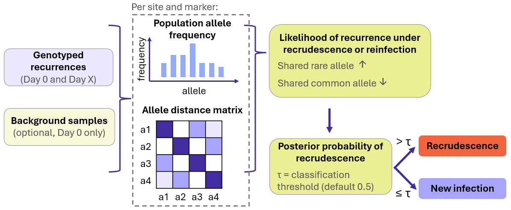

*Overview of the MalReBay framework.*

- **Prior**: before seeing any genetic data, recrudescence and
  reinfection are assumed equally likely (50/50).
- **Likelihood**: the model asks how well each hypothesis (recrudescence
  or reinfection) explains the observed alleles, accounting for how
  common each allele is in the local parasite population, how many
  parasite clones each sample carries (polyclonal infections), and
  marker-specific genotyping noise.
- **Posterior**: prior and likelihood are combined via Bayes’ rule, into
  a final probability of recrudescence per patient which is compared
  against a user-defined threshold (0.5 by default) to get a
  Recrudescence/New infection classification call.

MalReBay computes these posterior probabilities with **Markov Chain
Monte Carlo (MCMC)** sampling, run through **Stan**.

### 2.3 The MalReBay workflow

The analysis runs in four stages:

    import_data()          Read and validate the genotyping + marker files
          |
    classify_infections()  Run the Bayesian MCMC model, site by site
          |
    summarise_results()    Turn raw outputs into clssification results, tables, diagnostics
          |
    save_results()         Save CSVs and plots to a chosen folder (optional)

All these steps are bundled inside the main
[`MalReBay()`](https://swisstph.github.io/MalReBay/reference/MalReBay.md)
function, used throughout this tutorial, which runs all four stages in a
single call. The examples below also show examples of
[`import_data()`](https://swisstph.github.io/MalReBay/reference/import_data.md)
and
[`classify_infections()`](https://swisstph.github.io/MalReBay/reference/classify_infections.md)
used as separate steps and which are useful when you want to inspect or
rerun part of the pipeline without repeating the rest.

------------------------------------------------------------------------

## 3 Installation

**CmdStan** must be installed **before installing MalReBay**, as
MalReBay contains an embedded Stan representation of the statistical
model that is compiled during the MalReBay installation (see the package
README for more details).

You only need to install **CmdStan and MalReBay once**. Once they are
installed, you can use MalReBay directly in your R sessions.

``` numberSource
# 1. Install CmdStan first (one-time, ~5 minutes)
cmdstanr::install_cmdstan()
```

``` numberSource
# 2. Install MalReBay from GitHub (development version)
remotes::install_github("SwissTPH/MalReBay")
```

Once the installation has completed successfully, or if the packages are
already installed, the MalReBay package can be loaded.

``` numberSource
library(MalReBay)
```

------------------------------------------------------------------------

## 4 Input data

MalReBay requires up to three inputs: a **genotyping data file**, a
**marker metadata file**, and an **MCMC configuration**.

### 4.1 Genotyping data file

The main input is an Excel workbook (or a CSV file). The first sheet of
the Excel file must contain one row per sample with the following column
layout:

| Column 1 | Column 2 | Columns 3+ |
|----|----|----|
| Patient.ID | Site | Allele columns (`marker_1`, `marker_2`, …) where marker encodes the marker name |

> **Tip**
>
> **💡Start from a template.** Ready-to-fill Excel templates for each
> data type (microsatellites, MSP1/MSP2/GLURP, AmpSeq) are provided with
> the package and can also be downloaded from the [templates folder on
> GitHub](https://github.com/SwissTPH/MalReBay/tree/main/inst/templates).
> Each has the two data sheets already laid out, example rows to
> replace, explanatory notes on the column headers, and an
> *Instructions* sheet.

**Each patient with a genotyped recurrence** must have exactly **two
rows on the data template**:

- A **Day 0** row
- A **recurrence** row

The **site** corresponds to the place/health facility where the samples
were collected. A data file can contain samples from multiple sites,
however **the analysis is performed individually per each site**.

**Allele column naming.** Columns are named `<marker_id>_1`,
`<marker_id>_2`, … (or `<marker_id>_allele_1`, `<marker_id>_allele_2`, …
both suffixes work for any data type) up to the maximum multiplicity of
infection (MOI) seen in the study. For example, three columns `msp1_1`,
`msp1_2`, `msp1_3` encode up to three distinct alleles per sample at the
marker msp1, this is how polyclonal infections are represented.

Missing values are recognized and set to `NA` automatically for: `N/A`,
`-`, `NA`, `na`, `""`, `" "`.

A second sheet (optional) can supply additional **Day-0-only background
samples**, used to estimate population allele frequencies more
precisely. It can be a separate CSV file too, via the argument
`additional_filepath`.

> **Tip**
>
> **💡More background samples, more reliable results.** MalReBay
> estimates how common each allele/family is in the local parasite
> population from the Day-0 samples it sees (the recurrence patient
> Day-0 rows, plus the infections from the background sheet). The more
> background Day-0 samples you provide, the more precisely those
> frequencies are estimated which directly affects how much weight a
> “match” carries. A handful of patients is enough to try the package
> out, but for a real analysis, you would need to include as much
> background Day-0 data as you have.

A single study can combine several length-polymorphic marker types, for
example a panel of neutral microsatellites, or MSP1/MSP2/GLURP, or
MSP1-2 and microsatellites together, as long as every marker has a
matching row in the marker metadata file with the right `binning_method`
(see next subsection). AmpSeq markers can’t be mixed with length
polymorphic markers in the same file, because the whole input data file
is classified as one data type.

Here is what this looks like in practice. A length-polymorphic
(microsatellite) panel where allele columns hold fragment sizes in base
pairs:

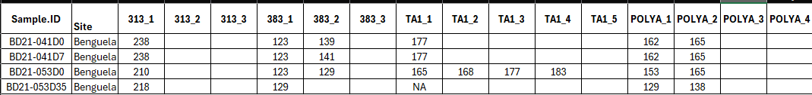

*Length-polymorphic data layout (microsatellite panel).*

An AmpSeq panel has the same layout, but allele columns hold haplotype
labels (e.g., cpmp_allele_1, etc.) instead of fragment sizes:


*Amplicon sequencing data layout.*

### 4.2 Marker metadata file

The marker metadata file is an Excel file with one row per marker.
Required columns:

| Column | Description |
|----|----|
| `marker_id` | Marker name: must match the prefix of the allele columns in the genotyping file |
| `repeatlength` | Repeat unit length (bp) for microsatellites; cluster/gap threshold (bp) for MSP/GLURP; ignored for AmpSeq |
| `binning_method` | `"microsatellite"`, `"msp_glurp"`, or `"exact"` (AmpSeq) |

Only markers present in *both* the genotyping file and the marker
metadata are used. The marker metadata can include information for other
markers and they will just be skipped. You can thus keep one metadata
file listing every marker your lab ever genotypes and reuse it across
studies with different subsets of markers. One marker info file is
provided within MalReBay:

``` numberSource
marker_file <- system.file("extdata", "makers_details.xlsx", package = "MalReBay")
marker_info <- as.data.frame(readxl::read_excel(marker_file))
head(marker_info)
```

The function
[`import_data()`](https://swisstph.github.io/MalReBay/reference/import_data.md)
auto-detects which type of data you have by looking at the first allele
value in your data: a number means **length-polymorphic** data
(microsatellites and/or MSP1/MSP2/GLURP) while text means **AmpSeq**
data. Here we show an example loading genotyped infections using the CDC
7-microsatellite panel.

``` numberSource
example_file <- system.file("extdata", "Dataset_microsatellite_panel.xlsx", package = "MalReBay")

imported_data <- import_data(
  filepath        = example_file,
  marker_filepath = marker_file,
  verbose         = TRUE
)

# The imported object is a list with four elements
names(imported_data)
```

    [1] "late_failures" "additional"    "marker_info"   "data_type"    

### 4.3 Visualizing the imported data

Before running the pipeline, we can use several plotting functions
within MalReBay to visualize several characteristics. Each accepts
`output_folder = NULL` and returns the plotted object(s) without saving
anything to disk. You can pass a path instead to also write PNG files.

[`plot_moi()`](https://swisstph.github.io/MalReBay/reference/plot_moi.md)
shows the distribution of the multiplicity of infection (number of
distinct alleles) per marker across infections, one plot per site and
with the mean MOI above each violin:

``` numberSource
p_moi <- plot_moi(imported_data$late_failures, output_folder = NULL)
p_moi$Benguela
```

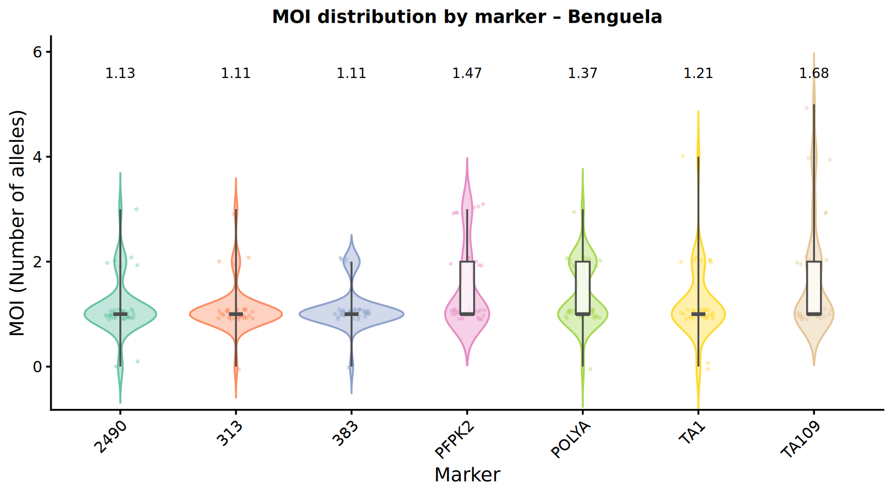

[`plot_markers_diversity()`](https://swisstph.github.io/MalReBay/reference/plot_markers_diversity.md)
shows the allele (or haplotype) frequency distribution per marker as pie
charts, per site as well as for all sites combined. Since the example
dataset has only one site, the plot for all sites is identical to the
one for one site.

``` numberSource
p_div <- plot_markers_diversity(
  genotypedata  = imported_data$late_failures,
  data_type     = imported_data$data_type,
  marker_info   = imported_data$marker_info,
  output_folder = NULL
)
p_div$by_site$Benguela
```

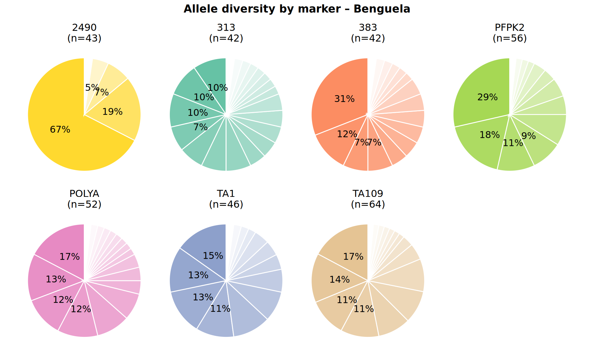

``` numberSource
p_div$all_sites
```

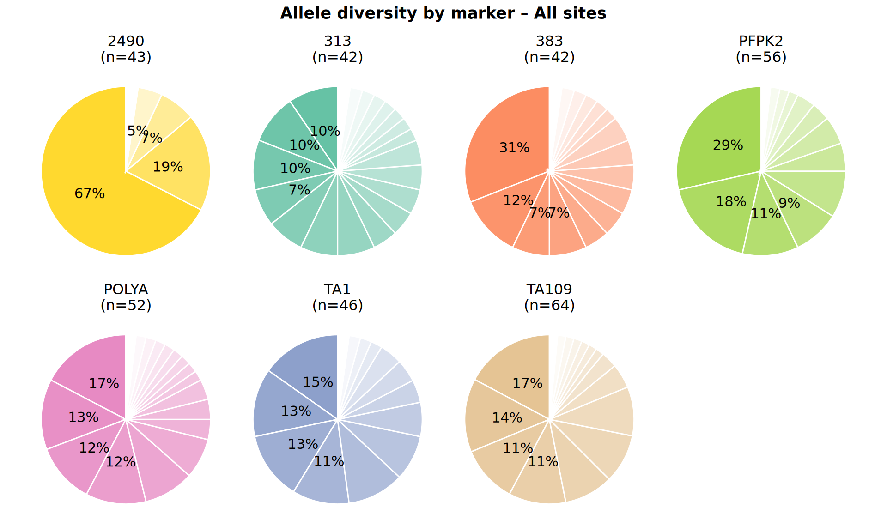

[`plot_allele_distribution()`](https://swisstph.github.io/MalReBay/reference/plot_allele_distribution.md)
shows the raw allele distribution per marker, with frequency (%) on the
y-axis: a size histogram for length-polymorphic markers
(microsatellites, MSP1/MSP2/GLURP), or a bar chart per haplotype name
for AmpSeq markers:

``` numberSource
p_allele <- plot_allele_distribution(
  genotypedata  = imported_data$late_failures,
  marker_info   = imported_data$marker_info,
  output_folder = NULL
)
p_allele$by_site$Benguela
```

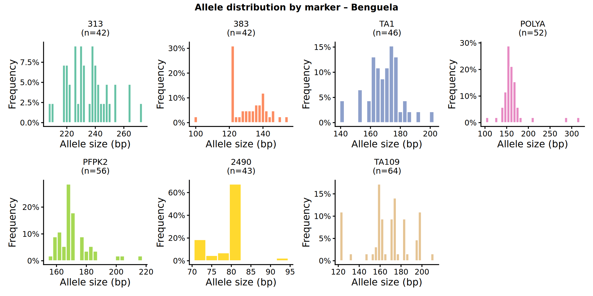

In summary, depending on the type of data used, the specifications for
the data input file(s) and marker file:

| Data type | What the allele values look like | `binning_method` in the marker file | Typical markers |
|----|----|----|----|
| **Microsatellites** | Numeric fragment sizes, e.g. `174`, `230.5` | `microsatellite` | `TA1`, `POLYA`, `PfPK2`, `2490`, `TA109`, … |
| **MSP1 / MSP2 / GLURP** | Numeric fragment sizes, e.g. `450`, `652` | `msp_glurp` | `K1`, `MAD20`, `RO33` (MSP1 family variants); `3D7`, `FC27`, `IC` (MSP2 family variants); `glurp` |
| **AmpSeq** | Haplotype names/strings, e.g. `"cpmp-1"`, `"Hap_A"` | `exact` | Amplicon panels such as `cpmp`, `cpp`, `ama1` |

### 4.4 MCMC configuration

The MCMC behavior of the statistical algorithm is controlled by a small
set of parameters. A set of default parameters is supplied within the
package. More detailed guidance about how to tune these parameters is
provided later in the document.

``` numberSource
# Read and display the default configuration
config_file <- system.file("extdata", "default_mcmc_config.rds", package = "MalReBay")
cfg <- readRDS(config_file)
cfg
```

| Parameter | Description |
|----|----|
| `n_chains` | Number of independent MCMC chains. More chains improve convergence diagnostics. Usually 2-3 chains used. The more chains, the more available parallel CPUs are required. |
| `iter` | Total MCMC iterations per chain (warm-up + sampling combined). Start with 1000-2000 for testing and increase depending on the convergence diagnosis. |
| `burn_in_frac` | Fraction of `iter` used as warm-up/burn-in (e.g. `0.5` → first 50% is warm-up, discarded). |
| `random_seed` | Seed for reproducibility. |
| `adapt_delta` | Stan’s target acceptance rate for step-size adaptation (0-1). Raise it (e.g. to `0.95`) if you see “divergent transitions” warnings. |

If you don’t pass `mcmc_config` at all,
[`MalReBay()`](https://swisstph.github.io/MalReBay/reference/MalReBay.md)
uses this bundled default. You can override any subset of it with a
plain list:

``` numberSource
quick_config <- list(n_chains = 2, iter = 1000, burn_in_frac = 0.5, adapt_delta = 0.8, random_seed = 42)
```

With any MCMC-based methods, **convergence of the results is
important.** There is no automatic convergence-based early stopping.
MalReBay runs exactly `iter` iterations per chain, once, for every site,
it does not check convergence mid-run and extend automatically. After
the run, inspect `results$convergence` and the convergence plots. If the
results have not convereged, increase `iter` and/or `n_chains` in
`mcmc_config` and rerun.

Convergence can also be limited by the data itself. If the diagnostics
do not improve after increasing iter, the data may not contain enough
information to pin down the model parameters. This can happen when a
site has few patients, many missing genotypes, or markers with little
allelic diversity. In that case, running the sampler longer or with more
chains will not help. Instead, check the data quality for that site (see
the quality-control and MOI plots), or interpret its probabilities with
caution.

------------------------------------------------------------------------

## 5 Running the pipeline

The main package function
[`MalReBay()`](https://swisstph.github.io/MalReBay/reference/MalReBay.md)
runs data import, classification, result summaries, and output saving
regardless of which of the three data types you are using.

### 5.1 Parameters

| Parameter | Description |
|----|----|
| `filepath` | Path to the genotyping Excel/CSV file with the TES data. |
| `marker_filepath` | Path to the marker metadata Excel file. |
| `additional_filepath` | Optional path to a separate background-data file (ignored if the main file is an excel file and already has a second sheet with additional infections). |
| `mcmc_config` | A named list, or a path to an `.rds` file with configuration parameters for the MCMC |
| `output_folder` | Directory where all output files and plots are written. Set to `NULL` to suppress file saving. |
| `n_workers` | Number of parallel workers for multi-chain MCMC. |
| `verbose` | If `TRUE`, prints progress and convergence messages to the console. |

### 5.2 Example 1: Microsatellite data

This walkthrough uses the bundled example dataset imported in the
example before: a real Angola 2021 TES with a panel of 7 neutral
microsatellites, for one site. Let’s first load the data:

``` numberSource
example_file <- system.file("extdata", "Dataset_microsatellite_panel.xlsx", package = "MalReBay")

imported_data <- import_data(
  filepath        = example_file,
  marker_filepath = marker_file,
  verbose         = TRUE
)

# The imported object is a list with four elements
names(imported_data)
```

    [1] "late_failures" "additional"    "marker_info"   "data_type"    

``` numberSource
# Main data: one row per sample (Day 0 and recurrence)
head(imported_data$late_failures)
```

``` numberSource
# Detected data type
imported_data$data_type
```

    [1] "length_polymorphic"

Once the data have been imported, the next step is to run the Bayesian
MCMC classification with
[`classify_infections()`](https://swisstph.github.io/MalReBay/reference/classify_infections.md)
and provided MCMC configuration parameters. It runs the algorithm site
by site and returns the raw results.

``` numberSource
quick_config <- list(
  n_chains     = 2,
  iter         = 2000,
  burn_in_frac = 0.5,
  adapt_delta  = 0.8,
  random_seed  = 42
)

mcmc_results <- classify_infections(
  imported_data = imported_data,
  mcmc_config   = quick_config,
  verbose       = TRUE
)
```

    Running MCMC with 2 parallel chains...

    Chain 1 Iteration:    1 / 2000 [  0%]  (Warmup)
    Chain 2 Iteration:    1 / 2000 [  0%]  (Warmup)
    Chain 2 Iteration:  500 / 2000 [ 25%]  (Warmup)
    Chain 1 Iteration:  500 / 2000 [ 25%]  (Warmup)
    Chain 2 Iteration: 1000 / 2000 [ 50%]  (Warmup)
    Chain 2 Iteration: 1001 / 2000 [ 50%]  (Sampling)
    Chain 1 Iteration: 1000 / 2000 [ 50%]  (Warmup)
    Chain 1 Iteration: 1001 / 2000 [ 50%]  (Sampling)
    Chain 2 Iteration: 1500 / 2000 [ 75%]  (Sampling)
    Chain 1 Iteration: 1500 / 2000 [ 75%]  (Sampling)
    Chain 2 Iteration: 2000 / 2000 [100%]  (Sampling)
    Chain 2 finished in 32.0 seconds.
    Chain 1 Iteration: 2000 / 2000 [100%]  (Sampling)
    Chain 1 finished in 32.4 seconds.

    Both chains finished successfully.
    Mean chain execution time: 32.2 seconds.
    Total execution time: 32.5 seconds.

``` numberSource
# Raw MCMC output:
names(mcmc_results)
```

    [1] "classifications"          "all_chains_loglikelihood"
    [3] "ids"                      "locus_summary"
    [5] "locus_lrs"                "locus_dists"
    [7] "locinames"                "stan_fits"               

``` numberSource
# Sites that were successfully classified
names(mcmc_results$ids)
```

    [1] "Benguela"

Instead of running the two steps (importing data and classifying
infections) separately, the entire analysis can be run directly with the
[`MalReBay()`](https://swisstph.github.io/MalReBay/reference/MalReBay.md)
function. A folder path can be provided (optionally) to save the results
and associated figures and summaries. In this example, a folder
`bayesian_algorithm_output` will be created in the same folder as this
notebook.

``` numberSource
results <- MalReBay(
  filepath        = example_file,
  marker_filepath = marker_file,
  mcmc_config     = quick_config,
  output_folder   = "bayesian_algorithm_output",
  verbose         = TRUE
)
```

    Running MCMC with 2 parallel chains...

    Chain 1 Iteration:    1 / 2000 [  0%]  (Warmup)
    Chain 2 Iteration:    1 / 2000 [  0%]  (Warmup)
    Chain 2 Iteration:  500 / 2000 [ 25%]  (Warmup)
    Chain 1 Iteration:  500 / 2000 [ 25%]  (Warmup)
    Chain 2 Iteration: 1000 / 2000 [ 50%]  (Warmup)
    Chain 2 Iteration: 1001 / 2000 [ 50%]  (Sampling)
    Chain 1 Iteration: 1000 / 2000 [ 50%]  (Warmup)
    Chain 1 Iteration: 1001 / 2000 [ 50%]  (Sampling)
    Chain 2 Iteration: 1500 / 2000 [ 75%]  (Sampling)
    Chain 1 Iteration: 1500 / 2000 [ 75%]  (Sampling)
    Chain 2 Iteration: 2000 / 2000 [100%]  (Sampling)
    Chain 2 finished in 34.1 seconds.
    Chain 1 Iteration: 2000 / 2000 [100%]  (Sampling)
    Chain 1 finished in 34.5 seconds.

    Both chains finished successfully.
    Mean chain execution time: 34.3 seconds.
    Total execution time: 34.6 seconds.

    Convergence Diagnostics for: Benguela
    --------------------------------------------------
    Classical Gelman-Rubin R-hat:
    Potential scale reduction factors:

      Point est. Upper C.I.
               1          1


    Rank-normalised R-hat (Vehtari 2021): 1.0017   [PASS]

    Classical ESS (coda): 569.5
    Bulk ESS: 617.4   [PASS]
    Tail ESS: 1201.5   [PASS]

    Geweke Z-scores per chain |Z| < 1.96 = stationary:
      Chain 1: Z = 0.4904  [PASS]
      Chain 2: Z = -1.3438  [PASS]
    -------------------------------------------------- 

**A quick look at the results:** the posterior probabilities per
patient, and a side-by-side comparison with the traditional allele
match-counting algorithms:

``` numberSource
head(results$posterior_probabilities)
```

`N_Markers_Day0` and `N_Markers_Recurrence` specify, for each sample,
the number of markers for which there are genotyped allelles on Day 0
and recurrence day, respectively. The column N_Markers_Compared
represents the number of markers which had genotyped alleles (were
comparable) between the two days.

Results of the traditional match-counting algorithms are provided in a
separate table. The results of the match counting classification
available at the marker level, as well as using the 5/7 and more strict
7/7 requirement of recrudescence to call an overall recrudescence. A
comparison of the match counting results with the MalReBay
classification result is included.

``` numberSource
head(results$comparison)
```

### 5.3 Interpreting algorithm convergence visually

**Why does algorithm convergence matter?** MCMC methods estimate the
posterior distribution by sampling from it over many iterations. We want
to make sure that all chains have reached the same region of the
posterior distribution and are exploring it adequately. If the chains
have not converged, the resulting posterior estimates may depend on
where the chains started or may not yet represent the target
distribution reliably. Convergence diagnostics therefore help us check
that the MCMC run has produced stable and trustworthy estimates before
interpreting the results. For a detailed description of convergence
metrics and the criteria used, please check the section
[Section 6.4](#sec-interpretation-convergence).

Alongside the numeric summary in `results$convergence`,
[`plot_likelihood_diagnostics()`](https://swisstph.github.io/MalReBay/reference/plot_likelihood_diagnostics.md)
builds, **for each site**, **four diagnostic panels** directly from the
raw per-chain log-likelihood traces in `results$mcmc_loglikelihoods`:

``` numberSource
# We select first the TES site:
site_name <- names(results$mcmc_loglikelihoods)[1]

conv_plots <- plot_likelihood_diagnostics(
  all_chains_loglikelihood = results$mcmc_loglikelihoods[[site_name]],
  site_name                = site_name,
  save_plot                = FALSE,
  verbose                  = FALSE
)

# A named list: numeric diagnostics (gelman, ess, rhat_rank, ess_bulk, ess_tail,
# geweke) plus one ggplot object per panel
names(conv_plots)
```

     [1] "gelman"          "ess"             "rhat_rank"       "ess_bulk"
     [5] "ess_tail"        "geweke"          "traceplot"       "gelman_rubin"
     [9] "log_posterior"   "autocorrelation" "combined"       

**Traceplot**: shows the log-posterior value across iterations, with one
line for each chain. A well-converged run should look like a flat, fuzzy
“caterpillar”: the chains should overlap and move around the same band,
without a clear upward or downward trend or any chain remaining
separated from the others.

``` numberSource
conv_plots$traceplot
```

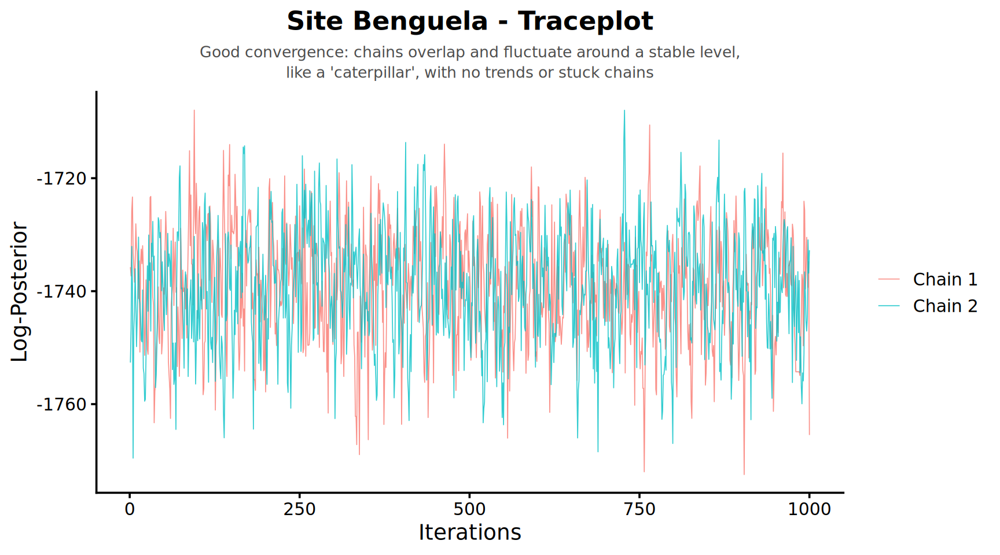

**Gelman-Rubin plot**: the running R-hat statistic (comparing
between-chain to within-chain variance) as more iterations are included.
It should drop and flatten out close to 1 as the x-axis progresses; a
shrink factor that stays high or keeps climbing means the chains still
haven’t settled on the same distribution. `NULL` when only a single
chain was run.

``` numberSource
conv_plots$gelman_rubin
```

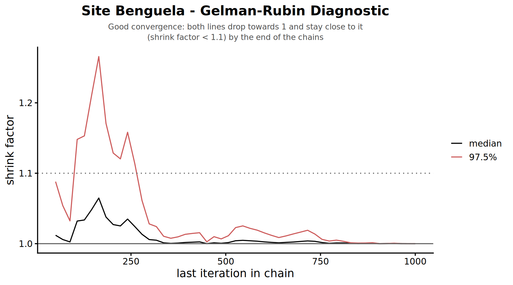

**Log-posterior distribution**: a histogram of the log-posterior across
all post-warmup draws, chains pooled. It should be a single smooth,
roughly bell-shaped distribution. Multiple separated peaks are a sign
the sampler is jumping between distinct modes rather than settling into
one region of the posterior.

``` numberSource
conv_plots$log_posterior
```

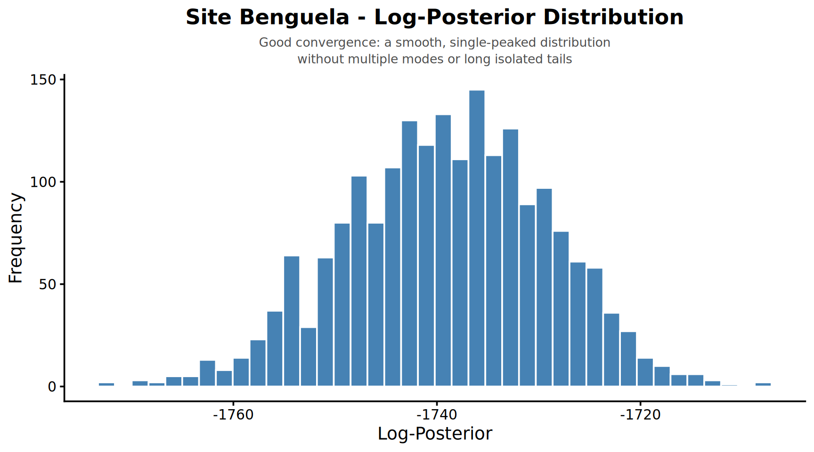

**Autocorrelation**: one panel per chain, showing how correlated the
log-posterior is with itself at increasing lags. It should decay quickly
to (and stay near) zero within the first few lags. A slow decay means
consecutive draws are still very similar to each other, which is exactly
what drags `ESS_Bulk`/`ESS_Tail` down even when R-hat looks fine.

``` numberSource
conv_plots$autocorrelation
```

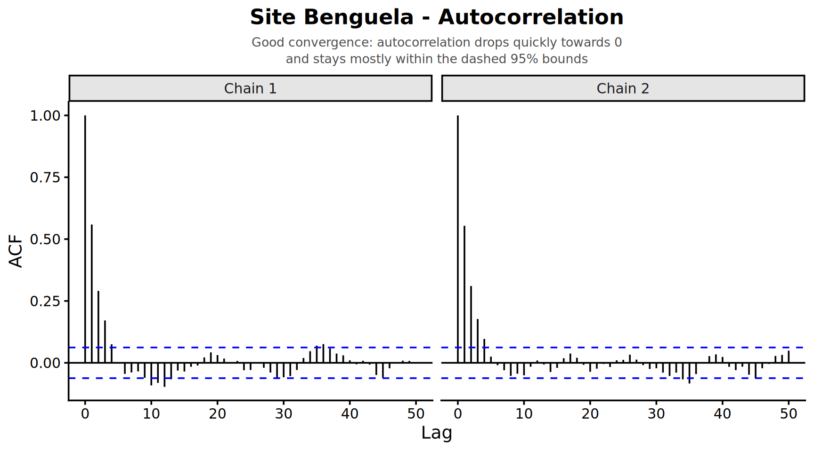

> **Tip**
>
> **💡To visualize all four panels at once:** pass
> `combine_plots = TRUE` to get a fifth element, `conv_plots$combined`,
> with all four arranged in a 2x2 grid via
> [`patchwork::wrap_plots()`](https://patchwork.data-imaginist.com/reference/wrap_plots.html).
> **If any of the panels look unusual** (a drifting trace, a shrink
> factor that hasn’t flattened, a multi-modal histogram, or
> slow-decaying autocorrelation), the fix is the same: raise `iter`
> and/or `n_chains` in `mcmc_config` and rerun.
>
> **Advanced:** if you also want to see the MCMC sampler own live
> divergence/treedepth/E-BFMI warnings while you re-tune (silenced by
> default), pass `suppress_warnings = FALSE` to
> [`classify_infections()`](https://swisstph.github.io/MalReBay/reference/classify_infections.md)
> or
> [`MalReBay()`](https://swisstph.github.io/MalReBay/reference/MalReBay.md).

``` numberSource
conv_plots_combined <- plot_likelihood_diagnostics(
  all_chains_loglikelihood = results$mcmc_loglikelihoods[[site_name]],
  site_name                = site_name,
  save_plot                = FALSE,
  verbose                  = FALSE,
  combine_plots            = TRUE
)

conv_plots_combined$combined
```

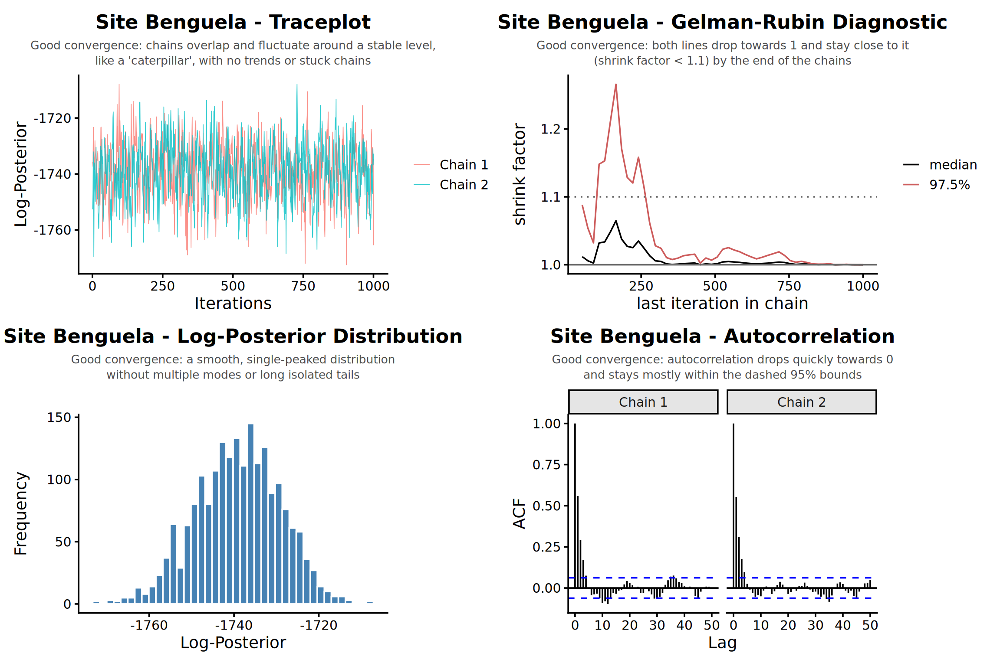

### 5.4 What non-convergence looks like

For comparison, here is the same site classified with far too few
iterations (`iter = 50`, well below the recommended minimum) which is a
useful reference for recognizing a bad run on your own data.

``` numberSource
bad_mcmc_config <- list(n_chains = 2, iter = 150, burn_in_frac = 0.25, random_seed = 55)

results_nonconverge <- MalReBay(
  filepath        = example_file,
  marker_filepath = marker_file,
  mcmc_config     = bad_mcmc_config,
  output_folder   = NULL,
  verbose         = FALSE,
  plots           = FALSE
)
```

    Running MCMC with 2 parallel chains...

    Chain 1 WARNING: There aren't enough warmup iterations to fit the
    Chain 1          three stages of adaptation as currently configured.
    Chain 1          Reducing each adaptation stage to 15%/75%/10% of
    Chain 1          the given number of warmup iterations:
    Chain 1            init_buffer = 7
    Chain 1            adapt_window = 38
    Chain 1            term_buffer = 5
    Chain 2 WARNING: There aren't enough warmup iterations to fit the
    Chain 2          three stages of adaptation as currently configured.
    Chain 2          Reducing each adaptation stage to 15%/75%/10% of
    Chain 2          the given number of warmup iterations:
    Chain 2            init_buffer = 7
    Chain 2            adapt_window = 38
    Chain 2            term_buffer = 5
    Chain 1 finished in 33.2 seconds.
    Chain 2 finished in 34.2 seconds.

    Both chains finished successfully.
    Mean chain execution time: 33.7 seconds.
    Total execution time: 34.3 seconds.

``` numberSource
results_nonconverge$convergence
```

Compared to the converged run above, `ESS_Bulk`/`ESS_Tail` fall well
below the `400` threshold, and the Gelman-Rubin plot shows the shrink
factor hasn’t fully flattened to 1 by the end of the (short) run:

``` numberSource
site_nonconverge <- names(results_nonconverge$mcmc_loglikelihoods)[1]

diag_nonconverge <- plot_likelihood_diagnostics(
  all_chains_loglikelihood = results_nonconverge$mcmc_loglikelihoods[[site_nonconverge]],
  site_name                = site_nonconverge,
  save_plot                = FALSE,
  verbose                  = FALSE,
  combine_plots            = TRUE
)

diag_nonconverge$combined
```

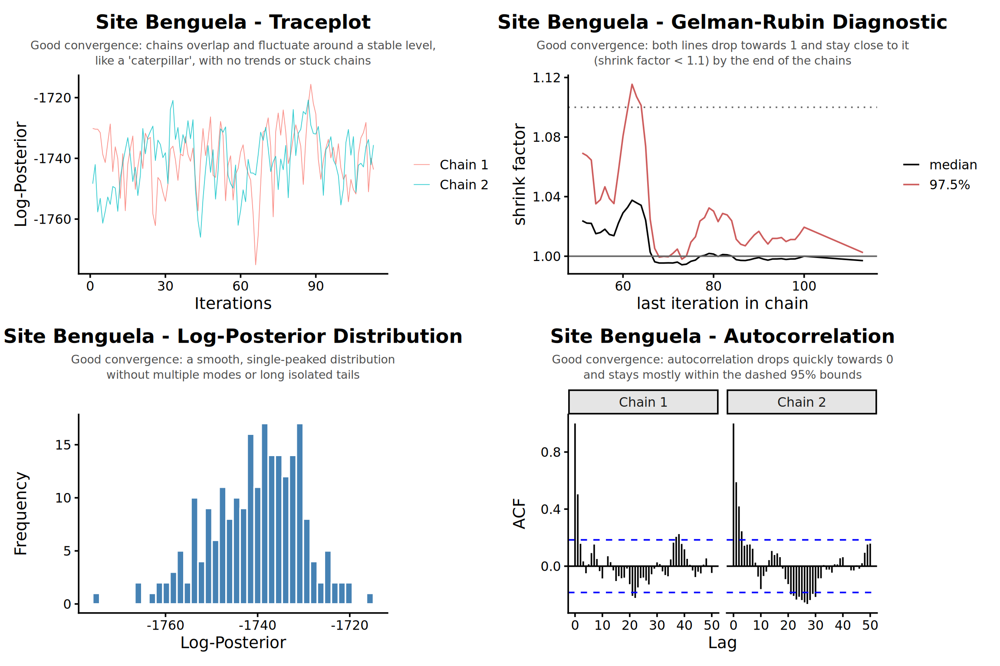

> **Important**
>
> **💡A stable-looking classification is not proof of convergence.** On
> this small demo dataset, the final Recrudescence/New infection counts
> happen to come out identical between the converged and non-converged
> runs below:
>
> ``` numberSource
> classification_counts <- function(res, label) {
>   data.frame(
>     Scenario        = label,
>     Recrudescence   = sum(res$posterior_probabilities$Classification == "Recrudescence", na.rm = TRUE),
>     `New infection` = sum(res$posterior_probabilities$Classification == "New infection", na.rm = TRUE),
>     check.names     = FALSE
>   )
> }
>
> rbind(
>   classification_counts(results, paste0("Converged (", quick_config$iter, " iterations)")),
>   classification_counts(results_nonconverge, "Non-converged (200 iterations)")
> )
> ```
>
> This is just a coincidence and not a guarantee. With real data,
> borderline patients (`Probability` near `prob_threshold`) are exactly
> the ones most likely to change. Always check `results$convergence` and
> the plots above.

Going back to the previous example where the algorithm converged and
results were robust, the distribution of the posterior probability of
recrudescence can be visualized to gather a general understanding of the
classification outcome. An overview across all sites, as well as per
site can be generated:

``` numberSource
p_hist <- plot_probability_histogram(results, output_folder = NULL)
```

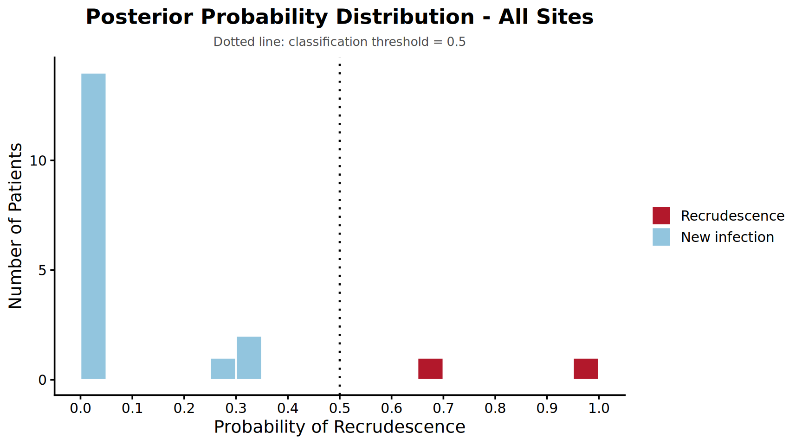

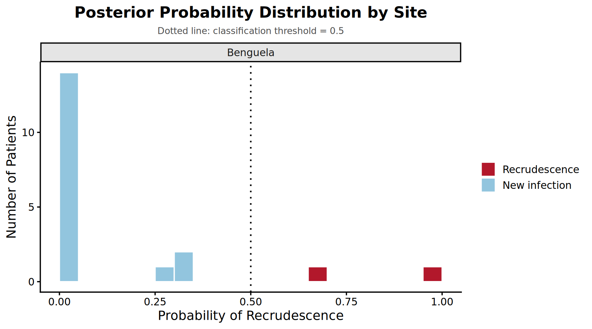

In this case, the classification threshold was the default 0.5, so all
the infections with the posterior probability of recrudescence larger
than 0.5 were classified as recrudescence, while the remaining ones were
classified as new infections.

> **Important**
>
> **💡A** **probability** **distribution with most mass near 0 and 1
> (few infections near 0.5) indicates the markers were informative for
> most patients**. If the probability of some infections is around 0.5,
> it means that the algorithm could not find strong evidence for either
> outcome (recrudescence or reinfection). It is possible to set a more
> strict threshold for classification in the MalReBay function call. For
> example, if we consider only infections with probability above 0.8:

``` numberSource
results <- MalReBay(
  filepath        = example_file,
  marker_filepath = marker_file,
  mcmc_config     = quick_config,
  output_folder   = NULL,
  verbose         = TRUE,
  prob_threshold = 0.8, 
  plots = FALSE
)
```

    Running MCMC with 2 parallel chains...

    Chain 1 Iteration:    1 / 2000 [  0%]  (Warmup)
    Chain 2 Iteration:    1 / 2000 [  0%]  (Warmup)
    Chain 1 Iteration:  500 / 2000 [ 25%]  (Warmup)
    Chain 2 Iteration:  500 / 2000 [ 25%]  (Warmup)
    Chain 2 Iteration: 1000 / 2000 [ 50%]  (Warmup)
    Chain 2 Iteration: 1001 / 2000 [ 50%]  (Sampling)
    Chain 1 Iteration: 1000 / 2000 [ 50%]  (Warmup)
    Chain 1 Iteration: 1001 / 2000 [ 50%]  (Sampling)
    Chain 2 Iteration: 1500 / 2000 [ 75%]  (Sampling)
    Chain 1 Iteration: 1500 / 2000 [ 75%]  (Sampling)
    Chain 1 Iteration: 2000 / 2000 [100%]  (Sampling)
    Chain 2 Iteration: 2000 / 2000 [100%]  (Sampling)
    Chain 1 finished in 32.4 seconds.
    Chain 2 finished in 32.4 seconds.

    Both chains finished successfully.
    Mean chain execution time: 32.4 seconds.
    Total execution time: 32.4 seconds.

    Convergence Diagnostics for: Benguela
    --------------------------------------------------
    Classical Gelman-Rubin R-hat:
    Potential scale reduction factors:

      Point est. Upper C.I.
               1          1


    Rank-normalised R-hat (Vehtari 2021): 1.0017   [PASS]

    Classical ESS (coda): 569.5
    Bulk ESS: 617.4   [PASS]
    Tail ESS: 1201.5   [PASS]

    Geweke Z-scores per chain |Z| < 1.96 = stationary:
      Chain 1: Z = 0.4904  [PASS]
      Chain 2: Z = -1.3438  [PASS]
    -------------------------------------------------- 

``` numberSource
p_hist <- plot_probability_histogram(results, output_folder = NULL)
```

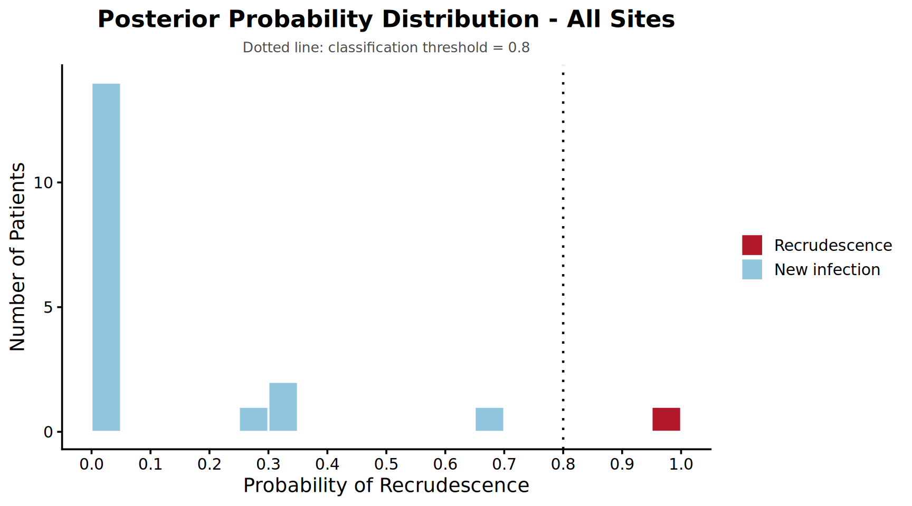

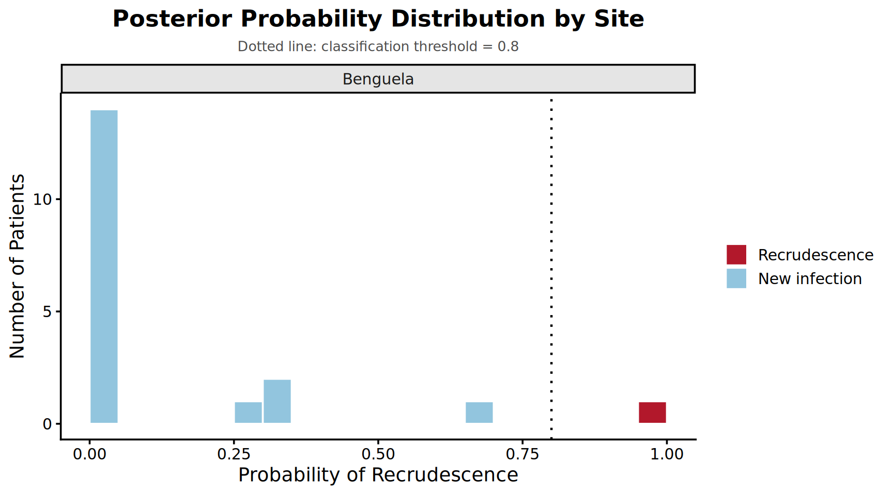

Another way to visualize the classification results is a patient-wise
comparison between MalReBay and match counting algorithms where each row
represents a patient with a recurrent infection, and each column
presents the result of the match counting algorithms (yes/no) and of
MalReBay (probability of recrudescence):

``` numberSource
p_comparison_heatmap <- plot_comparison_heatmap(results, 
                                                imported_data$marker_info, 
                                                output_folder = NULL)
```

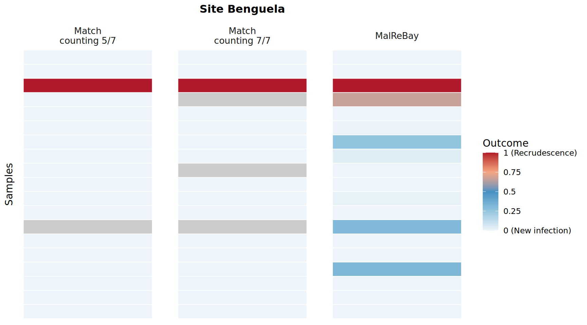


### 5.5 Example 2: AmpSeq

The same `MalReBay` function is used for AmpSeq data as well, same
`marker_filepath` (already containing AmpSeq markers), just a different
genotyping file. MalReBay detects the AmpSeq format automatically from
the haplotype strings.

``` numberSource
ampseq_file <- system.file("extdata", "Dataset_amplicon_sequencing.xlsx", package = "MalReBay")

ampseq_imported <- import_data(filepath = ampseq_file, marker_filepath = marker_file, verbose = TRUE)
head(ampseq_imported$late_failures[, 1:5])
```

As with the previous microsatellite example, it is worth visualizing the
imported data before running the pipeline:

``` numberSource
p_moi_ampseq <- plot_moi(ampseq_imported$late_failures, output_folder = NULL)
print(p_moi_ampseq$`1`)
```

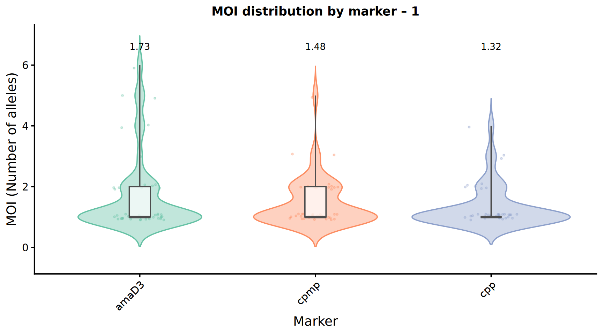

``` numberSource
p_div_ampseq <- plot_markers_diversity(
  genotypedata  = ampseq_imported$late_failures,
  data_type     = ampseq_imported$data_type,
  marker_info   = ampseq_imported$marker_info,
  output_folder = NULL
)
print(p_div_ampseq$by_site$`1`)
```


AmpSeq haplotypes are not numeric fragment sizes, so
[`plot_allele_distribution()`](https://swisstph.github.io/MalReBay/reference/plot_allele_distribution.md)
shows a bar chart of frequency per haplotype name instead of a size
histogram:

``` numberSource
p_allele_ampseq <- plot_allele_distribution(
  genotypedata  = ampseq_imported$late_failures,
  marker_info   = ampseq_imported$marker_info,
  output_folder = NULL,
  max_cols      = 1
)
print(p_allele_ampseq$by_site$`1`)
```

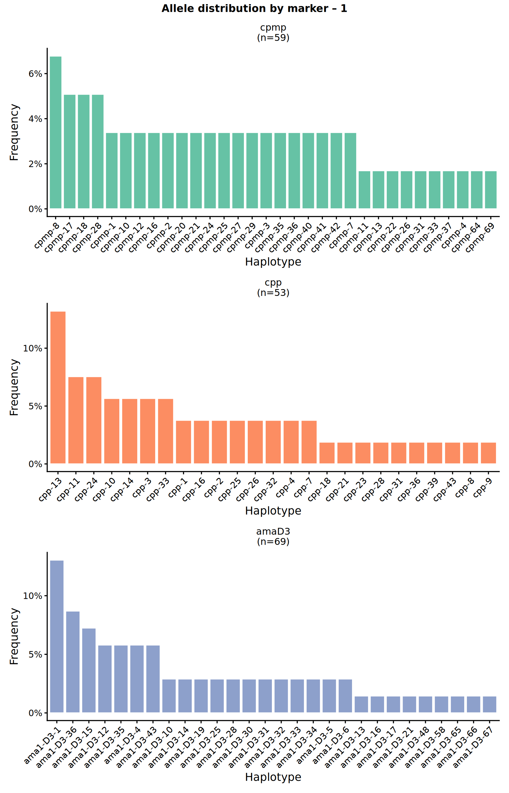

Finally, to run the entire MalReBay analysis and obtain the results and
visualizations:

``` numberSource
ampseq_results <- MalReBay(
  filepath        = ampseq_file,
  marker_filepath = marker_file,
  mcmc_config     = quick_config,
  output_folder   = NULL,
  verbose         = TRUE
)
```

    Running MCMC with 2 parallel chains...

    Chain 1 Iteration:    1 / 2000 [  0%]  (Warmup)
    Chain 2 Iteration:    1 / 2000 [  0%]  (Warmup)
    Chain 1 Iteration:  500 / 2000 [ 25%]  (Warmup)
    Chain 2 Iteration:  500 / 2000 [ 25%]  (Warmup)
    Chain 2 Iteration: 1000 / 2000 [ 50%]  (Warmup)
    Chain 2 Iteration: 1001 / 2000 [ 50%]  (Sampling)
    Chain 1 Iteration: 1000 / 2000 [ 50%]  (Warmup)
    Chain 1 Iteration: 1001 / 2000 [ 50%]  (Sampling)
    Chain 2 Iteration: 1500 / 2000 [ 75%]  (Sampling)
    Chain 1 Iteration: 1500 / 2000 [ 75%]  (Sampling)
    Chain 2 Iteration: 2000 / 2000 [100%]  (Sampling)
    Chain 2 finished in 13.8 seconds.
    Chain 1 Iteration: 2000 / 2000 [100%]  (Sampling)
    Chain 1 finished in 14.3 seconds.

    Both chains finished successfully.
    Mean chain execution time: 14.1 seconds.
    Total execution time: 14.4 seconds.

    Convergence Diagnostics for: 1
    --------------------------------------------------
    Classical Gelman-Rubin R-hat:
    Potential scale reduction factors:

      Point est. Upper C.I.
               1       1.02


    Rank-normalised R-hat (Vehtari 2021): 1.001   [PASS]

    Classical ESS (coda): 657.2
    Bulk ESS: 598.8   [PASS]
    Tail ESS: 794   [PASS]

    Geweke Z-scores per chain |Z| < 1.96 = stationary:
      Chain 1: Z = -0.0665  [PASS]
      Chain 2: Z = -1.8469  [PASS]
    -------------------------------------------------- 

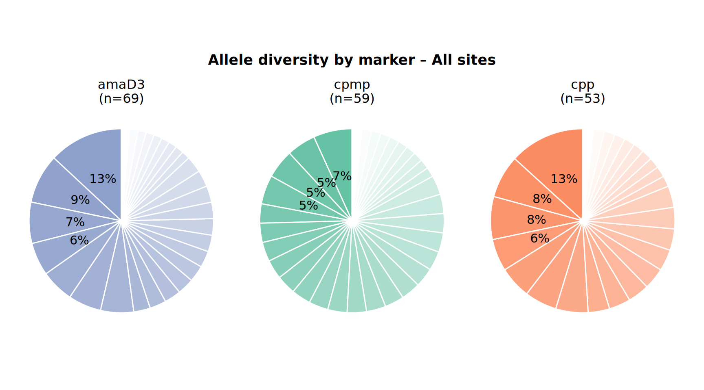


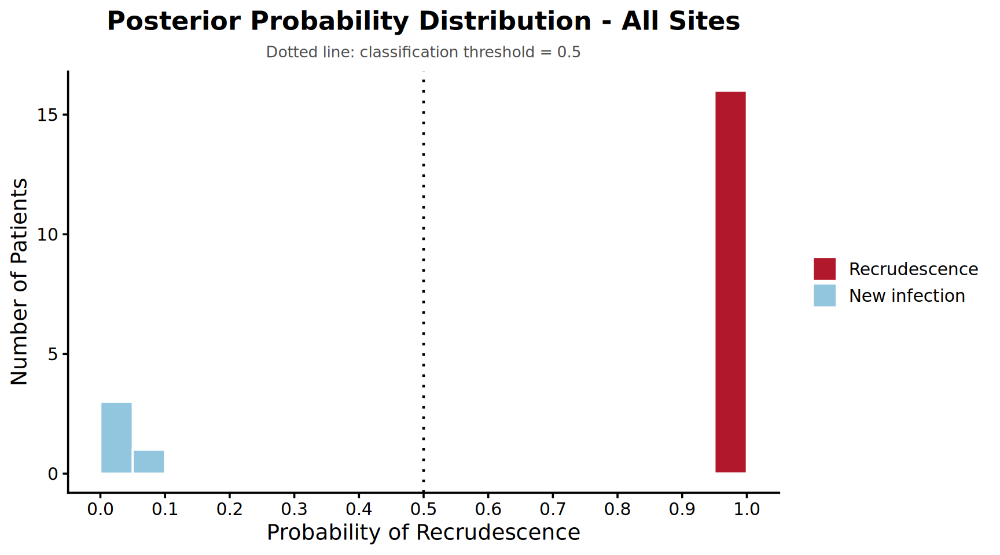

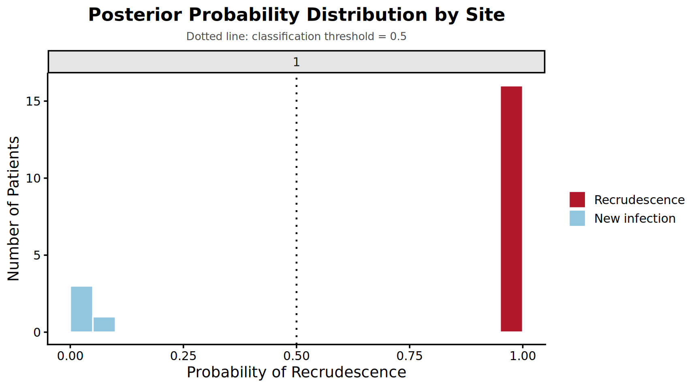

``` numberSource
head(ampseq_results$posterior_probabilities)
```

Finally, let’s have a closer look at the convergence diagnostics:

``` numberSource
ampseq_results$convergence
```

``` numberSource
conv_plots_combined_ampseq <- plot_likelihood_diagnostics(
  all_chains_loglikelihood = ampseq_results$mcmc_loglikelihoods$`1`,
  site_name                = "1",
  save_plot                = FALSE,
  verbose                  = FALSE,
  combine_plots            = TRUE
)

print(conv_plots_combined_ampseq$combined)
```

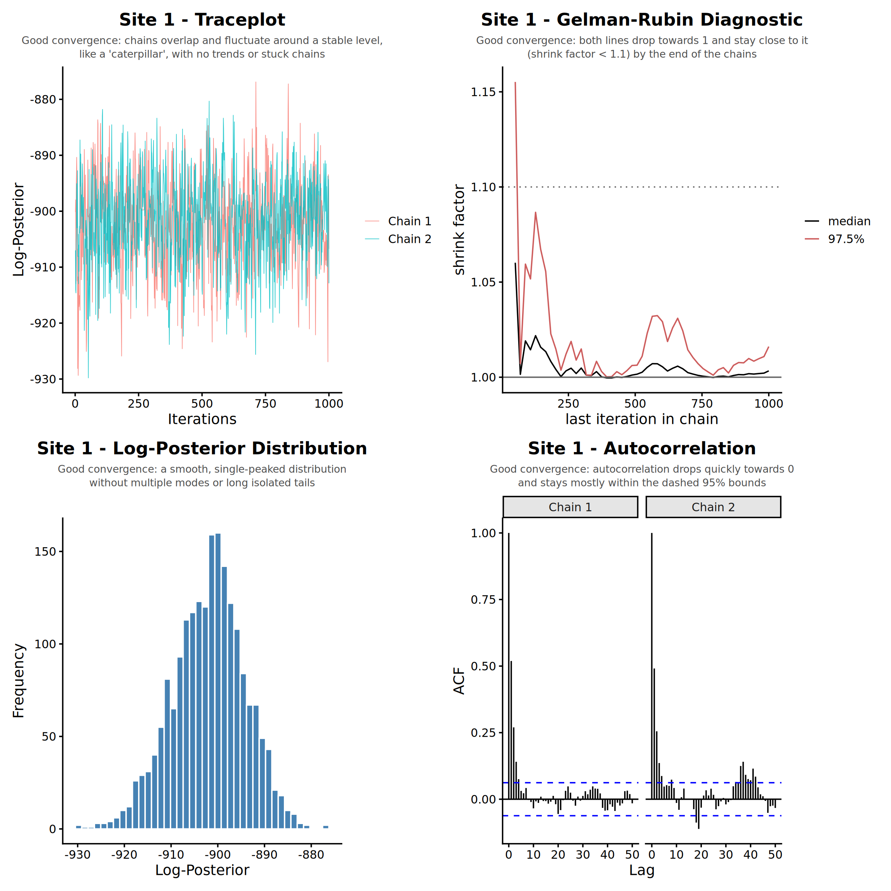

### 5.6 Example 3: MSP1 / MSP2 / GLURP

For the final example, this tutorial uses a real MSP1/MSP2/GLURP panel
from an Ugandan TES published in [*Mwesigwa et
al. 2025*](https://pmc.ncbi.nlm.nih.gov/articles/PMC11799330/) with 54
patients across three sites, genotyped at the MSP1 family variants
(`K1`, `MAD20`, `RO33`), the MSP2 family variants (`3D7`, `FC27`), and
`glurp`.

``` numberSource
msp_file <- system.file("extdata", "Dataset_msp_glurp.xlsx", package = "MalReBay")

msp_imported <- import_data(filepath = msp_file, marker_filepath = marker_file, verbose = TRUE)
head(msp_imported$late_failures[, 1:8])
```

> **Note**
>
> **💡**Notice `R033` in the column names above: this dataset spells the
> MSP1 family variant RO33 with a zero instead of a letter O, a common
> transcription slip in lab spreadsheets.
> [`detect_msp_variants()`](https://swisstph.github.io/MalReBay/reference/detect_msp_variants.md)
> normalises `0`/`O` before matching, so it’s still recognised as RO33
> and folded into the `msp1` call.

All three plotting functions apply across the three sites, one
violin/pie/histogram per MSP1 and MSP2 family variant plus `glurp`:

``` numberSource
p_moi_msp <- plot_moi(msp_imported$late_failures, output_folder = NULL)
print(p_moi_msp)
```

    $A


    $B

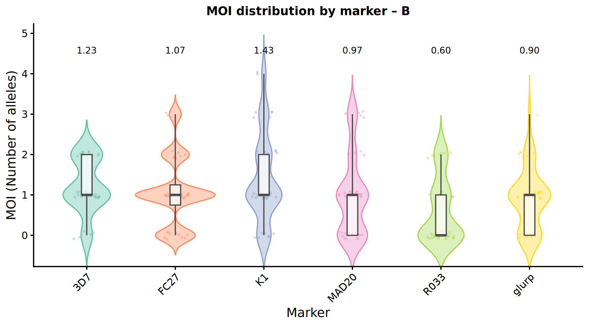

    $C

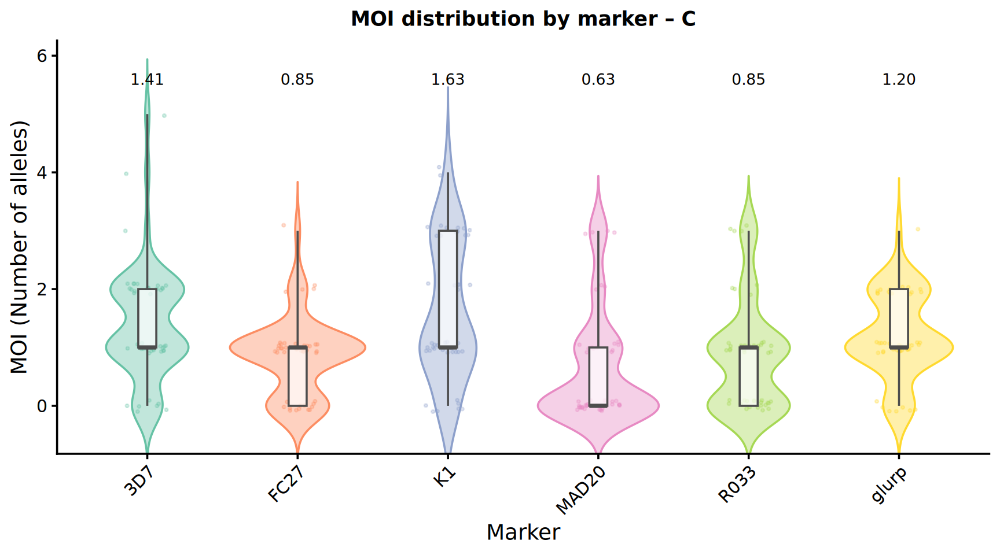

Similarly, the allele diversity across all sites and per site:

``` numberSource
p_div_msp <- plot_markers_diversity(
  genotypedata  = msp_imported$late_failures,
  data_type     = msp_imported$data_type,
  marker_info   = msp_imported$marker_info,
  output_folder = NULL
)
print(p_div_msp$all_sites)
```

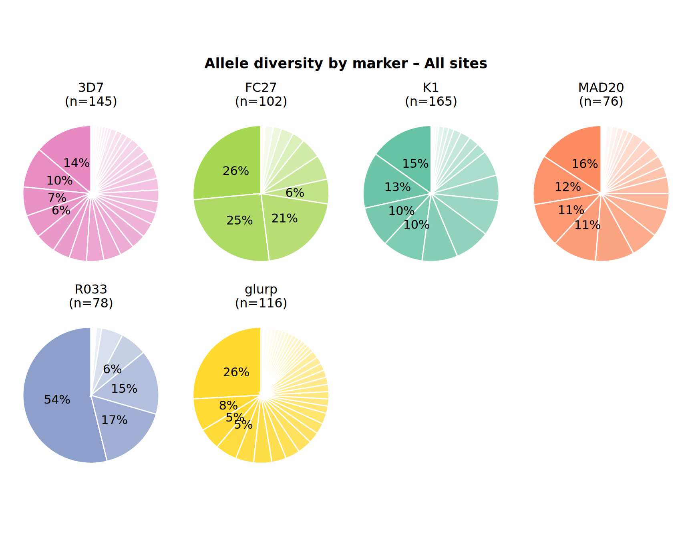

``` numberSource
for (p in p_div_msp$by_site) print(p)
```

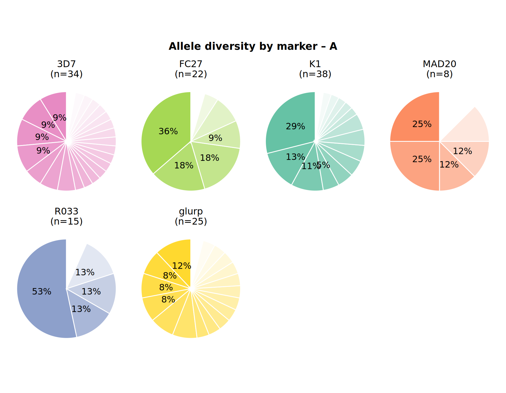

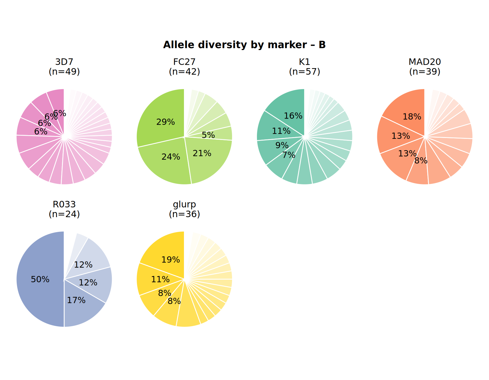

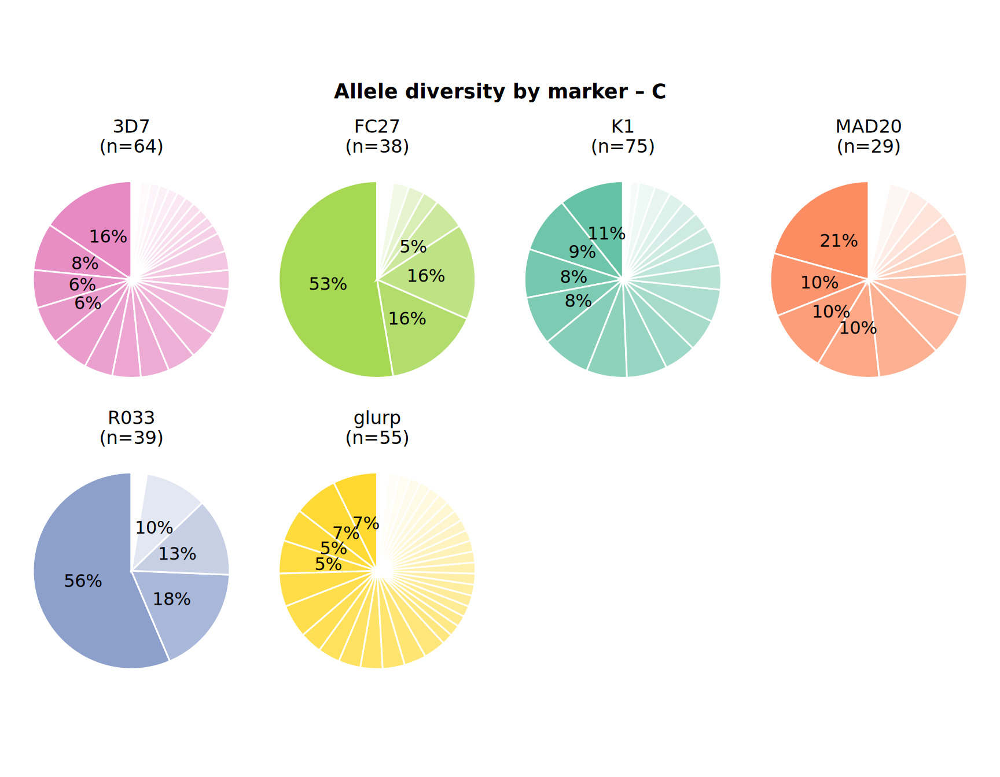

And the allele frequency distribution:

``` numberSource
p_allele_msp <- plot_allele_distribution(
  genotypedata  = msp_imported$late_failures,
  marker_info   = msp_imported$marker_info,
  output_folder = NULL
)
print(p_allele_msp$all_sites)
```

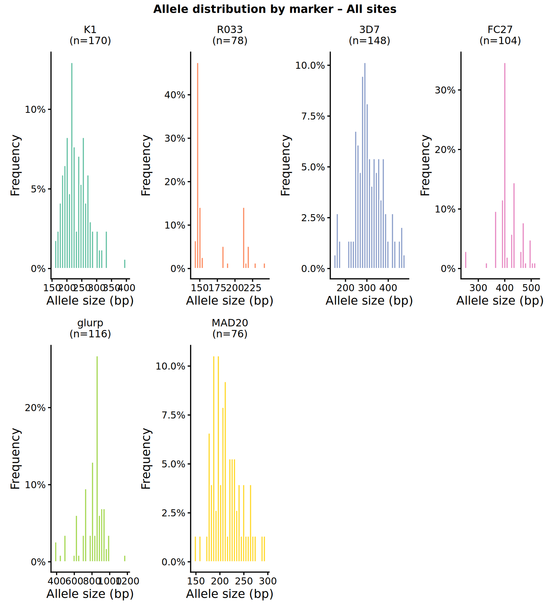

``` numberSource
for (p in p_allele_msp$by_site) print(p)
```

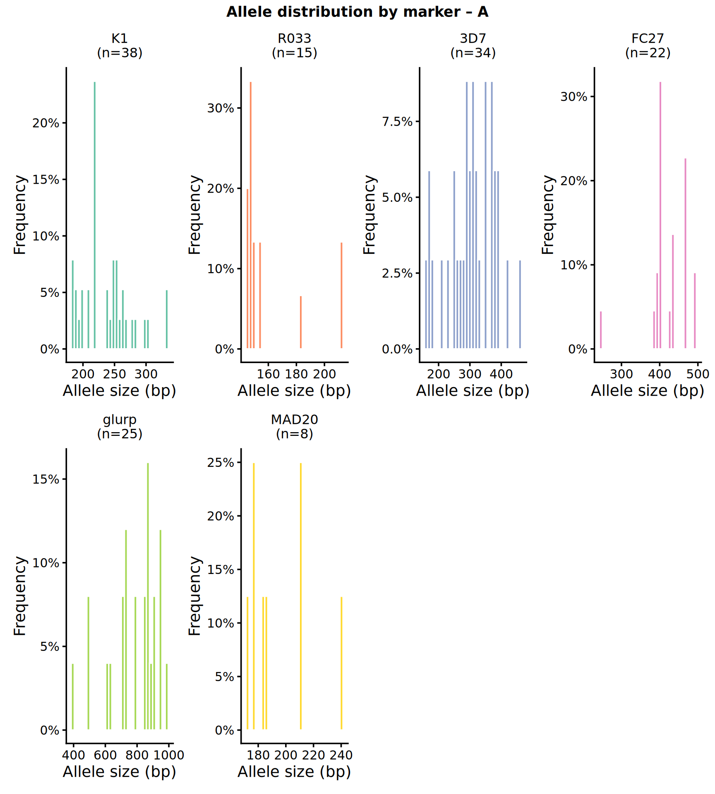

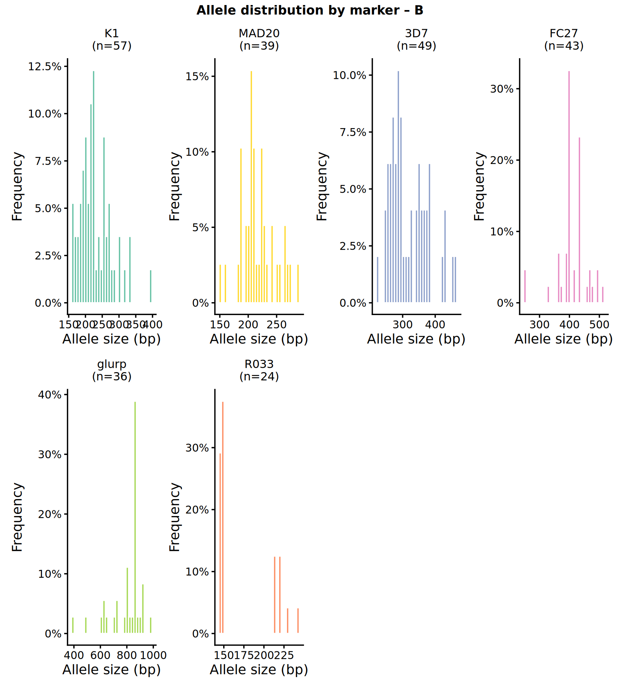

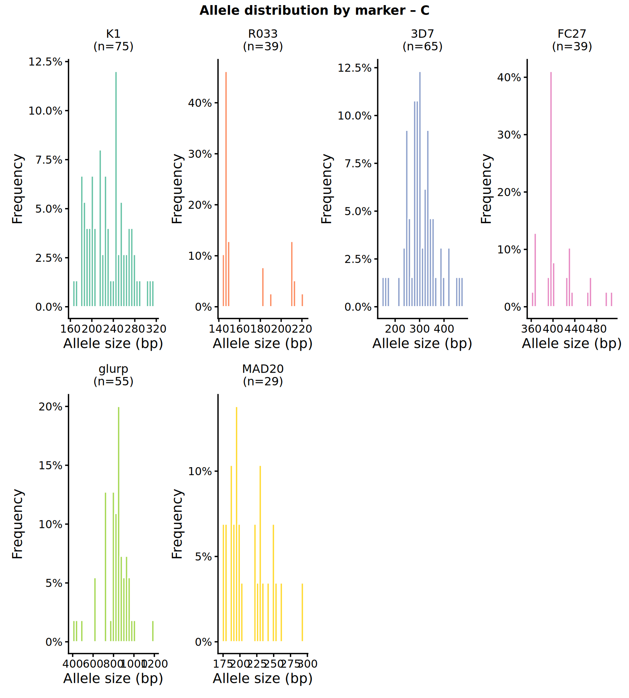

Genotyping in the field is rarely complete for every marker at every
visit, so it’s normal to see fewer comparable loci per patient here than
in the microsatellite panel above:

``` numberSource
msp_results <- MalReBay(
  filepath        = msp_file,
  marker_filepath = marker_file,
  mcmc_config     = list(n_chains = 2, iter = 1500, burn_in_frac = 0.5, random_seed = 42),
  output_folder   = NULL,
  verbose         = TRUE
)
```

    Running MCMC with 2 parallel chains...

    Chain 1 Iteration:    1 / 1500 [  0%]  (Warmup)
    Chain 2 Iteration:    1 / 1500 [  0%]  (Warmup)
    Chain 1 Iteration:  500 / 1500 [ 33%]  (Warmup)
    Chain 2 Iteration:  500 / 1500 [ 33%]  (Warmup)
    Chain 2 Iteration:  751 / 1500 [ 50%]  (Sampling)
    Chain 1 Iteration:  751 / 1500 [ 50%]  (Sampling)
    Chain 2 Iteration: 1250 / 1500 [ 83%]  (Sampling)
    Chain 2 Iteration: 1500 / 1500 [100%]  (Sampling)
    Chain 2 finished in 25.8 seconds.
    Chain 1 Iteration: 1250 / 1500 [ 83%]  (Sampling)
    Chain 1 Iteration: 1500 / 1500 [100%]  (Sampling)
    Chain 1 finished in 31.1 seconds.

    Both chains finished successfully.
    Mean chain execution time: 28.5 seconds.
    Total execution time: 31.3 seconds.

    Running MCMC with 2 parallel chains...

    Chain 1 Iteration:    1 / 1500 [  0%]  (Warmup)
    Chain 2 Iteration:    1 / 1500 [  0%]  (Warmup)
    Chain 1 Iteration:  500 / 1500 [ 33%]  (Warmup)
    Chain 2 Iteration:  500 / 1500 [ 33%]  (Warmup)
    Chain 1 Iteration:  751 / 1500 [ 50%]  (Sampling)
    Chain 2 Iteration:  751 / 1500 [ 50%]  (Sampling)
    Chain 1 Iteration: 1250 / 1500 [ 83%]  (Sampling)
    Chain 1 Iteration: 1500 / 1500 [100%]  (Sampling)
    Chain 1 finished in 58.2 seconds.
    Chain 2 Iteration: 1250 / 1500 [ 83%]  (Sampling)
    Chain 2 Iteration: 1500 / 1500 [100%]  (Sampling)
    Chain 2 finished in 81.8 seconds.

    Both chains finished successfully.
    Mean chain execution time: 70.0 seconds.
    Total execution time: 81.9 seconds.

    Running MCMC with 2 parallel chains...

    Chain 1 Iteration:    1 / 1500 [  0%]  (Warmup)
    Chain 2 Iteration:    1 / 1500 [  0%]  (Warmup)
    Chain 1 Iteration:  500 / 1500 [ 33%]  (Warmup)
    Chain 2 Iteration:  500 / 1500 [ 33%]  (Warmup)
    Chain 1 Iteration:  751 / 1500 [ 50%]  (Sampling)
    Chain 2 Iteration:  751 / 1500 [ 50%]  (Sampling)
    Chain 2 Iteration: 1250 / 1500 [ 83%]  (Sampling)
    Chain 1 Iteration: 1250 / 1500 [ 83%]  (Sampling)
    Chain 2 Iteration: 1500 / 1500 [100%]  (Sampling)
    Chain 2 finished in 70.2 seconds.
    Chain 1 Iteration: 1500 / 1500 [100%]  (Sampling)
    Chain 1 finished in 72.3 seconds.

    Both chains finished successfully.
    Mean chain execution time: 71.2 seconds.
    Total execution time: 72.4 seconds.

    Convergence Diagnostics for: A
    --------------------------------------------------
    Classical Gelman-Rubin R-hat:
    Potential scale reduction factors:

      Point est. Upper C.I.
               1          1


    Rank-normalised R-hat (Vehtari 2021): 1.0059   [PASS]

    Classical ESS (coda): 402.4
    Bulk ESS: 397.5   [FAIL]
    Tail ESS: 793.5   [PASS]

    Geweke Z-scores per chain |Z| < 1.96 = stationary:
      Chain 1: Z = -1.7542  [PASS]
      Chain 2: Z = 2.1244  [FAIL]
    --------------------------------------------------
    Convergence Diagnostics for: B
    --------------------------------------------------
    Classical Gelman-Rubin R-hat:
    Potential scale reduction factors:

      Point est. Upper C.I.
               1          1


    Rank-normalised R-hat (Vehtari 2021): 1.0049   [PASS]

    Classical ESS (coda): 405.6
    Bulk ESS: 380.4   [FAIL]
    Tail ESS: 692.9   [PASS]

    Geweke Z-scores per chain |Z| < 1.96 = stationary:
      Chain 1: Z = 0.5171  [PASS]
      Chain 2: Z = 2.4352  [FAIL]
    --------------------------------------------------
    Convergence Diagnostics for: C
    --------------------------------------------------
    Classical Gelman-Rubin R-hat:
    Potential scale reduction factors:

      Point est. Upper C.I.
               1          1


    Rank-normalised R-hat (Vehtari 2021): 1.0012   [PASS]

    Classical ESS (coda): 422.4
    Bulk ESS: 447.6   [PASS]
    Tail ESS: 692.7   [PASS]

    Geweke Z-scores per chain |Z| < 1.96 = stationary:
      Chain 1: Z = -0.5868  [PASS]
      Chain 2: Z = 0.5974  [PASS]
    -------------------------------------------------- 

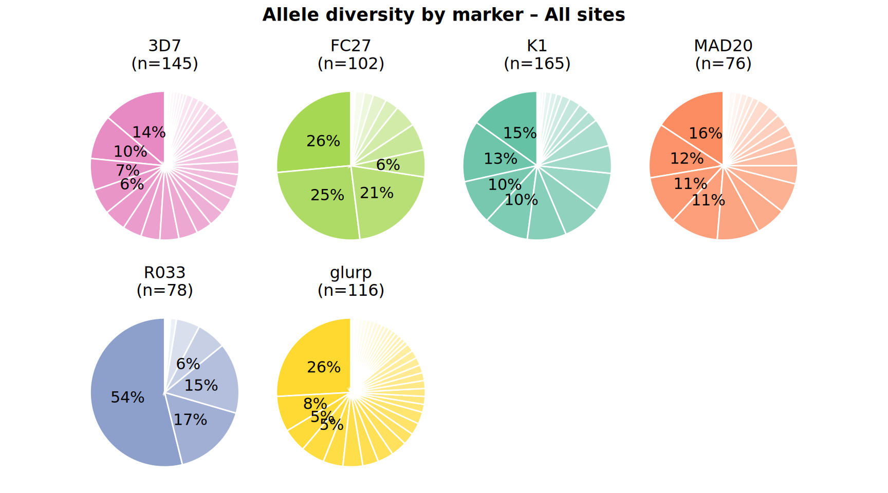

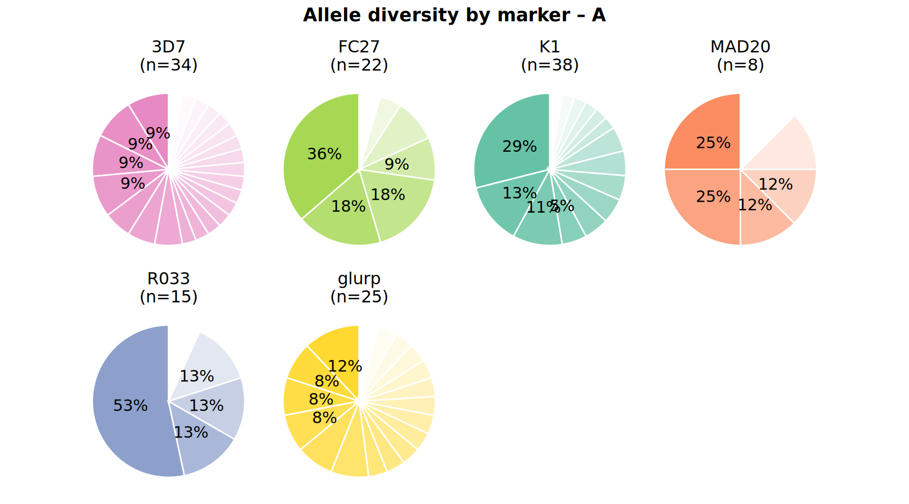

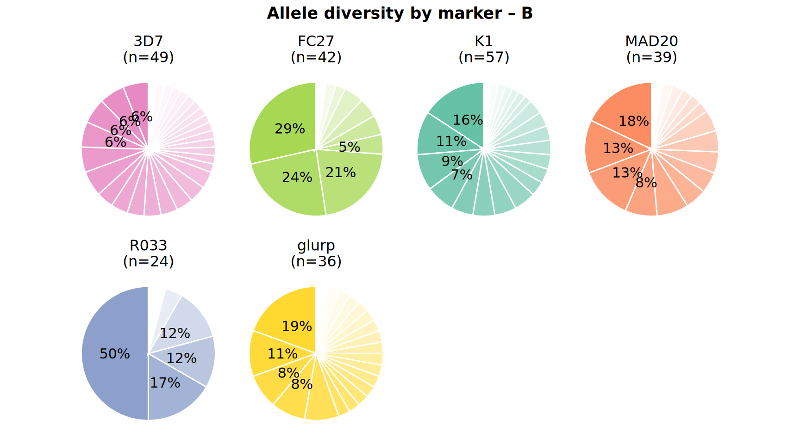

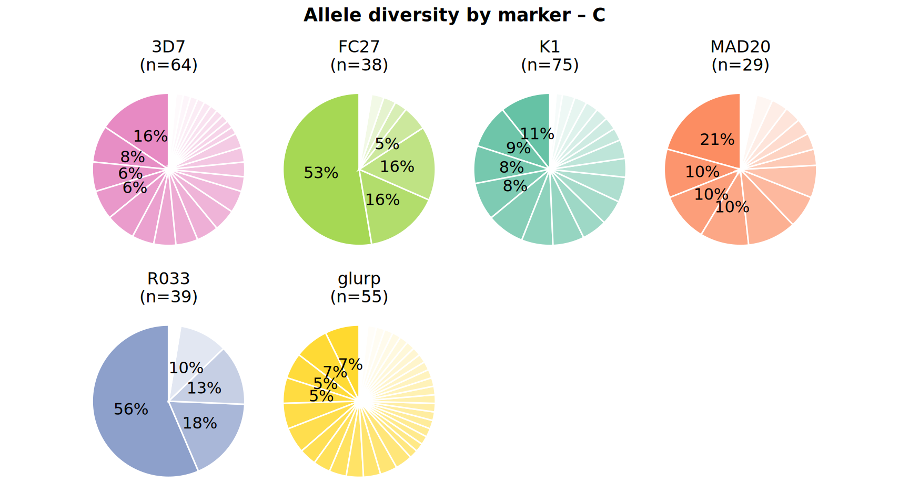

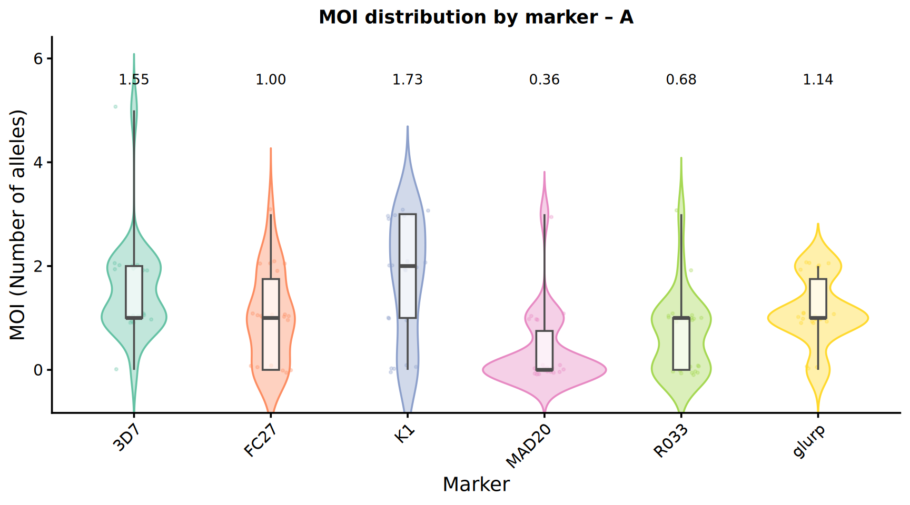


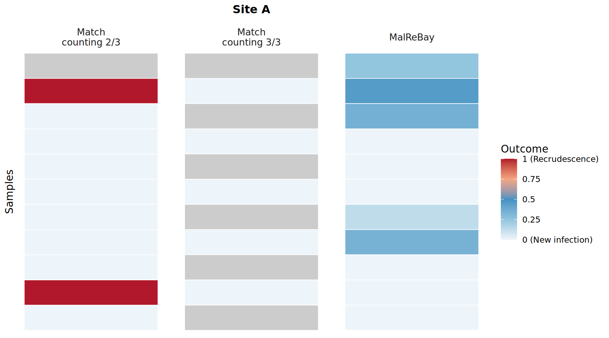

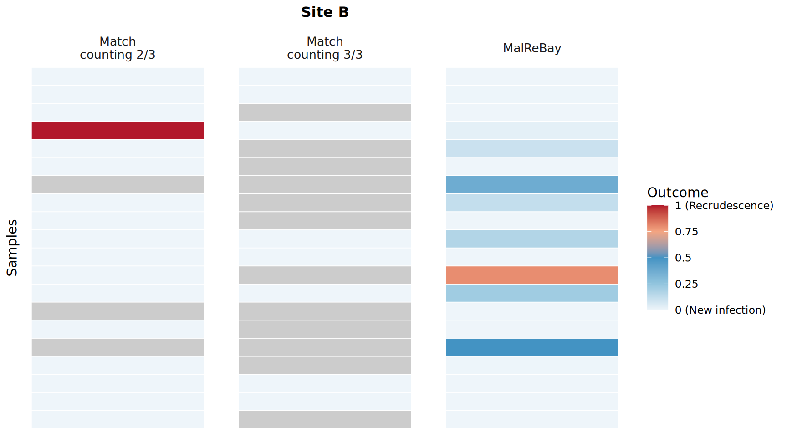

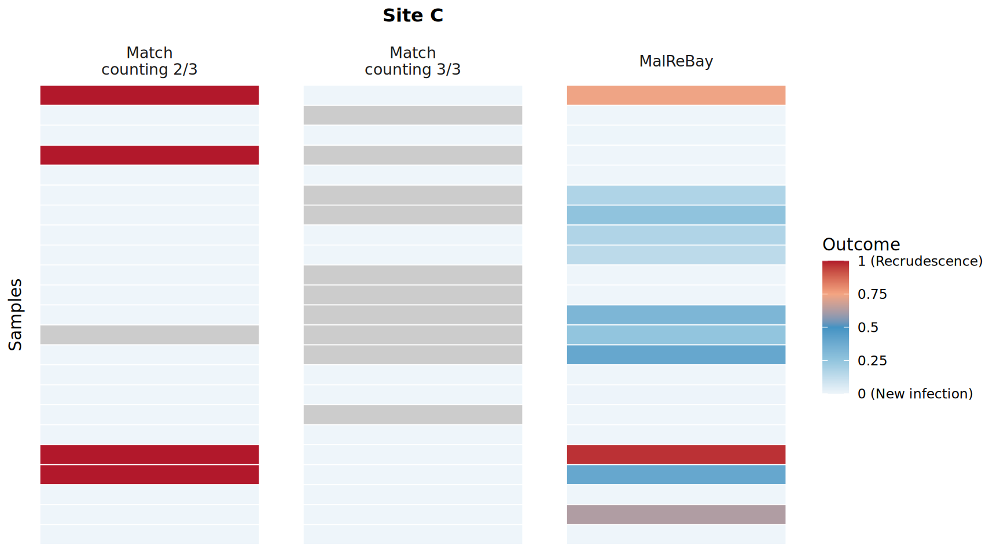

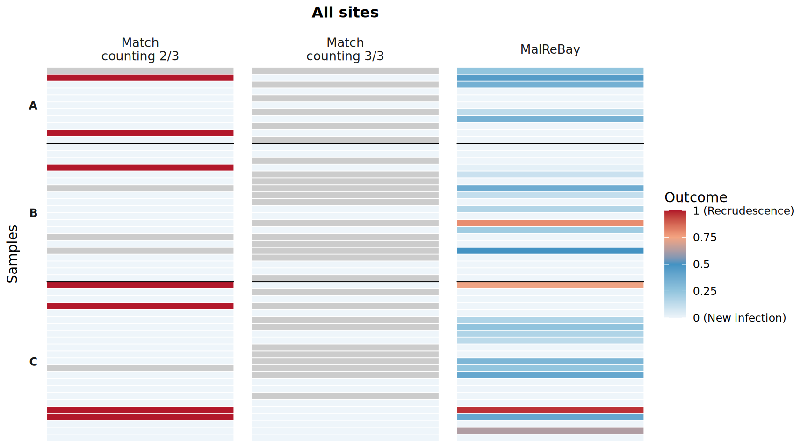

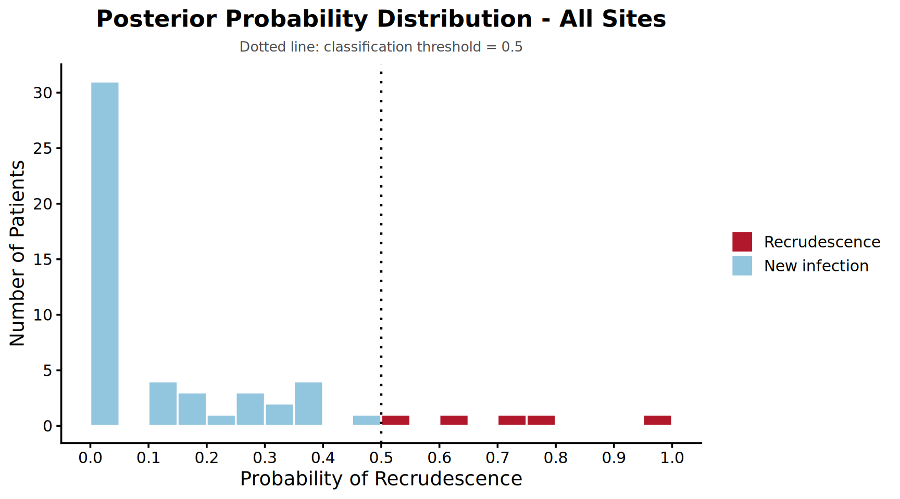

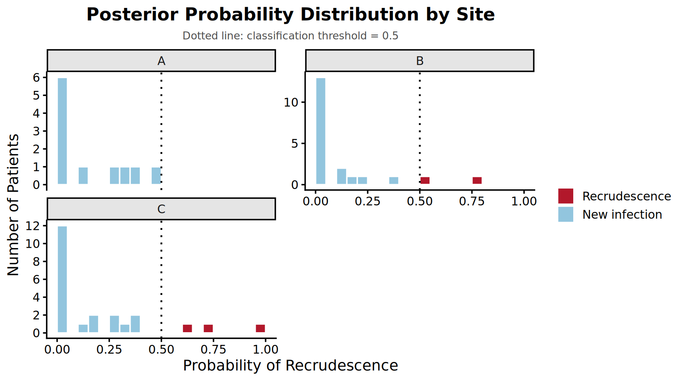

``` numberSource
head(msp_results$posterior_probabilities[, c("Site", "Sample.ID", "Probability", "N_Markers_Compared")], 10)
```

As you can see, in this example, there are quite a few infections where
the probability of recrudescence is close to 0.5. These are infections
where the genotyping data was not conclusive enough for a robust
probability estimation. Keep an eye on cases with very few markers
compared (`N_Markers_Compared` of 1 or 2 above) as there is not a lot of
genetic evidence to work with for those patients, resulting in the
probability sitting closer to 0.5.

Finally, let’s have a closer look at the convergence diagnostics which
confirm that the algorithm did converge:

``` numberSource
msp_results$convergence
```

``` numberSource
conv_plots_combined <- plot_likelihood_diagnostics(
  all_chains_loglikelihood = msp_results$mcmc_loglikelihoods$A,
  site_name                = "A",
  save_plot                = FALSE,
  verbose                  = FALSE,
  combine_plots            = TRUE
)

print(conv_plots_combined$combined)
```

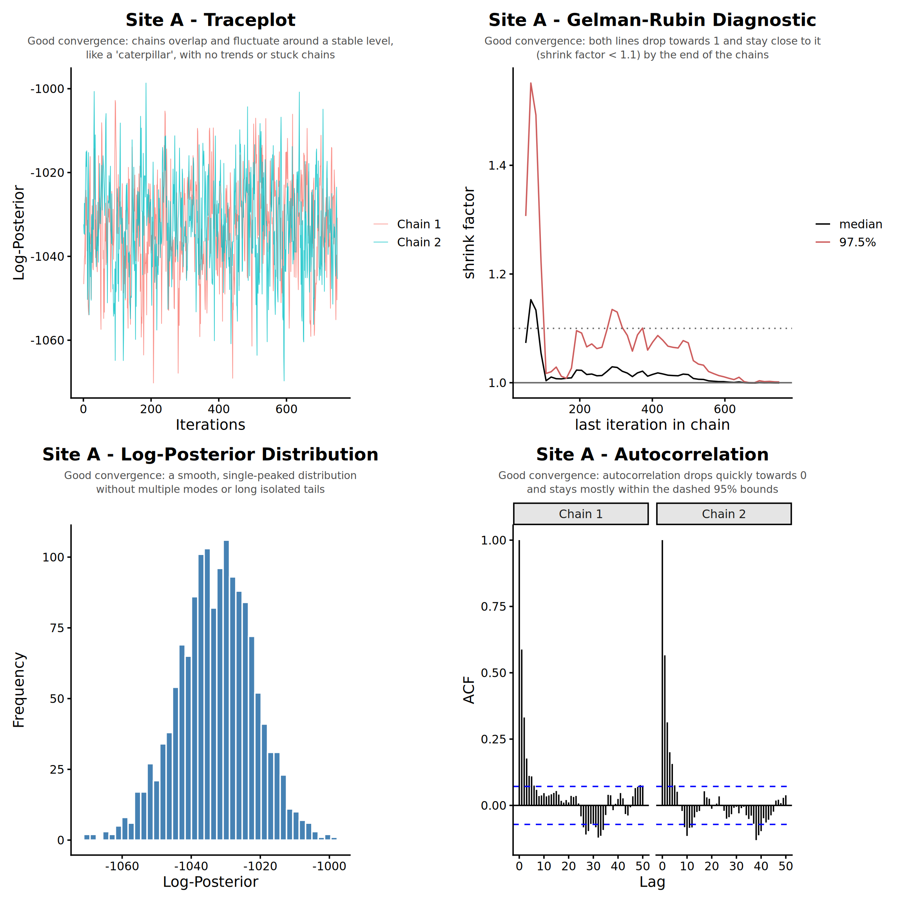

### 5.7 Using CSV files instead of Excel

`filepath` and `additional_filepath` both also accept `.csv` files —
[`import_data()`](https://swisstph.github.io/MalReBay/reference/import_data.md)
picks the reader based on the file extension. The one exception is
`marker_filepath`, which must stay Excel for now.

Each of the three example datasets above also ships as CSV in
`extdata/`, so you can try this without preparing your own files:

| Dataset | Excel | CSV |
|----|----|----|
| Microsatellites | `Dataset_microsatellite_panel.xlsx` | `Dataset_microsatellite_panel.csv` + `Dataset_microsatellite_panel_additional.csv` |
| AmpSeq | `Dataset_amplicon_sequencing.xlsx` | `Dataset_amplicon_sequencing.csv` |
| MSP1 / MSP2 / GLURP | `Dataset_msp_glurp.xlsx` | `Dataset_msp_glurp.csv` |

> **Note**
>
> A CSV file can only hold one sheet. Where the Excel version bundles
> recurrence and background samples together as two sheets in one
> workbook (like the microsatellite panel above), the CSV version is
> split into two files instead: the main one specified with the argument
> `filepath`, and the `_additional` specified with the argument
> `additional_filepath`.

The microsatellite example from CSV gives identical results to the Excel
version used above:

``` numberSource
microsat_csv       <- system.file("extdata", "Dataset_microsatellite_panel.csv", package = "MalReBay")
microsat_csv_extra <- system.file("extdata", "Dataset_microsatellite_panel_additional.csv", package = "MalReBay")

imported_from_csv <- import_data(
  filepath             = microsat_csv,
  marker_filepath      = marker_file,
  additional_filepath  = microsat_csv_extra,
  verbose              = TRUE
)
identical(imported_from_csv$late_failures, imported_data$late_failures)
```

    [1] TRUE

And the full pipeline, MCMC and all, runs the same way from a CSV
`filepath` as from Excel:

``` numberSource
ampseq_csv <- system.file("extdata", "Dataset_amplicon_sequencing.csv", package = "MalReBay")

ampseq_results_csv <- MalReBay(
  filepath        = ampseq_csv,
  marker_filepath = marker_file,
  mcmc_config     = quick_config,
  output_folder   = NULL,
  verbose         = TRUE
)
```

    Running MCMC with 2 parallel chains...

    Chain 1 Iteration:    1 / 2000 [  0%]  (Warmup)
    Chain 2 Iteration:    1 / 2000 [  0%]  (Warmup)
    Chain 1 Iteration:  500 / 2000 [ 25%]  (Warmup)
    Chain 2 Iteration:  500 / 2000 [ 25%]  (Warmup)
    Chain 2 Iteration: 1000 / 2000 [ 50%]  (Warmup)
    Chain 2 Iteration: 1001 / 2000 [ 50%]  (Sampling)
    Chain 1 Iteration: 1000 / 2000 [ 50%]  (Warmup)
    Chain 1 Iteration: 1001 / 2000 [ 50%]  (Sampling)
    Chain 2 Iteration: 1500 / 2000 [ 75%]  (Sampling)
    Chain 1 Iteration: 1500 / 2000 [ 75%]  (Sampling)
    Chain 2 Iteration: 2000 / 2000 [100%]  (Sampling)
    Chain 2 finished in 15.8 seconds.
    Chain 1 Iteration: 2000 / 2000 [100%]  (Sampling)
    Chain 1 finished in 16.1 seconds.

    Both chains finished successfully.
    Mean chain execution time: 15.9 seconds.
    Total execution time: 16.1 seconds.

    Convergence Diagnostics for: 1
    --------------------------------------------------
    Classical Gelman-Rubin R-hat:
    Potential scale reduction factors:

      Point est. Upper C.I.
               1       1.02


    Rank-normalised R-hat (Vehtari 2021): 1.001   [PASS]

    Classical ESS (coda): 657.2
    Bulk ESS: 598.8   [PASS]
    Tail ESS: 794   [PASS]

    Geweke Z-scores per chain |Z| < 1.96 = stationary:
      Chain 1: Z = -0.0665  [PASS]
      Chain 2: Z = -1.8469  [PASS]
    -------------------------------------------------- 


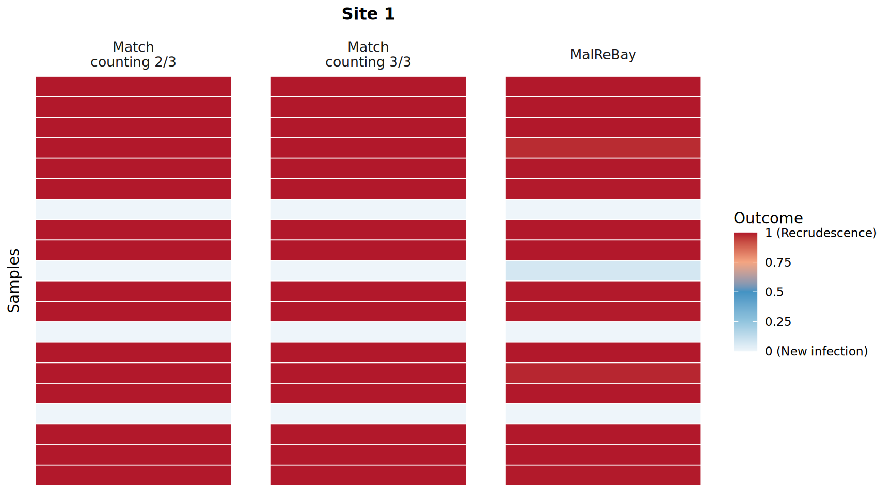

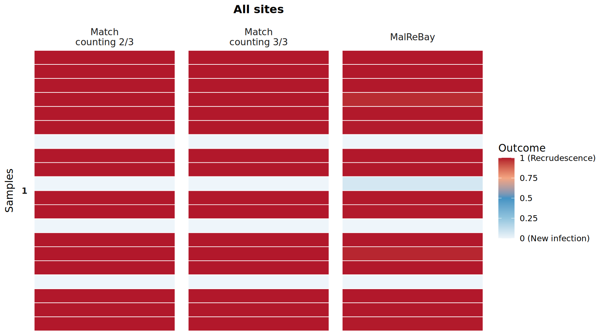


``` numberSource
head(ampseq_results_csv$posterior_probabilities)
```

------------------------------------------------------------------------

## 6 Interpreting the results

### 6.1 What the posterior probability actually measures

For each patient, MalReBay compares the Day-0 and recurrence genotypes
marker by marker and asks: how much more likely is this particular
pattern of alleles under “same infection persisting” (recrudescence)
than under “new, unrelated infection” (reinfection)? Three things drive
the answer:

- **How common the matching allele is.** Allele/family frequencies are
  estimated from the Day-0 samples in your data (the patients’ own Day-0
  rows, plus any background sheet). Matching on a *rare* allele is
  strong evidence of a shared origin, because it is an unlikely
  coincidence for two unrelated infections to share it. Matching on a
  *common* allele is much weaker evidence, because plenty of unrelated
  infections would share it anyway.
- **How the marker type defines a “match”.** Microsatellites use a
  distance-based decay (alleles a few repeat units apart under
  `repeatlength` are treated as more likely to be the same lineage with
  stutter/genotyping noise than as truly different); MSP1/MSP2/GLURP
  markers use family membership (same cluster vs. different cluster, per
  `repeatlength` as a gap threshold); AmpSeq uses exact haplotype
  identity.
- **Missing or hidden alleles are imputed**: if a patient is polyclonal
  and only some clones are observed, the model marginalizes over the
  plausible hidden ones rather than dropping the marker.

Evidence from each comparable marker is combined across markers
(assuming markers are independent, which is standard for the neutral
marker panels used in TES), and converted to a probability under an
equal 50/50 prior (i.e., before seeing the genotyping data,
recrudescence and reinfection are considered equally likely).

### 6.2 Reading the `Probability` column

`results$posterior_probabilities` already includes a `Classification`
column (`MalReBay_classification` in `results$comparison`), derived from
`Probability` by the `prob_threshold` argument to
[`MalReBay()`](https://swisstph.github.io/MalReBay/reference/MalReBay.md)
/
[`summarise_results()`](https://swisstph.github.io/MalReBay/reference/summarise_results.md)
(default `0.5`, the natural cutoff under this model’s equal 50/50
prior):

| Probability         | Classification |
|---------------------|----------------|
| ≥ `prob_threshold`  | Recrudescence  |
| \< `prob_threshold` | New infection  |

``` numberSource
pp <- results$posterior_probabilities
table(pp$Classification)
```

    New infection Recrudescence
               18             1 

Pass a different `prob_threshold` to
[`MalReBay()`](https://swisstph.github.io/MalReBay/reference/MalReBay.md)
(or
[`summarise_results()`](https://swisstph.github.io/MalReBay/reference/summarise_results.md)
if running the pipeline step by step) if your study calls for a
different cutoff than 0.5, e.g. only calling recrudescence at
`prob_threshold = 0.9` to require stronger evidence before flagging a
treatment failure:

``` numberSource
results_strict <- MalReBay(
  filepath        = example_file,
  marker_filepath = marker_file,
  mcmc_config     = quick_config,
  output_folder   = NULL,
  verbose         = FALSE,
  prob_threshold  = 0.9
)
```

    Running MCMC with 2 parallel chains...

    Chain 2 finished in 29.8 seconds.
    Chain 1 finished in 29.8 seconds.

    Both chains finished successfully.
    Mean chain execution time: 29.8 seconds.
    Total execution time: 29.9 seconds.

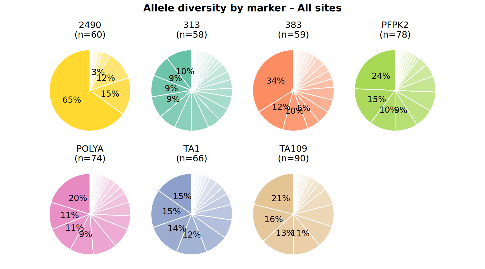


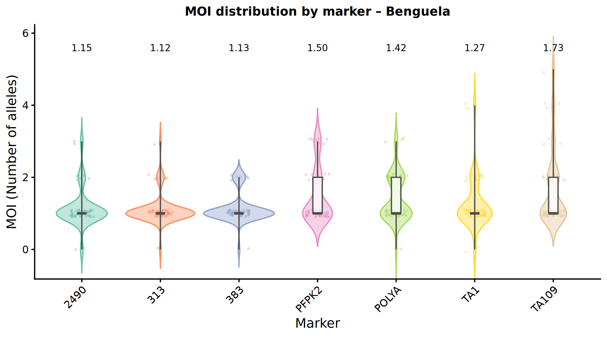


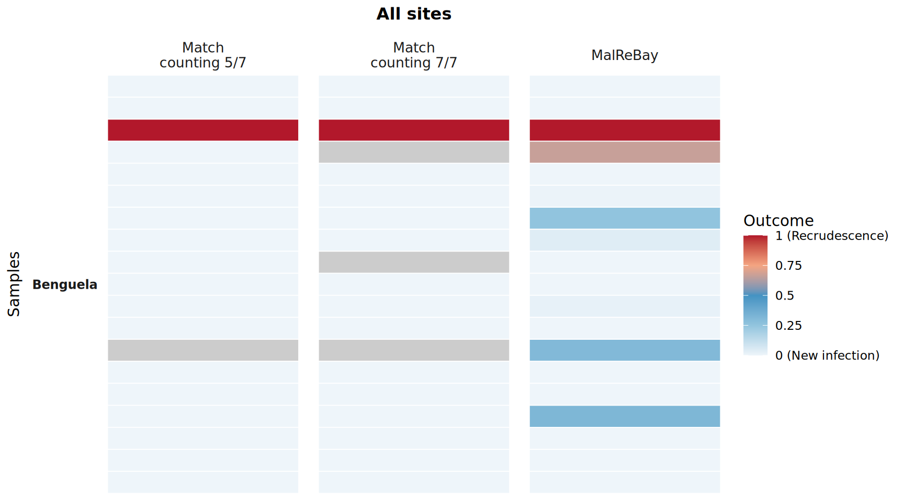


``` numberSource
table(results_strict$posterior_probabilities$Classification)
```

    New infection Recrudescence
               18             1 

Patients with few markers compared (`N_Markers_Compared`) should be
interpreted with caution: with less genetic evidence, the posterior
stays closer to the 0.5 prior rather than being pulled confidently
toward 0 or 1.

``` numberSource
# Flag low-information classifications
pp[pp$N_Markers_Compared <= 1, c("Sample.ID", "Site", "Probability",
                                  "N_Markers_Compared", "Classification")]
```

### 6.3 MalReBay vs. the match counting algorithms

`results$comparison` also reports the traditional match-counting result
per marker (`R` = match/recrudescence-supporting, `NI` =
mismatch/new-infection-supporting, `IND` = indeterminate/missing data,
`ERR` = no valid Day-0/recurrence pair), plus two overall calls built
from those (`Recrudescence`, `New infection`, or `NA` when too few
markers could be compared to apply the rule):

- **Loose rule** (`Match_counting_2of3` for MSP1/MSP2 panels, otherwise
  ~70% of markers, e.g. `Match_counting_5of7`): a simple threshold rule
  (see [Section 4](#sec-data-types) for which variant applies to your
  panel).
- **Strict rule** (`Match_counting_3of3`, `Match_counting_7of7`, …): the
  same rule, but requiring every marker to match.

For MSP1/MSP2 panels the table also has `msp1` and `msp2` columns: each
family’s allelic variants (e.g. K1/MAD20/RO33) collapsed into one call,
which is what the 2/3 rule is applied to.

These are deterministic rules: a marker either counts as a full match or
it doesn’t, with no notion of how common that matching allele is or how
much genotyping noise to expect. MalReBay’s `Probability` is the more
informative of the two, but the WHO columns are useful precisely
*because* they’re simple and widely used — the comparison heatmap
([`plot_comparison_heatmap()`](https://swisstph.github.io/MalReBay/reference/plot_comparison_heatmap.md))
puts all three side by side per site so you can see where MalReBay
agrees with convention and where it draws on evidence the WHO rules
can’t use (rare vs. common alleles, partial/polyclonal data).

### 6.4 How to read the convergence diagnostics

MCMC draws samples from the posterior distribution step by step,
starting each chain from an initial value. Early draws can still depend
on where the chain started, and draws close together in a chain are
correlated. Convergence diagnostics check two things: whether the chains
have forgotten their starting point and are exploring the same
distribution, and whether there are enough effectively independent draws
to estimate it reliably. MalReBay reports the following for each site:

| Diagnostic | What it measures | Criterion |
|----|----|----|
| **Rank-normalised R̂** | Compares the variation *between* chains with the variation *within* each chain. If all chains explore the same distribution, the two agree and R̂ ≈ 1. | R̂ \< 1.01 |
| **Bulk ESS** | Effective sample size: how many independent draws the correlated chain is worth, for the centre of the distribution (mean, median). | \> 400 |
| **Tail ESS** | The same for the tails (5% and 95% quantiles), which matter for credible intervals. | \> 400 |
| **Gelman-Rubin shrink factor** (plot) | The classical version of R̂, recomputed on longer and longer portions of the chains. The lines show the median and the upper 97.5% bound. | Both lines settle close to 1 (below 1.1) and stay flat by the end of the run |
| **Geweke Z-score** | Compares the mean of the start of each chain (first 10%) with the end (last 50%). A large difference means the chain was still drifting. | \|Z\| \< 1.96 |

A run that fails these criteria isn’t necessarily wrong, but its
probabilities can’t be trusted yet. The usual fix is to increase `iter`,
and with it the warmup, in the MCMC configuration and run again.

For more details, see the Stan Reference Manual chapter on [MCMC
convergence and effective sample
size](https://mc-stan.org/docs/reference-manual/analysis.html). The R̂
and ESS criteria come from [Vehtari et
al. (2021)](https://doi.org/10.1214/20-BA1221), and the shrink-factor
plot is described in [Brooks & Gelman
(1998)](https://doi.org/10.1080/10618600.1998.10474787).

### 6.5 Practical tips

- **Provide as much background data as you have.** More Day-0 samples →
  better-estimated allele frequencies → more trustworthy probabilities.
  This matters more for smaller studies and rarer marker panels.
- **Check the diversity and MOI plots before trusting the results.** A
  marker that is monomorphic in your data (one slice in the pie chart)
  or has very high missingness contributes little to the classification.
- **A probability close to 0.5 reflects genuinely limited information,
  not model failure.**
- **Always check the convergence results.** If the convergence summary
  shows high R-hat (`> 1.1`) or low ESS (`< 400`) for a site, increase
  `iter` in the MCMC configuration and rerun.

------------------------------------------------------------------------

## 7 Getting help

If you run into a problem or have a question, please open an issue on
the [MalReBay GitHub page](https://github.com/SwissTPH/MalReBay/issues)
or contact
[monica.golumbeanu@swisstph.ch](https://swisstph.github.io/MalReBay/articles/monica.golumbeanu@swisstph.ch)

For full documentation of every function, see
[`?MalReBay`](https://swisstph.github.io/MalReBay/reference/MalReBay.md),
[`?import_data`](https://swisstph.github.io/MalReBay/reference/import_data.md),
[`?classify_infections`](https://swisstph.github.io/MalReBay/reference/classify_infections.md),
or the [package reference
site](https://swisstph.github.io/MalReBay/reference/index.html).
