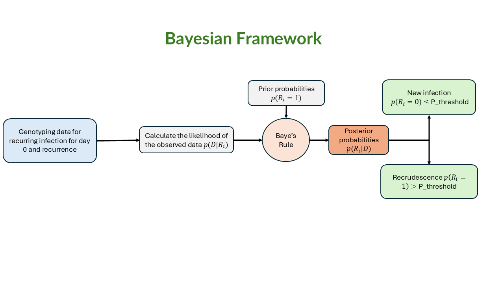

<style>
p.caption {
font-size: 0.85em;
font-style: italic;
color: grey
}
</style>


```{r, include = FALSE}
knitr::opts_chunk$set(
  collapse = TRUE,
  comment = "#>"
)
```

## 1. Introduction

To monitor the effectiveness of antimalarial drugs, the **World Health Organization (WHO)** recommends the use of **Therapeutic Efficacy Studies (TES)**. TES are observational studies in which patients with uncomplicated malaria are treated and followed for several weeks to check if the infection clears and remains suppressed. Because patients can become re-infected during this follow-up period, distinguishing whether a recurrence is due to **recrudescence** (the reappearance of parasites from the original infection after partial clearance) or a **reinfection** (a new infection from a separate mosquito bite) is essential. This process, known as **molecular correction**, relies on comparing parasite genotypes from the initial infection and any subsequent recurrence.

`MalReBay` is an R package that implements a **Bayesian framework** for molecular correction in malaria therapeutic efficacy studies. Instead of making a direct deterministic call, it uses genotyping data from a patient’s initial infection (day 0) and their recurrent infection to estimate the probability that a **recurrence** is due to **recrudescence** versus **reinfection**. Unlike rule-based methods, it explicitly incorporates genotyping uncertainty, within-host diversity, and local allele frequency information, providing a principled and robust classification.

This tutorial provides a step-by-step guide to the main analysis workflow, from loading your data to interpreting the final results. We will first review the conceptual framework of the package and then walk through a practical example, from loading data to interpreting the final results.


## 2. The MalReBay workflow
The workflow begins with paired genotyping data from `day 0` and `day of recurrence` infections. These data are combined with model parameters (e.g., genotyping error rates, within-host diversity, allele frequencies) and analyzed using a Markov chain **Monte Carlo (MCMC)** algorithm. The output is the posterior probability of recrudescence for each recurrence, which can then be summarized at both the patient and study level.

{width=600px}


Here we will have the conceptual steps that `MalReBay` takes to get from your raw data to the final classification. The main `classify_infections()` function automates this entire pipeline for you.


## 3. Input Data

`MalReBay` can analyze two main types of genotyping data:

+ Length-polymorphic markers (e.g., microsatellites, MSP, GLURP).

+ Amplicon sequencing data (haplotype).

The primary input is an Excel file containing genotyping data from a TES.

The input format differs slightly depending on which data type you are working with. Below we describe each format and provide examples.


### 3.1 Length-polymorphic markers

For length-polymorphic markers, the input Excel file should have the following structure:
+ A `Sample.ID` column that uniquely identifies each sample and includes "Day 0" or "Day of recurrence".

+ The day of sampling (0 for baseline, X for recurrence). Note sometimes this is included in the Sample.ID column (e.g., `BD21-002D0` and `BD21-002D42`).

+ A `Site` column indicating the geographical origin of the sample.

+ Marker columns named like `LocusName_AlleleNumber` (e.g., `313_1`, `313_2`, `313_3`, etc.), where each cell represents the parasite clones fragment length observed in base pairs.

Here is an example of the expected input format for length-polymorphic data:
{width=700px}

### 3.2 Amplicon sequencing data

For amplicon sequencing,but the marker columns store haplotype labels instead of allele lengths. The input Excel file have similar structure as length-polymorphic data:

Here is an example of the expected input format for amplicon sequencing data:
{width=700px}


## 4. Descritptive analysis

Before running the main classification analysis, it is often helpful to explore your genotyping data. `MalReBay` provides specialized functions to visualize allele and haplotype diversity, depending on the type of data you are analyzing.

### 4.1 Length-polymorphic markers

For datasets with length-polymorphic markers, we use the `generate_allele_frequency_plot()` function, which generates:

+ Visualizes the frequency of each allele (defined by its length in base pairs) for each marker.

+ Produces faceted bar plots that directly compare Day 0 (baseline) and Day of recurrence samples.

+ Helps to visually identify changes in the parasite population over time.

### 4.2 Amplicon sequencing data

For amplicon sequencing datasets, we use the `generate_haplotype_diversity_plots()` function which generates:

+ Genetic Diversity: A bar chart comparing three standard diversity indices (Richness, Shannon, and Simpson) across the markers.


## 5. Example of classification: length-polymorphic markers

In this section, we provide a step-by-step example of using the `MalReBay` package to classify recurrent malaria infections with length-polymorphic genotyping data.

We will use an example dataset included with the package, containing data from a Therapeutic Efficacy Study (TES) conducted in Angola in 2021. The dataset includes 7 microsatellite markers; `313`, `383`, `TA1`, `POLYA`, `PFPK2`, `2490`, `TA109`, genotyped from 70 patients from three study sites: Benguela, Lunda Sul and Zaire.

First, we need to load the `MalReBay` package, along with a couple of other useful packages for data handling and plotting.

```{r required packages, message=FALSE, warning=FALSE}
library(MalReBay)
library(future)
library(dplyr)
library(ggplot2)
library(PfRecur)
library(purrr)
library(tidyr)
library(here)
library(kableExtra)
```

#### Step 1: Load data

```{r get-data-path-length}
input_file <- system.file("extdata", "Angola_2021_TES_7NMS.xlsx", package = "MalReBay")
imported_data <- MalReBay:::import_data(filepath = input_file)
full_data <- dplyr::bind_rows(imported_data$late_failures, imported_data$additional)
full_data <- full_data %>%
  dplyr::mutate(
    Patient.ID = gsub("D[0-9]+$", "", Sample.ID),
    DayNumber = readr::parse_number(stringr::str_extract(Sample.ID, "D[0-9]+$")),
    Day = ifelse(DayNumber == 0, "Day 0", "Day X")
  )
```


#### Step 2: Define an Output Folder


```{r define-output-dir-length}
output_dir <- here::here("vignettes", "malrebay_vignette_outputs")
if (!dir.exists(output_dir)) {
  dir.create(output_dir, recursive = TRUE)
}
```


#### Step 3: Descriptive statistics

In this step, we generate summary statistics to explore the genetic characteristics of the data before running the Bayesian model. Two key measures are considered:

+ Multiplicity of Infection (MOI): estimates the number of distinct parasite clones per marker in each sample, providing insight into within-host diversity.

+ Marker diversity: visualizes the distribution of allele sizes for each marker, helping to assess the level of genetic variability in the study population.

These descriptive outputs give context for interpreting molecular correction results and can highlight potential sources of genotyping uncertainty.

##### Multiplicity of Infection (MOI) 

```{r MOI,fig.width=7, fig.height=5}
genotypedata_lp <- dplyr::bind_rows(imported_data$late_failures, imported_data$additional)

if (nrow(genotypedata_lp) > 0) {
  moi_per_marker_data <- MalReBay::calculate_marker_moi(
    genotypedata = genotypedata_lp
  )
  if (!is.null(moi_per_marker_data) && nrow(moi_per_marker_data) > 0) {
    MalReBay::generate_marker_moi_plot(
      moi_data = moi_per_marker_data,
      output_folder = output_dir
    )
  } else {
    message("Skipping MOI plot: MOI data could not be calculated.")
  }
} else {
  message("Skipping MOI analysis: No genotype data available.")
}
```


##### Marker diversity
```{r marker-diversity-length-descriptive,fig.width=7, fig.height=5}
if (imported_data$data_type == "length_polymorphic" && nrow(genotypedata_lp) > 0) {
  diversity_plot <- MalReBay:::generate_diversity_plots(
    genotypedata    = genotypedata_lp,
    data_type       = "length_polymorphic",
    marker_info     = imported_data$marker_info,
    output_folder   = output_dir,
    filename_prefix = "length_polymorphic_diversity"
  )
  if (!is.null(diversity_plot)) print(diversity_plot)
} else {
  message("Skipping Length Polymorphic diversity plots: No data found.")
}
```

#### Step 4: MCMC Configuration

The MCMC sampler has several parameters that control its runtime and convergence criteria. For this quick tutorial, we will use a relaxed configuration. For a real analysis, you should use more iterations (e.g., `max_iterations` should be 10000 or more) and stricter thresholds to ensure robust convergence.

```{r define-mcmc-config-length}

quick_mcmc_config <- list(
  n_chains = 4, 
  chunk_size = 5000, 
  max_iterations = 20000,
  rhat_threshold = 1.1,
  ess_threshold = 400
)
```


#### Step 5: Execute the Main Function

Now we can run the analysis. `classify_infections()` will print progress messages to the console, informing you about the data type it detected, the sites it is analyzing, and the status of the MCMC convergence.  The 'future' package is used in the background for parallel processing, so you can expect the analysis to run faster on multi-core machines.

```{r run-analysis-length, cache=TRUE}
plan(multisession, workers = 2)

classification_summary <- classify_infections(
  input_filepath = input_file,
  mcmc_config = quick_mcmc_config,
  output_folder = output_dir,
  verbose = FALSE
)

plan(sequential)
```


The `classify_infections()` function returns a list containing two key data frames: `summary` and `marker_details`. 

The `$summary` data frame provides the main result for each patient. Let's look at the first few rows.

```{r view-summary-length}
summary_df <- classification_summary$summary

knitr::kable(head(summary_df), caption = "Classification summary.")
```

The columns are:
+ **Site**: The geographical site of the sample.

+ **Sample.ID**: The unique patient identifier.

*   **Probability**: The posterior probability that the infection is a **recrudescence**. A value near 1.0 suggests recrudescence, while a value near 0.0 suggests reinfection.

+ **N_Available_D0 / N_Available_DF**: The number of loci with genetic data at Day 0 and Day of Failure, respectively.

+ **N_Comparable_Loci**: The number of loci with data at *both* time points, which is the amount of data used for the classification.


#### Step 6: Visualizing the Results

A histogram of the posterior probabilities is an excellent way to visualize the overall results. A clear separation into two groups (one near 0 and one near 1) indicates high confidence in the classifications.

```{r plot-histogram-length, fig.width=6, fig.height=4, out.width='100%'}
ggplot(summary_df, aes(x = Probability)) +
  geom_histogram(binwidth = 0.05, fill = "steelblue", color = "white", boundary = 0) +
  labs(
    title = "Distribution of Posterior Probabilities of Recrudescence",
    x = "Posterior Probability",
    y = "Number of Patients"
  ) +
  theme_bw()
```

<p class="caption">This histogram shows the distribution of posterior probabilities. In this example run, we see a clear group of patients with low probability (likely reinfections) and another group with high probability (likely recrudescences).</p>


#### Step 7: Convergence diagnosis
Convergence is monitored automatically during sampling using both the log-likelihood and standard diagnostics. By default, the algorithm will stop once the following criteria are met:

+ **R-hat (Gelman–Rubin diagnostic):** All monitored parameters must have $\hat{R} < 1.1$ and the Gelman–Rubin plot should stabilize near 1.0 and remain below the 1.1 threshold.

+ **Effective Sample Size (ESS):** The number of effectively independent samples must exceed the user-defined threshold (the value defined in parameter `ess_threshold`)

+ **Maximum iterations:** If convergence has not been reached, sampling stops once the iteration cap (the value defined in parameter `max_iterations`).

The figures below illustrate the convergence diagnostics, including the Gelman–Rubin statistic, log-likelihood trace, histogram, and autocorrelation plot. Together, these provide a visual check that the chains have mixed well and stabilized.

```{r convergence-diagnostics}
image_paths <- c(
  file.path(output_dir, "convergence_diagnosis/Benguela/gelman_loglikelihood.png"),
  file.path(output_dir, "convergence_diagnosis/Benguela/loglikelihood_traceplot.png"),
  file.path(output_dir, "convergence_diagnosis/Benguela/loglikelihood_histogram.png"),
  file.path(output_dir, "convergence_diagnosis/Benguela/loglikelihood_acf.png")
)

knitr::kable(
  matrix(paste0("{width=100%}"), ncol = 2, byrow = TRUE),
  escape = FALSE
)
```


#### Step 8: Comparison with other methods

```{r comparison-methods, cache=TRUE, message=FALSE, warning=FALSE}
pfrecur_raw_data <- readxl::read_excel(input_file)
pfrecur_results <- MalReBay:::run_pfrecur_analysis_original_prep(
  raw_data_df = pfrecur_raw_data,
  output_csv_path = tempfile(fileext = ".csv") 
)
pfrecur_clean <- pfrecur_results %>%
  mutate(Sample.ID = as.character(sub("^(.*)D[0-9]+$", "\\1", recurrence))) %>%
  rename(PfRecur_Probability = M1) %>%
  select(Sample.ID, PfRecur_Probability)

match_results_lp <- MalReBay:::perform_match_counting(
  genotypedata_latefailures = imported_data$late_failures, 
  marker_info = imported_data$marker_info
)
match_summary_clean <- match_results_lp %>%
  rename(Patient.ID = Sample.ID)

malrebay_clean <- summary_df %>%
  select(Site, Sample.ID, MalReBay_Probability = Probability) %>%
  mutate(Sample.ID = as.character(Sample.ID))

combined_comparison <- malrebay_clean %>%
  left_join(pfrecur_clean, by = "Sample.ID") %>%
  left_join(match_summary_clean, by = c("Sample.ID" = "Patient.ID"))

marker_column_names <- setdiff(colnames(match_summary_clean), c("Patient.ID", "Number_Matches", "Number_Loci_Compared"))
final_table <- combined_comparison %>%
  select(
    Sample.ID,
    Site,
    Number_Matches,
    Loci_Compared = Number_Loci_Compared,
    all_of(marker_column_names),
    MalReBay = MalReBay_Probability,
    PfRecur = PfRecur_Probability
  )

knitr::kable(
  head(final_table), 
  caption = "Comparison of MalReBay, PfRecur, and match-counting results for length-polymorphic data.",
  digits = 3
) %>%
  scroll_box(width = "100%") 
```


## 6. Example of classification: amplicon sequencing data

We will use an example dataset included with the package, containing data from a Therapeutic Efficacy Study (TES). The dataset includes 3 sequencing markers; `cpmp`, `cpp`, `amaD3`, genotyped from 20 patients.

#### Step 1: Load data

```{r get-data-path ampseq}
input_file_ampseq <- system.file("extdata", "Amplicon_Sequencing.xlsx",
                                 package = "MalReBay")

imported_data_ampseq <- MalReBay:::import_data(filepath = input_file_ampseq)
```


#### Step 2: Define an Output Folder

```{r define-output-dir-ampseq}
output_dir <- here::here("vignettes", "malrebay_vignette_outputs")
if (!dir.exists(output_dir)) {
  dir.create(output_dir, recursive = TRUE)
}
```


#### Step 3: Descriptive statistics

In this step, we generate summary statistics to explore the genetic characteristics of the data before running the Bayesian model. Two key measures are considered:

+ Multiplicity of Infection (MOI): estimates the number of distinct parasite clones per marker in each sample, providing insight into within-host diversity.

+ Marker diversity: visualizes the distribution of allele sizes for each marker, helping to assess the level of genetic variability in the study population.

These descriptive outputs give context for interpreting molecular correction results and can highlight potential sources of genotyping uncertainty.


##### Multiplicity of Infection (MOI)  
```{r MOI ampseq,fig.width=7, fig.height=5}
genotypedata_ampseq <- dplyr::bind_rows(imported_data_ampseq$late_failures, imported_data_ampseq$additional)

if (nrow(genotypedata_ampseq) > 0) {
  moi_per_marker_data <- MalReBay:::calculate_marker_moi(
    genotypedata = genotypedata_ampseq
  )
  
  if (!is.null(moi_per_marker_data) && nrow(moi_per_marker_data) > 0) {
    MalReBay::generate_marker_moi_plot(
      moi_data = moi_per_marker_data,
      output_folder = output_dir
    )
  } else {
    message("Skipping MOI plot: MOI data could not be calculated.")
  }
} else {
  message("Skipping MOI analysis: No genotype data available.")
}
```

##### Marker diversity
```{r marker-diversity-ampseq,fig.width=7, fig.height=5}
if (imported_data_ampseq$data_type == "ampseq" && nrow(genotypedata_ampseq) > 0) {
  diversity_plot_ampseq <- MalReBay:::generate_diversity_plots(
    genotypedata    = genotypedata_ampseq,
      data_type       = "ampseq",
      output_folder   = output_dir,
      filename_prefix = "haplotype_diversity"
  )
  if (!is.null(diversity_plot_ampseq)) print(diversity_plot_ampseq)
} else {
  message("Skipping AmpSeq diversity plots: No data found.")
}
```

#### Step 4: MCMC Configuration

```{r define-mcmc-config-amspeq}

quick_mcmc_config <- list(
  n_chains = 4,          # Run two parallel chains
  chunk_size = 5000,       # Check convergence every 1000 iterations
  max_iterations = 20000,   # Stop after a maximum of 1000 total iterations
  rhat_threshold = 1.1,  # A relaxed convergence threshold for the example
  ess_threshold = 1000     # A relaxed effective sample size for the example
)
```


#### Step 5: Execute the Main Function

Now we can run the analysis. `classify_infections()` will print progress messages to the console, informing you about the data type it detected, the sites it is analyzing, and the status of the MCMC convergence.  The 'future' package is used in the background for parallel processing, so you can expect the analysis to run faster on multi-core machines.

```{r run-analysis-ampseq, cache=TRUE}
plan(multisession, workers = 2)

classification_summary_ampseq <- classify_infections(
  input_filepath = input_file_ampseq,
  mcmc_config = quick_mcmc_config,
  output_folder = output_dir,
  verbose = FALSE
)

plan(sequential)
```


The `classify_infections()` function returns a list containing two key data frames: `summary` and `marker_details`. 

The `$summary` data frame provides the main result for each patient. Let's look at the first few rows.

```{r view-summary-ampseq}
summary_df <- classification_summary_ampseq$summary

knitr::kable(head(summary_df), caption = "Classification summary.")
```

The columns are:
+ **Site**: The geographical site of the sample.

+ **Sample.ID**: The unique patient identifier.

+ **Probability**: The posterior probability that the infection is a **recrudescence**. A value near 1.0 suggests recrudescence, while a value near 0.0 suggests reinfection.

+ **N_Available_D0 / N_Available_DF**: The number of loci with genetic data at Day 0 and Day of Failure, respectively.

+ **N_Comparable_Loci**: The number of loci with data at *both* time points, which is the amount of data used for the classification.


#### Step 6: Visualizing the Results

A histogram of the posterior probabilities is an excellent way to visualize the overall results. A clear separation into two groups (one near 0 and one near 1) indicates high confidence in the classifications.

```{r plot-histogram-ampseq, fig.width=6, fig.height=4, out.width='100%'}
ggplot(summary_df, aes(x = Probability)) +
  geom_histogram(binwidth = 0.05, fill = "steelblue", color = "white", boundary = 0) +
  labs(
    title = "Distribution of Posterior Probabilities of Recrudescence",
    x = "Posterior Probability",
    y = "Number of Patients"
  ) +
  theme_bw()
```

<p class="caption">This histogram shows the distribution of posterior probabilities. In this example run, we see a clear group of patients with low probability (likely reinfections) and another group with high probability (likely recrudescences).</p>


#### Step 7: Convergence diagnosis

Convergence is monitored automatically during sampling using both the log-likelihood and standard diagnostics. By default, the algorithm will stop once the following criteria are met:

+ **R-hat (Gelman–Rubin diagnostic):** All monitored parameters must have $\hat{R} < 1.1$ and the Gelman–Rubin plot should stabilize near 1.0 and remain below the 1.1 threshold.

+ **Effective Sample Size (ESS):** The number of effectively independent samples must exceed the user-defined threshold (the value defined in parameter `ess_threshold`)

+ **Maximum iterations:** If convergence has not been reached, sampling stops once the iteration cap (the value defined in parameter `max_iterations`).

The figures below illustrate the convergence diagnostics, including the Gelman–Rubin statistic, log-likelihood trace, histogram, and autocorrelation plot. Together, these provide a visual check that the chains have mixed well and stabilized.

```{r convergence-diagnostics-ampseq}
image_paths2 <- c(
  file.path(output_dir, "convergence_diagnosis/1/gelman_loglikelihood.png"),
  file.path(output_dir, "convergence_diagnosis/1/loglikelihood_traceplot.png"),
  file.path(output_dir, "convergence_diagnosis/1/loglikelihood_histogram.png"),
  file.path(output_dir, "convergence_diagnosis/1/loglikelihood_acf.png")
)

knitr::kable(
  matrix(paste0("{width=100%}"), ncol = 2, byrow = TRUE),
  escape = FALSE
)
```


#### Step 9: Comparison with match-counting algorithm


```{r match-counting}
input_file_ampseq <- system.file("extdata", "Amplicon_Sequencing.xlsx",
                                 package = "MalReBay")
imported_data_ampseq <- MalReBay::import_data(filepath = input_file_ampseq, verbose = FALSE)

mcmc_summary_ampseq <- classify_infections(
  input_filepath = input_file_ampseq,
  mcmc_config = quick_mcmc_config,
  output_folder = output_dir,
  verbose = FALSE
)$summary

match_results_ampseq <- MalReBay:::perform_match_counting(
  genotypedata_latefailures = imported_data_ampseq$late_failures, 
  marker_info = imported_data_ampseq$marker_info)

mcmc_summary_clean <- mcmc_summary_ampseq %>%
  dplyr::rename(Patient.ID = Sample.ID) %>%
  dplyr::select(Patient.ID, Site, Prob_Recrud_MalReBay = Probability)

match_summary_clean <- match_results_ampseq %>%
  dplyr::rename(Patient.ID = Sample.ID)

final_table <- mcmc_summary_clean %>%
  dplyr::left_join(match_summary_clean, by = "Patient.ID")

marker_column_names <- setdiff(colnames(match_summary_clean), c("Patient.ID", "Number_Matches", "Number_Loci_Compared"))

final_comparison_table_ampseq <- final_table %>%
  dplyr::select(
    Sample.ID = Patient.ID,
    Site,
    Number_Matches,
    Number_Loci_Compared,
    all_of(marker_column_names), 
    MalReBay = Prob_Recrud_MalReBay
  )

knitr::kable(
  head(final_comparison_table_ampseq), 
  caption = "Comparison of match-counting results and MalReBay probability for amplicon data.",
  digits = 3
) %>%
  scroll_box(width = "100%")
```

The final table contains the following columns:

+ The raw allele data for each marker.

+ The summary of the match-counting algorithm (`Number_Matches`, `Number_Loci_Compared`).

+ The detailed per-locus result of the match-counting (`R` for match, `NI` for non-match, `IND` for indeterminate).

+ The final posterior probability of recrudescence from the Bayesian MCMC analysis (`Prob_Recrud_MalReBay`)


## 7. Checking non-converged chains and improving convergence

Convergence is a crucial step to ensure that the MCMC results are reliable. In `MalReBay`, convergence is monitored automatically during sampling using both the log-likelihood and standard diagnostics. If convergence is not achieved, the posterior estimates may be unreliable, leading to misleading classification of recurrences. For this reason, this is section is explicit for non-convergence check, so that users can easily diagnose problematic chains and take corrective action (e.g., increasing iterations, adjusting priors, or running more chains).

+ R-hat (Gelman–Rubin diagnostic): All parameters must satisfy $\hat{R} < 1.1$.

+ Effective Sample Size (ESS): The ESS must exceed the user-defined threshold (`ess_threshold`).

+ Maximum iterations: If convergence has not been achieved, sampling stops once the upper limit (`max_iterations`) is reached.


#### output non-convergence
```{r output-non-convergence, echo=FALSE}
input_file <- system.file("extdata", "Angola_2021_TES_7NMS.xlsx", package = "MalReBay")
output_dir <- here::here("vignettes", "malrebay_vignette_outputs")
if (!dir.exists(output_dir)) dir.create(output_dir, recursive = TRUE)
nonconv_dir <- file.path(output_dir, "non_convergence_diagnosis")
if (!dir.exists(nonconv_dir)) dir.create(nonconv_dir, recursive = TRUE)

quick_mcmc_config <- list(
  n_chains = 4, 
  chunk_size = 1000, 
  max_iterations = 5000,
  rhat_threshold = 1.1,
  ess_threshold = 400
)

plan(multisession, workers = 2)

classification_summary <- classify_infections(
  input_filepath = input_file,
  mcmc_config = quick_mcmc_config,
  output_folder = output_dir,
  verbose = FALSE
)

plan(sequential)

non_converge <- c(
  file.path(nonconv_dir, "gelman_loglikelihood.png"),
  file.path(nonconv_dir, "loglikelihood_traceplot.png"),
  file.path(nonconv_dir, "loglikelihood_histogram.png"),
  file.path(nonconv_dir, "loglikelihood_acf.png")
)

non_converge <- non_converge[file.exists(non_converge)]

if (length(non_converge) > 0) {
  for (img in non_converge) cat("{width=100%}\n\n", sep = "")
} else {
  cat("*(No non-convergence plots were generated)*\n")
}
```

#### Identifying lack of convergence

When diagnosing MCMC output, the following visual patterns indicate that chains may not have converged:

+ **$\hat{R}$ values:** In the Gelman–Rubin plot, values should stabilize close to 1.0. If the curve stays well above 1.1 or drifts without settling, it signals non-convergence.

+ **Chain mixing:** In well-mixed traceplots, chains appear as overlapping “caterpillars” that fluctuate around a common mean. If the traces show different levels, do not overlap, or drift apart, it suggests poor mixing.

+ **Autocorrelation:** A good autocorrelation plot shows a rapid decline toward zero within a few lags. If autocorrelation remains high or decays slowly across iterations, it means the chains are exploring the parameter space inefficiently and convergence has not been reached.

#### How to improve convergence.
If chains fail to converge, several adjustments can help improve stability and mixing:

+ Increase the number of iterations: Allow more sampling time so chains have a better chance to explore the parameter space thoroughly.

+ Run additional chains in parallel: More chains improve the chances of detecting convergence and can reveal mixing issues more clearly.

+ Adjust the chunk size or apply thinning: Modifying these settings can reduce autocorrelation and improve the efficiency of the samples.

The package also includes an automatic convergence check: sampling will stop early once the criteria above are satisfied, so in many cases you will not need to tune these settings manually.


## 9. Package structure and specifications
The `MalReBay` package is organized around three main stages: data preparation, Bayesian inference with MCMC, and summarization of results.

{width=600px}


### 9.1 Data preparation

+ `import_data()` function reads the input Excel file, automatically detects the data type (length-polymorphic vs. amplicon sequencing), and applies basic cleaning.

+ For length-polymorphic markers, `define_alleles()` groups raw fragment lengths into discrete, well-defined allele bins.

+ `calculate_frequencies()` function estimates the initial population-level frequency of each allele, which serves as the prior for the MCMC algorithm.

+ `recode_alleles()` converts allele values into integer-based codes, ensuring consistency across sites and markers.

**Output**: A clean, structured dataset ready to be passed into the Bayesian engine.


### 9.2 Bayesian inference with MCMC

At the core of the package is a Gibbs sampling engine that explores the probability space and classifies recurrent infections as reinfections or recrudescences.

+ `run_all_sites()` organizes the analysis across geographical sites, calling the relevant MCMC functions (`run_one_chain()` or `run_one_chain_ampseq()`).

+ During each iteration, the algorithm updates key parameters:

  + Hidden alleles (`switch_hidden_length()` / `switch_hidden_ampseq()`).
  
  + Population allele frequencies (`findposteriorfrequencies()`)
  
+ Multiple chains run in parallel, with automatic convergence checks based on R-hat and ESS.


### 9.3 Summarization and output

Once the MCMC converges, the package distills the results into clear, interpretable outputs.

+ Posterior Probabilities: A summary table reporting, for each patient, the posterior probability of recrudescence.

+ Diagnostic Reports: Functions such as `generate_likelihood_diagnostics()` produce trace plots and Gelman–Rubin plots for convergence checks.

+ Allele Frequency Plots: `generate_allele_frequency_plot()` visualizes allele distributions overall and by site.

+ Marker-Level Analysis: Detailed tables show how individual genetic markers contribute to each classification


