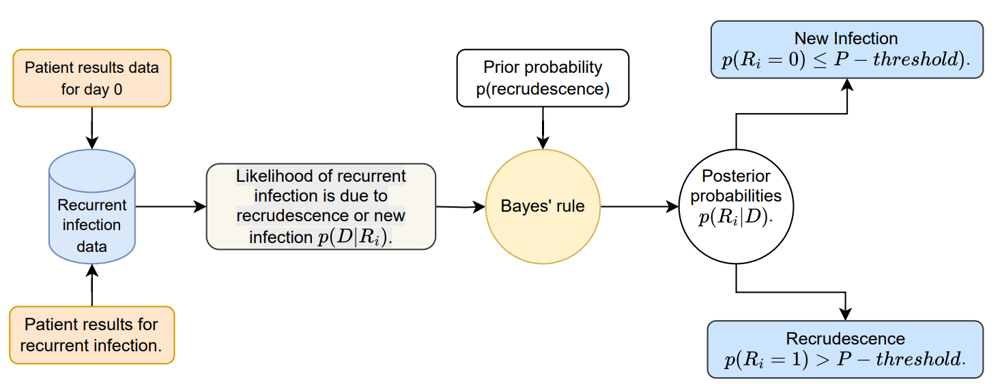
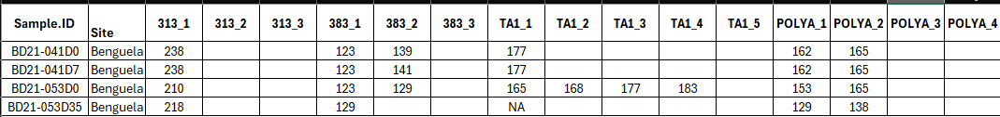
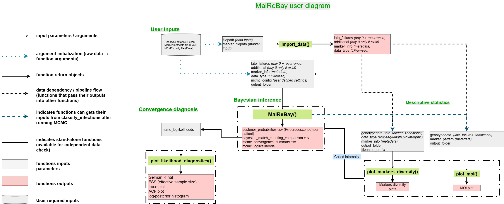

<style>
p.caption {
font-size: 0.85em;
font-style: italic;
color: grey
}
</style>


```{r, include = FALSE}
knitr::opts_chunk$set(
  collapse = TRUE,
  comment  = "#>",
  message  = FALSE,
  warning  = FALSE
)

# Skip Stan-dependent chunks if CmdStan is not available (e.g. during R CMD check)
cmdstan_ok <- tryCatch({
  path <- cmdstanr::cmdstan_path()
  nzchar(path) && file.exists(path)
}, error = function(e) FALSE)

knitr::opts_chunk$set(eval = cmdstan_ok)
```


## 1. Introduction

The **World Health Organization (WHO)** recommends **Therapeutic Efficacy Studies (TES)** to monitor how well antimalarial drugs are working. In a TES, patients with uncomplicated malaria are treated and then followed for several weeks. The goal is to check whether their infection cleared and stayed away.

A key challenge in these studies is telling apart two reasons why parasites may return after treatment:

+ **Recrudescence:** the same parasites from the original infection come back. This means the treatment did not fully work.

+ **Reinfection:** a completely new infection from a different mosquito bite.

Telling these two apart is called **molecular correction**. It works by comparing the parasite's genetic fingerprint from the start of treatment (Day 0) to the fingerprint from the time of recurrence.

`MalReBay` is an R package that does this comparison using a **Bayesian statistical model**. Instead of giving a simple yes or no answer, it gives a probability score between 0 and 1 for each patient. A score close to 1 means recrudescence is very likely. A score close to 0 means reinfection is very likely. This approach is more informative than simple rule-based methods because it accounts for uncertainty in the data.


## 2. How MalReBay works

For each patient, the model asks: given the genetic data we have, how likely is it that this recurrence is a treatment failure?

{width="100%"}

The model has three parts:

+ **Prior belief:** before looking at any data, we assume there is an equal chance of recrudescence or reinfection (50/50). This means the model does not favour one outcome over the other from the start.

+ **Likelihood:** the model looks at the genetic data and asks how well each hypothesis (recrudescence or reinfection) explains what was observed. It takes into account allele frequencies in the local population, the number of parasite clones in each sample, and possible laboratory errors such as allele dropout.

+ **Posterior probability:** the model combines the prior belief with the evidence from the data to produce a final probability score for each patient.

The model uses a method called **MCMC sampling** (Markov chain Monte Carlo) to calculate these probabilities. Think of MCMC as a search process that explores millions of possible explanations for the data and settles on the most consistent answer. MalReBay runs this process using **Stan**, a widely used statistical computing engine.


## 3. The MalReBay workflow

The full analysis runs in four main stages:

```
import_data()          Read and check your Excel files
      |
classify_infections()  Run the Bayesian model
      |
summarise_results()    Summarise the outputs
      |
save_results()         Save tables and plots to your chosen folder
```

The main `MalReBay()` function runs all four stages automatically. You only need to provide your data files and a folder to save the results.


## 4. Preparing your data

`MalReBay` works with two types of genotyping data:

+ **Length-polymorphic markers** such as microsatellites, MSP, and GLURP. These store fragment lengths measured in base pairs.

+ **Amplicon sequencing data.** These store haplotype labels (text codes) instead of numbers.

Both types are provided as Excel files. The structure is the same for both.

### 4.1 Length-polymorphic markers

Your Excel file must have:

+ A `Sample.ID` column that identifies each sample. Each name must include either "Day 0" or "recurrence" so the package knows which sample is which. For example: `BD21-002 Day 0` and `BD21-002 recurrence`.

+ A `Site` column showing where the sample was collected.

+ Marker columns named as `MarkerName_AlleleNumber` (for example `TA1_1`, `TA1_2`). Each cell holds the fragment length in base pairs for one parasite clone.

Here is an example of the expected layout:

{width="100%"}

### 4.2 Amplicon sequencing data

The layout is the same as for length-polymorphic data. The only difference is that the marker columns contain haplotype labels (text strings) instead of fragment lengths.

Here is an example of the expected layout:

{width="100%"}


## 5. Step-by-step example: length-polymorphic markers

This section walks through a complete analysis using an example dataset that comes with the package. The data are from a Therapeutic Efficacy Study carried out in Angola in 2021. It includes 7 microsatellite markers (`313`, `383`, `TA1`, `POLYA`, `PFPK2`, `2490`, `TA109`) from 70 patients across three study sites: Benguela, Lunda Sul and Zaire.

The example focuses on the Benguela site.

```{r required packages, message=FALSE, warning=FALSE}
library(MalReBay)
library(dplyr)
library(ggplot2)
library(purrr)
library(tidyr)
library(here)
library(kableExtra)
```

### Step 1: Load the data

We read the example files using `import_data()`. This function reads both the genotyping file and the marker information file, checks the data, and prepares it for analysis.

```{r get-data-path-length}
input_file_lp <- system.file("extdata", "Angola_2021_TES_7NMS.xlsx", package = "MalReBay")
marker_file   <- system.file("extdata", "makers_details.xlsx", package = "MalReBay")

imported_data <- MalReBay::import_data(
  filepath        = input_file_lp,
  marker_filepath = marker_file
)
```

### Step 2: Set an output folder

Choose a folder where all results, tables, and plots will be saved. If the folder does not exist yet, it will be created automatically.

```{r define-output-dir-length}
output_dir_lp <- file.path(tempdir(), "malrebay_results")

if (!dir.exists(output_dir_lp)) {
  dir.create(output_dir_lp, recursive = TRUE)
}

genotypedata_lp <- dplyr::bind_rows(imported_data$late_failures, imported_data$additional)
```

### Step 3: Explore your data

Before running the model, it is good practice to look at the data. MalReBay provides two plots to help with this.

**Multiplicity of Infection (MOI):** this plot shows how many distinct parasite clones were found per marker in each sample. A higher MOI means the patient was infected by more than one parasite strain at the same time.

```{r MOI, fig.width=7, fig.height=5, message=FALSE, out.width='100%', fig.alt="Violin plot showing the multiplicity of infection per marker."}
if (nrow(genotypedata_lp) > 0) {
  first_site      <- unique(genotypedata_lp$Site)[1]
  genotypedata_s1 <- dplyr::filter(genotypedata_lp, Site == first_site)

  moi_plots <- MalReBay::plot_moi(
    genotypedata  = genotypedata_s1,
    output_folder = output_dir_lp
  )
  print(moi_plots[[first_site]])
}
```

**Marker diversity:** this plot shows how common each allele is within each marker. Markers with many different alleles at similar frequencies are more useful for telling apart recrudescence from reinfection.

```{r marker-diversity-length-descriptive, fig.width=7, out.width='100%', fig.height=5, message=FALSE, fig.alt="Pie charts showing allele diversity for each microsatellite marker."}
if (nrow(genotypedata_lp) > 0) {
  div_plot <- MalReBay::plot_markers_diversity(
    genotypedata  = genotypedata_lp,
    data_type     = "length_polymorphic",
    marker_info   = imported_data$marker_info,
    output_folder = output_dir_lp
  )
  if (!is.null(div_plot)) print(div_plot)
}
```

### Step 4: Configure and run the analysis

The model has a few settings that control how long the sampling runs. The table below explains each one.

| Setting | What it does |
|---|---|
| `n_chains` | How many independent sampling runs to perform. More chains give more reliable results. |
| `iter` | Total number of steps per chain. More steps improve accuracy but take longer. For a real study use 2000 or more. |
| `burn_in_frac` | The fraction of early steps to discard while the sampler is warming up. The default of 0.5 works well in most cases. |
| `adapt_delta` | Controls how carefully the sampler moves through the parameter space. A higher value (up to 1.0) reduces errors but runs more slowly. |

For a real analysis, use at least 2000 iterations. The quick settings below are fine for exploring the results but may not be suitable for publication.

```{r run-analysis-length, cache=TRUE}
quick_config <- list(
  n_chains     = 2,
  iter         = 1000,
  burn_in_frac = 0.5,
  adapt_delta  = 0.8,
  random_seed  = 42
)

results <- MalReBay::MalReBay(
  filepath        = input_file_lp,
  marker_filepath = marker_file,
  mcmc_config     = quick_config,
  output_folder   = output_dir_lp,
  verbose         = FALSE
)

if (is.null(results)) {
  knitr::knit_exit("The model did not produce results. Please check your data and try again.")
}
```

### Step 5: View the results

The `results` object contains four items:

+ `posterior_probabilities`: the main results table with one row per patient.
+ `comparison`: a side-by-side table comparing MalReBay probabilities with match-counting results.
+ `convergence`: convergence diagnostic summaries for each site.
+ `mcmc_loglikelihoods`: the raw sampling history, used for diagnostic plots.

The most important output is `posterior_probabilities`. The key columns are:

+ **Site:** the study site where the sample was collected.
+ **Sample.ID:** the patient identifier.
+ **Probability:** the probability that the recurrence is a recrudescence. A value close to 1 means recrudescence is very likely. A value close to 0 means reinfection is very likely.
+ **N_Available_D0 / N_Available_DF:** the number of markers with data at Day 0 and at the day of recurrence.
+ **N_Comparable_Loci:** the number of markers that had data at both time points and were used in the classification.

```{r view-summary-length}
summary_df <- results$posterior_probabilities

benguela_df <- dplyr::filter(summary_df, Site == "Benguela")

knitr::kable(
  benguela_df,
  caption = "Classification results for Benguela showing posterior probabilities.",
  digits  = 3
)
```

### Step 6: Plot the results

A histogram of all posterior probabilities gives a quick overview of the study population. If patients separate clearly into two groups (one near 0 and one near 1), the model is confident in its classifications. Patients with probabilities in the middle (around 0.5) are harder to classify and may need further review.

```{r plot-histogram-length, fig.width=6, fig.height=4, out.width='100%', fig.alt="Histogram of posterior probabilities of recrudescence."}
MalReBay::plot_probability_histogram(results)
```

<p class="caption">A clear split between patients near 0 (likely reinfections) and patients near 1 (likely recrudescences) shows that the model has enough information to classify most cases with confidence.</p>

### Step 7: Check convergence

Convergence means that the sampling process has settled on a stable answer. MalReBay checks this automatically and reports the results in `results$convergence`. You can also view the diagnostic plots interactively.

Good convergence is shown by:

+ **R-hat values below 1.1:** R-hat measures how similar the results are across independent chains. A value close to 1.0 is ideal.
+ **Effective Sample Size (ESS) above your chosen threshold:** ESS measures how many truly independent samples were produced. A higher value means more reliable estimates.
+ **Trace plots that look like fuzzy caterpillars:** chains should overlap and move up and down without any clear trend or drift.
+ **Autocorrelation that drops to zero quickly:** this means each sample is contributing new information.

```{r convergence-diagnostics-LP, fig.width=10, fig.height=8, out.width='100%', fig.alt="Four convergence diagnostic plots arranged in a 2 by 2 grid for the Benguela site."}
site_to_plot <- names(results$mcmc_loglikelihoods)[1]
loglik_data  <- results$mcmc_loglikelihoods[[site_to_plot]]

if (!is.null(loglik_data)) {
  MalReBay::plot_likelihood_diagnostics(
    all_chains_loglikelihood = loglik_data,
    site_name                = site_to_plot,
    stan_fit                 = results$stan_fits[[site_to_plot]],
    save_plot                = FALSE,
    combine_plots            = TRUE,
    verbose                  = FALSE
  )
}
```

### Step 8: Compare with match counting

The `results$comparison` table lets you compare MalReBay probabilities against the traditional match-counting method. Each row shows, for one patient, how many markers were compared, how many matched, the per-marker result (R for match, NI for no match, IND for not enough data), and the MalReBay probability.

```{r comparison-methods, cache=TRUE, message=FALSE, warning=FALSE}
final_table <- results$comparison

knitr::kable(
  head(final_table),
  caption = "Comparison of MalReBay probabilities and traditional match counting.",
  digits  = 3
) %>%
  kableExtra::scroll_box(width = "100%")
```


## 6. Understanding convergence

### 6.1 What poor convergence looks like

The example below shows what diagnostic plots look like when the model has not had enough iterations to converge. This can happen when the number of iterations is too low.

```{r output-non-convergence, fig.width=10, fig.height=8, out.width='100%', fig.alt="Four convergence diagnostic plots showing a non-converged model arranged in a 2 by 2 grid."}
bad_mcmc_config <- list(
  n_chains     = 2,
  iter         = 200,
  burn_in_frac = 0.5,
  random_seed  = 1
)

results_nonconverge <- MalReBay::MalReBay(
  filepath        = input_file_lp,
  marker_filepath = marker_file,
  mcmc_config     = bad_mcmc_config,
  output_folder   = NULL,
  verbose         = FALSE
)

if (!is.null(results_nonconverge)) {
  site_to_plot <- names(results_nonconverge$mcmc_loglikelihoods)[1]

  MalReBay::plot_likelihood_diagnostics(
    all_chains_loglikelihood = results_nonconverge$mcmc_loglikelihoods[[site_to_plot]],
    site_name                = site_to_plot,
    stan_fit                 = results_nonconverge$stan_fits[[site_to_plot]],
    save_plot                = FALSE,
    combine_plots            = TRUE,
    verbose                  = FALSE
  )
}
```

Signs to watch for in the plots:

+ **R-hat stays well above 1.1:** the chains have not agreed on a stable answer.
+ **Chains in the trace plot sit at different levels or drift apart:** the sampling is not exploring the same area of the parameter space.
+ **Autocorrelation stays high for many lags:** the sampler is moving slowly and each sample carries little new information.

### 6.2 How to improve convergence

If your results show poor convergence, try the following:

+ **Increase the number of iterations.** This gives the sampler more time to explore the data and settle on a stable answer.
+ **Run more chains.** Having at least 4 chains makes it easier to spot when something is wrong.
+ **Increase `adapt_delta`.** Setting this closer to 1.0 makes the sampler take more careful steps, which can help with difficult datasets.

MalReBay also checks convergence automatically during sampling and stops early once the criteria are met. In most cases you will not need to adjust the settings manually.


## 7. Using amplicon sequencing data

The workflow for amplicon sequencing data is exactly the same as for length-polymorphic markers. The only differences are:

+ The marker columns in your Excel file contain haplotype labels (text) instead of fragment lengths.
+ You do not need a repeat length value in the marker information file.

MalReBay detects the data type automatically when you call `import_data()`. From that point, all the same steps apply: load the data, explore it, run the model, and check the results.


## 8. Package structure

This section gives a brief overview of how MalReBay is organised for users who want to understand or extend the package.

{width="100%"}

### 8.1 Data preparation

+ `import_data()` reads the input Excel file, detects the data type automatically, and carries out basic data cleaning.
+ For length-polymorphic markers, `define_alleles()` groups raw fragment lengths into clearly defined allele bins.
+ `calculate_frequencies()` estimates how common each allele is in the study population. This information is used as a starting point for the model.
+ `recode_alleles()` converts allele values into integer codes so they can be passed to the statistical engine.

### 8.2 Bayesian inference with Stan

The core of MalReBay is a Stan model that uses Hamiltonian Monte Carlo sampling to estimate posterior probabilities.

+ `run_stan_sites()` organises the analysis across study sites and runs the Stan model for length-polymorphic data.
+ `run_stan_sites_ampseq()` does the same for amplicon sequencing data.
+ Multiple chains run in parallel. Convergence is checked automatically using R-hat and ESS after each run.

### 8.3 Results and output

Once sampling is complete, the package turns the raw MCMC output into clear summaries.

+ **Posterior probabilities:** a table with one row per patient showing the probability of recrudescence.
+ **Convergence diagnostics:** `plot_likelihood_diagnostics()` produces trace plots, R-hat plots, histograms, and autocorrelation plots.
+ **Diversity plots:** `plot_markers_diversity()` and `plot_moi()` visualise allele distributions and within-host diversity.
+ **Comparison table:** `results$comparison` shows MalReBay results alongside match-counting results for easy comparison.


## 9. Getting help

If you run into a problem or have a question, please open an issue on the
[MalReBay GitHub page](https://github.com/SwissTPH/MalReBay/issues).

For a detailed description of the statistical model and the methods used, see the package documentation with `?MalReBay`.
