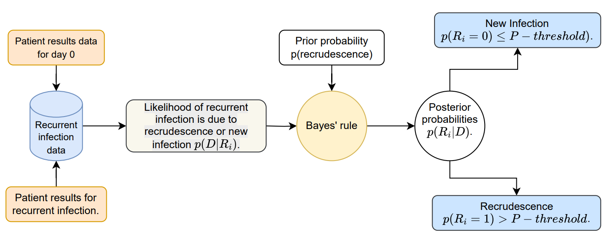
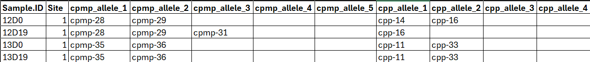

## Overview

**MalReBay** is an R package for classifying recurrent *Plasmodium falciparum* infections in Therapeutic Efficacy Studies (TES). For each patient, it estimates the **probability that a recurrent infection is a recrudescence** (i.e. a treatment failure) rather than a **reinfection** (a new infection acquired after treatment).

MalReBay uses a **Bayesian approach**, which combines the available genotyping data with prior information to estimate this probability. The model uses **Markov Chain Monte Carlo (MCMC)** sampling to obtain the estimates.

Key advantages of MalReBay include:

-   Handles **polyclonal infections**, where a patient can carry multiple parasite strains

-   **Imputes missing genotypes** as part of the MCMC analysis, handling missing data

-   Works with the **three main genotyping approaches** used in TES: microsatellites, MSP1/MSP2/GLURP length-polymorphic markers, and amplicon sequencing (AmpSeq)

------------------------------------------------------------------------

## Background

### Why molecular correction?

The **World Health Organization (WHO)** recommends **Therapeutic Efficacy Studies (TES)** to monitor how well antimalarial drugs are working: patients with uncomplicated malaria are treated and then followed for several weeks to check whether the infection cleared and stayed away.

A parasite reappearing during follow-up can mean one of two things, and they look clinically identical:

-   **Recrudescence**: the original infection was never fully cleared by the drug -- a sign of treatment failure.
-   **New infection** (reinfection): a new, unrelated infection from a different mosquito bite -- not a sign the drug failed.

**Molecular correction** tells these apart by comparing the parasite's genetic fingerprint at Day 0 against the fingerprint at the time of recurrence. MalReBay automates this comparison with a Bayesian model, rather than the simpler rule-based "match counting" traditionally used (see @sec-interpretation-who for a side-by-side comparison of the two).

### How MalReBay works conceptually

For each patient, MalReBay asks: given the genetic data at hand, how much more consistent is this pattern of alleles with "the same infection persisting" than with "a new, unrelated infection"?

{width="100%"}

-   **Prior**: before seeing any genetic data, recrudescence and reinfection are assumed equally likely (50/50).
-   **Likelihood**: the model asks how well each hypothesis explains the observed alleles, accounting for how common each allele is in the local parasite population, how many parasite clones each sample carries (polyclonal infections), and marker-specific genotyping noise.
-   **Posterior**: prior and likelihood combine, via Bayes' rule, into a final probability of recrudescence per patient -- compared against `prob_threshold` (@sec-interpretation-probability) to get a Recrudescence/New infection call.

MalReBay computes these posterior probabilities with **Markov Chain Monte Carlo (MCMC)** sampling, run through **Stan** -- see @sec-convergence-plots and @sec-interpretation-convergence later in this tutorial for how to check that sampling actually converged before trusting the results.

### The MalReBay workflow

The analysis runs in four stages:

```         
import_data()          Read and validate the genotyping + marker files
      |
classify_infections()  Run the Bayesian MCMC model, site by site
      |
summarise_results()    Turn raw MCMC output into probabilities, tables, diagnostics
      |
save_results()         Save CSVs and plots to a chosen folder (optional)
```

`MalReBay()`, used throughout this tutorial, runs all four stages in a single call. The examples below also show `import_data()` and `classify_infections()` used as separate steps -- useful when you want to inspect or rerun part of the pipeline (e.g. after raising `iter`) without repeating the rest.

------------------------------------------------------------------------

## Installation

**CmdStan** must be installed **before installing MalReBay**, as MalReBay contains an embedded Stan representation of the statistical model that is compiled during the MalReBay installation (see the package README for more details).

You only need to install **CmdStan and MalReBay once**. Once they are installed, you can use MalReBay directly in your R sessions.

```{r}
#| eval: false
# 1. Install CmdStan first (one-time, ~5 minutes)
cmdstanr::install_cmdstan()
```

```{r}
#| eval: false
# 2. Install MalReBay from GitHub (development version)
remotes::install_github("SwissTPH/MalReBay")
```

Once the installation has completed successfully, or if the packages are already installed, the MalReBay package can be loaded.

```{r}
library(MalReBay)
```

------------------------------------------------------------------------

## Input data

MalReBay requires up to three inputs: a **genotyping data file**, a **marker metadata file**, and an **MCMC configuration**.

### Genotyping data file

The main input is an Excel workbook (or a CSV file). The first sheet of the Excel file must contain one row per sample with the following column layout:

| Column 1 | Column 2 | Column 3 | Columns 4+ |
|----|----|----|----|
| PatientID | Day | Site | Allele columns (`marker_1`, `marker_2`, …) where marker encodes the marker name |

::: callout-tip
**Start from a template.** Ready-to-fill Excel templates for each data type (microsatellites, MSP1/MSP2/GLURP, AmpSeq) ship with the package. Each has the two data sheets already laid out, grey example rows to replace, notes on the column headers, and an *Instructions* sheet. Copy one to your working folder and fill it in:

```{r}
#| eval: false
templates <- system.file("templates", package = "MalReBay")
list.files(templates)
#> "MalReBay_template_ampseq.xlsx" "MalReBay_template_microsatellite.xlsx" "MalReBay_template_msp_glurp.xlsx"
file.copy(file.path(templates, "MalReBay_template_microsatellite.xlsx"), ".")
```
:::

**Each patient** must have exactly **two rows**:

-   A **Day 0** row
-   A **recurrence** row

The **site** corresponds to the place/health facility where the samples were collected. A data file can contain samples from multiple sites, however the analysis is performed individually per each site.

**Allele column naming.** Columns are named `<marker_id>_1`, `<marker_id>_2`, … (or `<marker_id>_allele_1`, `<marker_id>_allele_2`, … both suffixes work for any data type) up to the maximum multiplicity of infection (MOI) seen in the study. For example, three columns `msp1_1`, `msp1_2`, `msp1_3` encode up to three distinct alleles per sample at that marker, this is how polyclonal infections are represented.

Missing values are recognized and set to `NA` automatically for: `N/A`, `-`, `NA`, `na`, `""`, `" "`.

A second sheet (optional) can supply additional **Day-0-only background samples**, used to estimate population allele frequencies more precisely. It can be a separate CSV file too, via the argument `additional_filepath`.

::: callout-tip
**More background samples, more reliable results.** MalReBay estimates how common each allele/family is in the local parasite population from the Day-0 samples it sees (the late-failure patient Day-0 rows, plus the infections from the background sheet). The more Day-0 samples you provide, the more precisely those frequencies are estimated which directly affects how much weight a "match" carries. A handful of patients is enough to try the package out, but for a real analysis, you would need to include as much background Day-0 data as you have.
:::

A single study can combine several length-polymorphic marker types, for example a panel of 7 neutral microsatellites, or MSP1/MSP2/GLURP, or MSP1-2 and microsatellites together, as long as every marker has a matching row in the marker metadata file with the right `binning_method` (see next subsection). AmpSeq markers can't be mixed with length polymorphic markers in the same file, because the whole input data file is classified as one data type.

Here is what this looks like in practice. A length-polymorphic (microsatellite) panel -- allele columns hold fragment sizes in base pairs:

{width="100%"}

And an AmpSeq panel -- the same layout, but allele columns hold haplotype labels instead of fragment sizes:

{width="100%"}

### Marker metadata file

The marker metadata file is an Excel file with one row per marker. Required columns:

| Column | Description |
|----|----|
| `marker_id` | Marker name: must match the prefix of the allele columns in the genotyping file |
| `repeatlength` | Repeat unit length (bp) for microsatellites; cluster/gap threshold (bp) for MSP/GLURP; ignored for AmpSeq |
| `binning_method` | `"microsatellite"`, `"msp_glurp"`, or `"exact"` (AmpSeq) |

Only markers present in *both* the genotyping file and the marker metadata are used. The marker metadata can include information for other markers and they will just be skipped. You can thus keep one metadata file listing every marker your lab ever genotypes and reuse it across studies with different subsets of markers. One marker info file is provided within MalReBay:

```{r}
marker_file <- system.file("extdata", "makers_details.xlsx", package = "MalReBay")
marker_info <- as.data.frame(readxl::read_excel(marker_file))
head(marker_info)
```

The function `import_data()` auto-detects which type of data you have by looking at the first allele value in your data: a number means **length-polymorphic** data (microsatellites and/or MSP1/MSP2/GLURP) while text means **AmpSeq** data. Here we show an example loading genotyped infections using the CDC 7-microsatellite panel.

```{r}
example_file <- system.file("extdata", "Dataset_microsatellite_panel.xlsx", package = "MalReBay")

imported_data <- import_data(
  filepath        = example_file,
  marker_filepath = marker_file,
  verbose         = TRUE
)

# The imported object is a list with four elements
names(imported_data)
```

### Visualizing the imported data

Before running the pipeline, we can use several plotting functions within MalReBay to visualize several characteristics. Each accepts `output_folder = NULL` and returns the plotted object(s) without saving anything to disk. You can pass a path instead to also write PNG files.

`plot_moi()` shows the distribution of the multiplicity of infection (number of distinct alleles) per marker across infections, one violin plot per site and with the mean MOI above each violin:

```{r}
p_moi <- plot_moi(imported_data$late_failures, output_folder = NULL)
p_moi$Benguela
```

`plot_markers_diversity()` shows the allele (or haplotype) frequency distribution per marker as pie charts, pooling all samples and time points together:

```{r}
p_div <- plot_markers_diversity(
  genotypedata  = imported_data$late_failures,
  data_type     = imported_data$data_type,
  marker_info   = imported_data$marker_info,
  output_folder = NULL
)
print(p_div)
```

`plot_allele_distribution()` shows the raw allele distribution per marker, with frequency (%) on the y-axis: a size histogram for length-polymorphic markers (microsatellites, MSP1/MSP2/GLURP), or a bar chart per haplotype name for AmpSeq markers:

```{r}
p_allele <- plot_allele_distribution(
  genotypedata  = imported_data$late_failures,
  marker_info   = imported_data$marker_info,
  output_folder = NULL
)
print(p_allele)
```

In summary, depending on the type of data used, the specifications for the data input file(s) and marker file:

| Data type | What the allele values look like | `binning_method` in the marker file | Typical markers |
|----|----|----|----|
| **Microsatellites** | Numeric fragment sizes, e.g. `174`, `230.5` | `microsatellite` | `TA1`, `POLYA`, `PfPK2`, `2490`, `TA109`, ... |
| **MSP1 / MSP2 / GLURP** | Numeric fragment sizes, e.g. `450`, `652` | `msp_glurp` | `K1`, `MAD20`, `RO33` (MSP1 family variants); `3D7`, `FC27`, `IC` (MSP2 family variants); `glurp` |
| **AmpSeq** | Haplotype names/strings, e.g. `"cpmp-1"`, `"Hap_A"` | `exact` | Amplicon panels such as `cpmp`, `cpp`, `ama1` |

### MCMC configuration

The MCMC behavior of the statistical algorithm is controlled by a small set of parameters. A set of default parameters is supplied within the package. More detailed guidance about how to tune these parameters is provided later in the document.

```{r}
# Read and display the default configuration
config_file <- system.file("extdata", "default_mcmc_config.rds", package = "MalReBay")
cfg <- readRDS(config_file)
cfg
```

| Parameter | Description |
|----|----|
| `n_chains` | Number of independent MCMC chains. More chains improve convergence diagnostics. Usually 2-3 chains used. The more chains, the more available parallel CPUs are required. |
| `iter` | Total MCMC iterations per chain (warm-up + sampling combined). Start with 1000-2000 for testing and increase depending on the convergence diagnosis. |
| `burn_in_frac` | Fraction of `iter` used as warm-up/burn-in (e.g. `0.5` → first 50% is warm-up, discarded). |
| `random_seed` | Seed for reproducibility. |
| `adapt_delta` | Stan's target acceptance rate for step-size adaptation (0-1). Raise it (e.g. to `0.95`) if you see "divergent transitions" warnings. |

If you don't pass `mcmc_config` at all, `MalReBay()` uses this bundled default. You can override any subset of it with a plain list:

```{r}
#| eval: false
quick_config <- list(n_chains = 2, iter = 1000, burn_in_frac = 0.5, adapt_delta = 0.8, random_seed = 42)
```

::: callout-important
**There is no automatic convergence-based early stopping.** MalReBay runs exactly `iter` iterations per chain, once, for every site, it does not check convergence mid-run and extend automatically. After the run, inspect `results$convergence` and the convergenece plots. If a site hasn't converged, increase `iter` and/or `n_chains` in `mcmc_config` and rerun.
:::

------------------------------------------------------------------------

## Running the pipeline

The main package function `MalReBay()` runs data import, MCMC classification, result summaries, and output saving regardless of which of the three data types you are using.

### Parameters

| Parameter | Description |
|----|----|
| `filepath` | Path to the genotyping Excel/CSV file with the TES data. |
| `marker_filepath` | Path to the marker metadata Excel file. |
| `additional_filepath` | Optional path to a separate background-data file (ignored if the main file is an excel file and already has a second sheet with additional infections). |
| `mcmc_config` | A named list, or a path to an `.rds` file with configuration parameters for the MCMC |
| `output_folder` | Directory where all output files and plots are written. Set to `NULL` to suppress file saving. |
| `n_workers` | Number of parallel workers for multi-chain MCMC. |
| `verbose` | If `TRUE`, prints progress and convergence messages to the console. |

### Example 1: Microsatellite data

This walkthrough uses the bundled example dataset imported in the example before: a real Angola 2021 TES with a panel of 7 neutral microsatellites, for one site. Let's first load the data:

```{r}
example_file <- system.file("extdata", "Dataset_microsatellite_panel.xlsx", package = "MalReBay")

imported_data <- import_data(
  filepath        = example_file,
  marker_filepath = marker_file,
  verbose         = TRUE
)

# The imported object is a list with four elements
names(imported_data)
```

```{r}
# Main data: one row per sample (Day 0 and recurrence)
head(imported_data$late_failures)
```

```{r}
# Detected data type
imported_data$data_type
```

Once the data have been imported, the next step is to run the Bayesian MCMC classification with `classify_infections()` and provided MCMC configuration parameters. It runs the algorithm site by site and returns the raw results.

```{r}
quick_config <- list(
  n_chains     = 2,
  iter         = 2000,
  burn_in_frac = 0.5,
  adapt_delta  = 0.8,
  random_seed  = 42
)

mcmc_results <- classify_infections(
  imported_data = imported_data,
  mcmc_config   = quick_config,
  verbose       = TRUE
)

# Raw MCMC output:
names(mcmc_results)
```

```{r}
# Sites that were successfully classified
names(mcmc_results$ids)
```

Instead of running the two steps (importing data and classifying infections) separately, the entire analysis can be run directly with the `MalReBay()` function. A folder path can be provided (optionally) to save the results and associated figures and summaries. In this example, a folder `bayesian_algorithm_output` will be created in the same folder as this notebook.

```{r}
results <- MalReBay(
  filepath        = example_file,
  marker_filepath = marker_file,
  mcmc_config     = quick_config,
  output_folder   = "bayesian_algorithm_output",
  verbose         = TRUE
)
```

As with the AmpSeq and MSP/GLURP examples further down, here's a quick look at the results: the posterior probabilities per patient, and the side-by-side comparison with the traditional allele match-counting algorithm (one column per marker, coded `R`/`NI`/`IND`/`ERR` -- see @sec-interpretation-who for how to read these, including how the WHO loose/strict summary calls are derived from them).

```{r}
head(results$posterior_probabilities)
```

```{r}
head(results$comparison)
```

### Interpreting algorithm convergence visually {#sec-convergence-plots}

**Why does convergence matter?** MCMC methods estimate the posterior distribution by sampling from it over many iterations. We want to make sure that all chains have reached the same region of the posterior distribution and are exploring it adequately. If the chains have not converged, the resulting posterior estimates may depend on where the chains started or may not yet represent the target distribution reliably. Convergence diagnostics therefore help us check that the MCMC run has produced stable and trustworthy estimates before interpreting the results.

Alongside the numeric summary in `results$convergence`, `plot_likelihood_diagnostics()` builds, for each TES site, four ggplot2 diagnostic panels directly from the raw per-chain log-likelihood traces in `results$mcmc_loglikelihoods`:

```{r}
site_name <- names(results$mcmc_loglikelihoods)[1]

conv_plots <- plot_likelihood_diagnostics(
  all_chains_loglikelihood = results$mcmc_loglikelihoods[[site_name]],
  site_name                = site_name,
  save_plot                = FALSE,
  verbose                  = FALSE
)

# A named list: numeric diagnostics (gelman, ess, rhat_rank, ess_bulk, ess_tail,
# geweke) plus one ggplot object per panel
names(conv_plots)
```

**Traceplot**: shows the log-posterior value across iterations, with one line for each chain. A well-converged run should look like a flat, fuzzy “caterpillar”: the chains should overlap and move around the same band, without a clear upward or downward trend or any chain remaining separated from the others.

```{r}
conv_plots$traceplot
```

**Gelman-Rubin plot**: the running R-hat statistic (comparing between-chain to within-chain variance) as more iterations are included. It should drop and flatten out close to 1 as the x-axis progresses; a shrink factor that stays high or keeps climbing means the chains still haven't settled on the same distribution. `NULL` when only a single chain was run.

```{r}
conv_plots$gelman_rubin
```

**Log-posterior distribution**: a histogram of the log-posterior across all post-warmup draws, chains pooled. It should be a single smooth, roughly bell-shaped distribution. Multiple separated peaks are a sign the sampler is jumping between distinct modes rather than settling into one region of the posterior.

```{r}
conv_plots$log_posterior
```

**Autocorrelation**: one panel per chain, showing how correlated the log-posterior is with itself at increasing lags. It should decay quickly to (and stay near) zero within the first few lags. A slow decay means consecutive draws are still very similar to each other, which is exactly what drags `ESS_Bulk`/`ESS_Tail` down even when R-hat looks fine.

```{r}
conv_plots$autocorrelation
```

::: callout-tip
**Want all four panels at once?** Pass `combine_plots = TRUE` to get a fifth element, `conv_plots$combined`, with all four arranged in a 2x2 grid via `ggpubr::ggarrange()`. And **if any of the panels look off** (a drifting trace, a shrink factor that hasn't flattened, a multi-modal histogram, or slow-decaying autocorrelation), the fix is the same: raise `iter` and/or `n_chains` in `mcmc_config` and rerun. If you also want to see the MCMC sampler's own live divergence/treedepth/E-BFMI warnings while you retune (silenced by default), pass `suppress_warnings = FALSE` to `classify_infections()` or `MalReBay()`.
:::

```{r}
#| fig-width: 12
#| fig-height: 8
conv_plots_combined <- plot_likelihood_diagnostics(
  all_chains_loglikelihood = results$mcmc_loglikelihoods[[site_name]],
  site_name                = site_name,
  save_plot                = FALSE,
  verbose                  = FALSE,
  combine_plots            = TRUE
)

conv_plots_combined$combined
```

### What non-convergence looks like

For comparison, here is the same site classified with far too few iterations (`iter = 200`, well below the recommended minimum) -- a useful reference for recognising a bad run on your own data.

```{r}
bad_mcmc_config <- list(n_chains = 2, iter = 200, burn_in_frac = 0.5, random_seed = 55)

results_nonconverge <- MalReBay(
  filepath        = example_file,
  marker_filepath = marker_file,
  mcmc_config     = bad_mcmc_config,
  output_folder   = NULL,
  verbose         = FALSE
)

results_nonconverge$convergence
```

Compared to the converged run above, `ESS_Bulk`/`ESS_Tail` fall well below the `400` threshold, and the Gelman-Rubin plot shows the shrink factor hasn't fully flattened to 1 by the end of the (short) run:

```{r}
#| fig-width: 12
#| fig-height: 8
site_nonconverge <- names(results_nonconverge$mcmc_loglikelihoods)[1]

diag_nonconverge <- plot_likelihood_diagnostics(
  all_chains_loglikelihood = results_nonconverge$mcmc_loglikelihoods[[site_nonconverge]],
  site_name                = site_nonconverge,
  save_plot                = FALSE,
  verbose                  = FALSE,
  combine_plots            = TRUE
)

diag_nonconverge$combined
```

::: callout-important
**A stable-looking classification is not proof of convergence.** On this small demo dataset, the final Recrudescence/New infection counts happen to come out identical between the converged and non-converged runs below -- the diagnostics are what changed, not (this time) the answer:

```{r}
classification_counts <- function(res, label) {
  data.frame(
    Scenario        = label,
    Recrudescence   = sum(res$posterior_probabilities$Classification == "Recrudescence", na.rm = TRUE),
    `New infection` = sum(res$posterior_probabilities$Classification == "New infection", na.rm = TRUE),
    check.names     = FALSE
  )
}

rbind(
  classification_counts(results, paste0("Converged (", quick_config$iter, " iterations)")),
  classification_counts(results_nonconverge, "Non-converged (200 iterations)")
)
```

That's not a guarantee -- with real data, borderline patients (`Probability` near `prob_threshold`) are exactly the ones most likely to flip under-sampling like this. Always check `results$convergence` (and the plots above) rather than assuming that unchanged counts mean the run was fine. If you see numbers like these on your own data, raise `iter` and/or `n_chains` in `mcmc_config` and rerun -- see @sec-interpretation-convergence.
:::

### Example 2: AmpSeq

Same function, same `marker_filepath` (it already lists the AmpSeq markers too), just a different genotyping file. MalReBay detects the AmpSeq format automatically from the haplotype strings.

```{r}
ampseq_file <- system.file("extdata", "Dataset_amplicon_sequencing.xlsx", package = "MalReBay")

ampseq_imported <- import_data(filepath = ampseq_file, marker_filepath = marker_file, verbose = TRUE)
head(ampseq_imported$late_failures[, 1:5])
```

As with the microsatellite example, it's worth visualising the imported data before running the pipeline:

```{r}
p_moi_ampseq <- plot_moi(ampseq_imported$late_failures, output_folder = NULL)
print(p_moi_ampseq$`1`)
```

```{r}
p_div_ampseq <- plot_markers_diversity(
  genotypedata  = ampseq_imported$late_failures,
  data_type     = ampseq_imported$data_type,
  marker_info   = ampseq_imported$marker_info,
  output_folder = NULL
)
print(p_div_ampseq)
```

AmpSeq haplotypes aren't numeric fragment sizes, so `plot_allele_distribution()` shows a bar chart of frequency per haplotype name instead of a size histogram. With many distinct haplotypes and long names, it also helps to put each marker on its own row via `max_cols = 1` (default is 4 markers per row) so the haplotype labels have room to breathe:

```{r}
#| fig-height: 14
p_allele_ampseq <- plot_allele_distribution(
  genotypedata  = ampseq_imported$late_failures,
  marker_info   = ampseq_imported$marker_info,
  output_folder = NULL,
  max_cols      = 1
)
print(p_allele_ampseq)
```

```{r}
ampseq_results <- MalReBay(
  filepath        = ampseq_file,
  marker_filepath = marker_file,
  mcmc_config     = quick_config,
  output_folder   = NULL,
  verbose         = TRUE
)
head(ampseq_results$posterior_probabilities)
```

### Example 3: MSP1 / MSP2 / GLURP

This walkthrough uses a real MSP1/MSP2/GLURP panel from a Ugandan TES (UGTES2019): 54 patients across three sites (`A`, `B`, `C`), genotyped at the MSP1 family variants (`K1`, `MAD20`, `R033`), the MSP2 family variants (`3D7`, `FC27`), and `glurp`.

```{r}
msp_file <- system.file("extdata", "Dataset_msp_glurp.xlsx", package = "MalReBay")

msp_imported <- import_data(filepath = msp_file, marker_filepath = marker_file, verbose = TRUE)
head(msp_imported$late_failures[, 1:8])
```

::: callout-note
Notice `R033` in the column names above: this dataset spells the MSP1 family variant RO33 with a zero instead of a letter O, a common transcription slip in lab spreadsheets. `detect_msp_variants()` (@sec-data-types) normalises `0`/`O` before matching, so it's still recognised as RO33 and folded into the `msp1` call — you don't need to rename anything.
:::

This panel is length-polymorphic, so all three plotting functions apply, one violin/pie/histogram per MSP1 and MSP2 family variant plus `glurp`:

```{r}
p_moi_msp <- plot_moi(msp_imported$late_failures, output_folder = NULL)
print(p_moi_msp)
```

```{r}
p_div_msp <- plot_markers_diversity(
  genotypedata  = msp_imported$late_failures,
  data_type     = msp_imported$data_type,
  marker_info   = msp_imported$marker_info,
  output_folder = NULL
)
print(p_div_msp)
```

```{r}
p_allele_msp <- plot_allele_distribution(
  genotypedata  = msp_imported$late_failures,
  marker_info   = msp_imported$marker_info,
  output_folder = NULL
)
print(p_allele_msp)
```

Genotyping in the field is rarely complete for every marker at every visit, so it's normal to see fewer comparable loci per patient here than in the microsatellite panel above:

```{r}
msp_results <- MalReBay(
  filepath        = msp_file,
  marker_filepath = marker_file,
  mcmc_config     = list(n_chains = 2, iter = 1500, burn_in_frac = 0.5, random_seed = 42),
  output_folder   = NULL,
  verbose         = TRUE
)
head(msp_results$posterior_probabilities[, c("Site", "Sample.ID", "Probability", "N_Markers_Compared")], 10)
```

```{r}
msp_results$convergence
```

Keep an eye on cases with very few markers compared (`N_Markers_Compared` of 1 or 2 above) — as @sec-interpretation-probability explains, there just isn't much genetic evidence to work with for those patients, so the probability sits closer to 0.5 regardless of what the WHO rule says. If `ESS_Bulk` above comes out under 400 for a site, that's this dataset's own convergence borderline showing up live — see @sec-interpretation-convergence for what to do about it (in short: raise `iter`).

### Using CSV files instead of Excel

`filepath` and `additional_filepath` both also accept `.csv` files — `import_data()` picks the reader based on the file extension. The one exception is `marker_filepath`, which must stay Excel for now.

Each of the three example datasets above also ships as CSV in `extdata/`, so you can try this without preparing your own files:

| Dataset | Excel | CSV |
|----|----|----|
| Microsatellites | `Dataset_microsatellite_panel.xlsx` | `Dataset_microsatellite_panel.csv` + `Dataset_microsatellite_panel_additional.csv` |
| AmpSeq | `Dataset_amplicon_sequencing.xlsx` | `Dataset_amplicon_sequencing.csv` |
| MSP1 / MSP2 / GLURP | `Dataset_msp_glurp.xlsx` | `Dataset_msp_glurp.csv` |

::: callout-note
A CSV file can only hold one sheet, so where the Excel version bundles late-failure and background samples together as two sheets in one workbook (like the microsatellite panel above), the CSV version is split into two files instead — the main one for `filepath`, and a `_additional` one for `additional_filepath`.
:::

The microsatellite example from CSV gives identical results to the Excel version used above:

```{r}
microsat_csv       <- system.file("extdata", "Dataset_microsatellite_panel.csv", package = "MalReBay")
microsat_csv_extra <- system.file("extdata", "Dataset_microsatellite_panel_additional.csv", package = "MalReBay")

imported_from_csv <- import_data(
  filepath             = microsat_csv,
  marker_filepath      = marker_file,
  additional_filepath  = microsat_csv_extra,
  verbose              = TRUE
)
identical(imported_from_csv$late_failures, imported_data$late_failures)
```

And the full pipeline, MCMC and all, runs the same way from a CSV `filepath` as from Excel — reusing the AmpSeq example here since it's the fastest of the three to rerun:

```{r}
ampseq_csv <- system.file("extdata", "Dataset_amplicon_sequencing.csv", package = "MalReBay")

ampseq_results_csv <- MalReBay(
  filepath        = ampseq_csv,
  marker_filepath = marker_file,
  mcmc_config     = quick_config,
  output_folder   = NULL,
  verbose         = TRUE
)
head(ampseq_results_csv$posterior_probabilities)
```

------------------------------------------------------------------------

## Output

`MalReBay()` returns a named list with four elements and, when `output_folder` is set, saves the CSV files and diagnostic plots. The structure of this list is identical whichever data type you used.

### Return value

```{r}
names(results)
```

#### `posterior_probabilities`

One row per patient. The key column is `Probability`: the posterior probability that the recurrence is a **recrudescence**. Also includes per-patient marker counts: `N_Markers_Day0` and `N_Markers_Recurrence` (markers successfully genotyped in the Day 0 and recurrence samples) and `N_Markers_Compared` (markers genotyped in both, i.e. the ones the model can actually compare).

```{r}
head(results$posterior_probabilities)
```

A probability close to **1** indicates recrudescence; close to **0** indicates reinfection. Values near **0.5** reflect uncertainty, often due to limited or missing genotyping data — see @sec-interpretation-probability.

#### `comparison`

One row per patient (`Site`, `Sample.ID`), combining the traditional **allele match-counting** result (one column per marker, coded `R`/`NI`/`IND`/`ERR`, plus the two overall match-counting calls, e.g. `Match_counting_5of7` and `Match_counting_7of7` — see @sec-interpretation-who) with `MalReBay_probability` and `MalReBay_classification`, enabling side-by-side comparison of both approaches. The raw alleles are not repeated here; they're in `imported_data$late_failures`.

```{r}
head(results$comparison)
```

#### `convergence`

Per-site MCMC convergence diagnostics.

```{r}
results$convergence
```

See @sec-interpretation-convergence for how to read this table.

#### `mcmc_loglikelihoods`

Raw per-chain log-likelihood traces, one list element per site. Useful for manual convergence inspection.

```{r}
# Sites present in the data
names(results$mcmc_loglikelihoods)
```

### Output files

When `output_folder` is provided, the following files are written:

| File | Contents |
|----|----|
| `posterior_probabilities.csv` | Posterior probability of recrudescence per patient, with locus counts. |
| `bayesian_match_counting_comparison.csv` | Per-patient match-counting result per marker alongside MalReBay's probability and classification. |
| `mcmc_convergence_summary.csv` | R-hat and ESS per site. |
| `recrudescence_probability_histogram.png` | Distribution of posterior probabilities across all patients. |
| `recrudescence_probability_histogram_by_site.png` | Same distribution, one panel per site. |
| `diversity_<data_type>_comparison.png` | Allele/haplotype diversity pie charts per marker. |
| `moi_per_marker_by_site.png` | Violin plots of multiplicity of infection per marker and site. |
| `convergence_diagnosis/<site>/` | Per-site MCMC trace plots, Gelman–Rubin plot, log-likelihood histogram, and autocorrelation plots. |
| `comparison_heatmap_<site>.png` | WHO vs. MalReBay comparison heatmap, one per site. |
| `comparison_heatmap_all_sites.png` | Same comparison for all sites combined, patients grouped by site. |

### Plots

The pipeline automatically generates the following plots. All of them work the same way regardless of data type.

**Allele diversity**: pie charts showing the frequency distribution of each allele (or haplotype) across all samples, per marker. Useful as a sanity check on your data — a marker with only one slice everywhere carries little discriminating information.

```{r}
p_div <- plot_markers_diversity(
  genotypedata  = imported_data$late_failures,
  data_type     = imported_data$data_type,
  marker_info   = imported_data$marker_info,
  output_folder = NULL
)
print(p_div)
```

**Multiplicity of infection (MOI)**: violin plots showing the number of distinct alleles per marker per sample, split by site. Higher MOI means more polyclonal infections at that site/marker, which generally makes individual comparisons less informative (more possible allele pairings to explain away).

```{r}
p_moi <- plot_moi(imported_data$late_failures, output_folder = NULL)
print(p_moi)
```

**Posterior probability histogram**: distribution of recrudescence probabilities across all classified patients. A histogram with most mass near 0 and 1 (few patients near 0.5) indicates the markers were informative for most patients.

```{r}
p_hist <- plot_probability_histogram(results, output_folder = NULL)
```

**MCMC convergence diagnostics**: trace plots, Gelman–Rubin plots, log-likelihood histograms, and autocorrelation plots, one set per site, saved under `convergence_diagnosis/<site>/` when `output_folder` is set (they're generated during the `MalReBay()` call above; see @sec-convergence-plots for how to read them, and @sec-interpretation-convergence for the numeric summary alongside them).

**Match counting vs. MalReBay comparison heatmap**: one heatmap per site, three columns per patient all on the same red/blue colour scale so agreement and disagreement are easy to spot at a glance.

```{r}
p_heatmap <- plot_comparison_heatmap(results, imported_data$marker_info, output_folder = NULL)
```

------------------------------------------------------------------------

## Interpreting the results {#sec-interpretation}

### What the probability actually measures {#sec-interpretation-model}

For each patient, MalReBay compares the Day-0 and recurrence genotypes marker by marker and asks: how much more likely is this particular pattern of alleles under "same infection persisting" (recrudescence) than under "new, unrelated infection" (reinfection)? Three things drive the answer:

-   **How common the matching allele is.** Allele/family frequencies are estimated from the Day-0 samples in your data (the patients' own Day-0 rows, plus any background sheet — @sec-interpretation-tips). Matching on a *rare* allele is strong evidence of a shared origin, because it's an unlikely coincidence for two unrelated infections to share it. Matching on a *common* allele is much weaker evidence, because plenty of unrelated infections would share it anyway.
-   **How the marker type defines a "match".** Microsatellites use a distance-based decay (alleles a few repeat units apart under `repeatlength` are treated as more likely to be the same lineage with stutter/genotyping noise than as truly different); MSP1/MSP2/GLURP markers use family membership (same cluster vs. different cluster, per `repeatlength` as a gap threshold); AmpSeq uses exact haplotype identity.
-   **Missing or hidden alleles are imputed**, not ignored — if a patient is polyclonal and only some clones are observed, the model marginalises over the plausible hidden ones rather than dropping the marker.

Evidence from each comparable marker is combined across markers (assuming markers are independent, which is standard for the neutral marker panels used in TES), and converted to a probability under an equal 50/50 prior — i.e. before seeing the genotyping data, recrudescence and reinfection are considered equally likely.

### Reading the `Probability` column {#sec-interpretation-probability}

`results$posterior_probabilities` already includes a `Classification` column (`MalReBay_classification` in `results$comparison`), derived from `Probability` by the `prob_threshold` argument to `MalReBay()` / `summarise_results()` (default `0.5`, the natural cutoff under this model's equal 50/50 prior):

| Probability         | Classification |
|---------------------|----------------|
| ≥ `prob_threshold`  | Recrudescence  |
| \< `prob_threshold` | New infection  |

```{r}
pp <- results$posterior_probabilities
table(pp$Classification)
```

Pass a different `prob_threshold` to `MalReBay()` (or `summarise_results()` if running the pipeline step by step) if your study calls for a stricter or looser cutoff than 0.5 -- e.g. only calling recrudescence at `prob_threshold = 0.9` to require stronger evidence before flagging a treatment failure:

```{r}
results_strict <- MalReBay(
  filepath        = example_file,
  marker_filepath = marker_file,
  mcmc_config     = quick_config,
  output_folder   = NULL,
  verbose         = FALSE,
  prob_threshold  = 0.9
)
table(results_strict$posterior_probabilities$Classification)
```

Patients with few markers compared (`N_Markers_Compared`) should be interpreted with caution: with less genetic evidence, the posterior stays closer to the 0.5 prior rather than being pulled confidently toward 0 or 1.

```{r}
# Flag low-information classifications
pp[pp$N_Markers_Compared <= 1, c("Sample.ID", "Site", "Probability",
                                  "N_Markers_Compared", "Classification")]
```

### MalReBay vs. the WHO rules {#sec-interpretation-who}

`results$comparison` also reports the traditional match-counting result per marker (`R` = match/recrudescence-supporting, `NI` = mismatch/new-infection-supporting, `IND` = indeterminate/missing data, `ERR` = no valid Day-0/recurrence pair), plus two overall calls built from those (`Recrudescence`, `New infection`, or `NA` when too few markers could be compared to apply the rule):

-   **Loose rule** (`Match_counting_2of3` for MSP1/MSP2 panels, otherwise \~70% of markers, e.g. `Match_counting_5of7`): a simple threshold rule (see @sec-data-types for which variant applies to your panel).
-   **Strict rule** (`Match_counting_3of3`, `Match_counting_7of7`, ...): the same rule, but requiring every marker to match.

For MSP1/MSP2 panels the table also has `msp1` and `msp2` columns: each family's allelic variants (e.g. K1/MAD20/RO33) collapsed into one call, which is what the 2/3 rule is applied to.

These are blunt, deterministic rules: a marker either counts as a full match or it doesn't, with no notion of how common that matching allele is or how much genotyping noise to expect. MalReBay's `Probability` is the more informative of the two, but the WHO columns are useful precisely *because* they're simple and widely used — the comparison heatmap (`plot_comparison_heatmap()`) puts all three side by side per site so you can see where MalReBay agrees with convention and where it draws on evidence the WHO rules can't use (rare vs. common alleles, partial/polyclonal data).

### MCMC convergence {#sec-interpretation-convergence}

`results$convergence` reports, per site:

| Column | What it means | Rule of thumb used internally |
|----|----|----|
| `Gelman_Rubin_Rhat` | Classical Gelman–Rubin R-hat across chains | ≈ 1.0 is good; the classic threshold is 1.1 |
| `Rank_Rhat` | Rank-normalised R-hat (Vehtari et al. 2021), more robust | `< 1.01` is treated as passing |
| `ESS_Bulk` / `ESS_Tail` | Effective sample size for the bulk/tails of the posterior | `> 400` is treated as passing |
| `Effective_Sample_Size` | Classical effective sample size (coda) | Higher is better |

If R-hat is high or ESS is low for a site, the chains haven't mixed well enough to trust the reported probabilities for that site — increase `iter` and/or `n_chains` in `mcmc_config` and rerun just that step (`classify_infections()` → `summarise_results()`), rather than the whole `MalReBay()` call, if you want to avoid recomputing sites that already converged. See @sec-convergence-plots for how to read the underlying diagnostic plots (traceplot, Gelman-Rubin, log-posterior distribution, autocorrelation) behind these numbers.

### Practical tips {#sec-interpretation-tips}

-   **Give it as much background data as you have.** More Day-0 samples → better-estimated allele frequencies → sharper, more trustworthy probabilities. This matters more for smaller studies and rarer marker panels.
-   **Check the diversity and MOI plots before trusting the results.** A marker that's monomorphic in your data (one slice in the pie chart) or has very high missingness contributes little to the classification.
-   **Don't over-interpret a single low-`N_Markers_Compared` patient.** A probability close to 0.5 there usually reflects genuinely limited information, not model failure.
-   **A tiny demo dataset (like Example 3 above) will not give textbook-clean numbers** — allele frequencies estimated from a handful of samples are noisy, which can make the model's probability disagree with intuition in ways a well-powered study wouldn't.

If the convergence summary shows high R-hat (`> 1.1`) or low ESS (`< 400`) for a site, increase `iter` in the MCMC configuration and rerun.

------------------------------------------------------------------------

## Getting help

If you run into a problem or have a question, please open an issue on the [MalReBay GitHub page](https://github.com/SwissTPH/MalReBay/issues).

For full documentation of every function, see `?MalReBay`, `?import_data`, `?classify_infections`, or the [package reference site](https://swisstph.github.io/MalReBay/reference/index.html).
